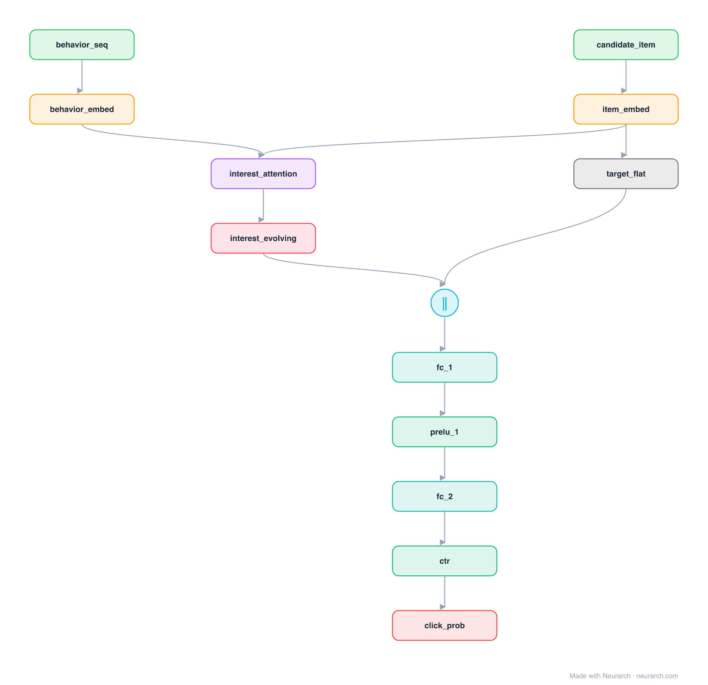

# Architecture: DIEN

## Motivation

Deep Interest Evolution Network: the sequel to DIN. After a target-aware attention scores the behaviour history, a GRU-based interest-evolution layer models how the user's interest moves over time before the CTR head. Captures temporal drift that DIN's single attention pool cannot.

## Core Idea

Deep Interest Evolution Network: the sequel to DIN.

## Architecture

### Overview

*The full graph, all 13 nodes. Vector: [diagram.svg](assets/diagram.svg).*

| Hyperparameter | Value |
|---|---|
| Type | CTR with user-behavior sequence |
| Interest attention | Target-aware scoring of the behaviour sequence |
| Interest evolution | GRU over the attended interests |
| Head | Concat evolved interest + candidate then MLP |
| Key idea | Model how interest drifts, not just which items matter |

`model.json` is the full graph, hand-built against the official config.json.

### Design Notes

- Builds directly on [din](../din/): same target-aware activation idea, with a recurrent interest-evolution layer added on top.
- Reference topology: behaviour attention into a GRU, concatenated with the candidate embedding before the MLP head.
- The full paper adds an auxiliary loss on the interest-extraction GRU and an attention-gated AUGRU; this graph shows the core evolution path.

### Parameter Check

This entry is a **structural reference**: its parameter mix is not recomputed by the per-layer estimator, so it carries no deviation gate. See the hyperparameter table above for the authoritative total / active parameter counts.

## Design Decisions

> **Analysis** — Observations derived from studying the architecture.

- Builds directly on [din](../din/): same target-aware activation idea, with a recurrent interest-evolution layer added on top.
- Reference topology: behaviour attention into a GRU, concatenated with the candidate embedding before the MLP head.
- The full paper adds an auxiliary loss on the interest-extraction GRU and an attention-gated AUGRU; this graph shows the core evolution path.

## Implementation Notes

- `model.json` contains the full structural graph with real dimensions and parameters.
- Open in [Neurarch](https://www.neurarch.com/) to visualize, edit, or export training code.
- Diagrams fold repeated identical blocks with a `× N` badge; `model.json` holds all nodes at real dimensions.

## Limitations

- This package focuses on the architectural structure. Training pipelines, 
dataset preparation, and production optimizations are out of scope.

## Evolution

> See `references/related/` for predecessor and successor architectures.

