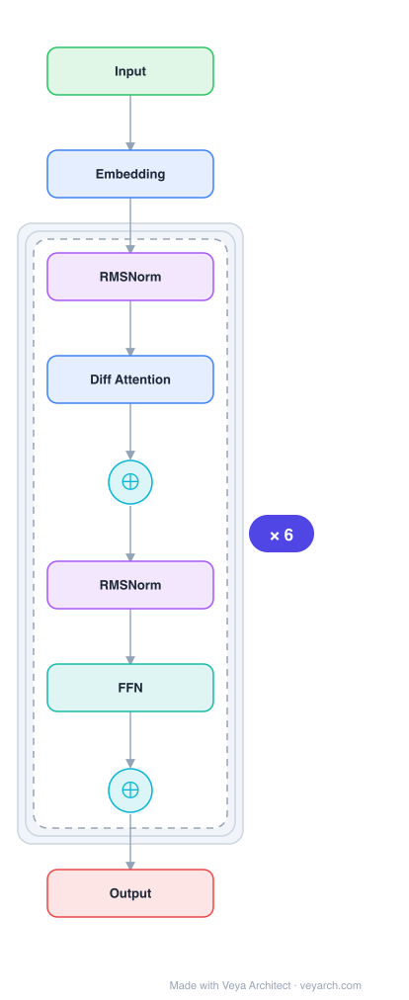

# Architecture: Differential Transformer

## Motivation

Transformer tends to overallocate attention to irrelevant context. Recent studies show that LLMs face challenges in accurately retrieving key information from context — the attention mechanism assigns non-negligible scores to irrelevant context, which drowns out the correct answer. This "attention noise" causes failures in key information retrieval, hallucination, in-context learning, and long-context modeling.

## Core Idea

Differential Transformer introduces a differential attention mechanism that calculates attention scores as the **difference between two separate softmax attention maps**. The subtraction cancels noise, promoting sparse attention patterns and amplifying attention to relevant context while canceling irrelevant signals.

## Architecture

### Overview

<b>Layer-by-layer (9 nodes)</b>

| # | Layer | Type | Params |
|---|---|---|---|
| 1 | Input | `input` |  |
| 2 | Embedding | `embed` |  |
| 3 | RMSNorm | `norm` |  |
| 4 | Diff Attention | `attention` |  |
| 5 | ⊕ | `residual` |  |
| 6 | RMSNorm | `norm` |  |
| 7 | FFN | `ffn` |  |
| 8 | ⊕ | `residual` |  |
| 9 | Output | `output` |  |

DIFF Transformer stacks L layers, each containing a multi-head differential attention module and a SwiGLU feed-forward network. The key innovation is the differential attention mechanism: instead of a single softmax attention map, two separate attention maps are computed and their difference is taken, which cancels noise and enables sparse attention patterns.

### Components

1. **Differential Attention** — The core mechanism. For each head, two separate attention maps are computed:
   - `Attn₁ = softmax(Q₁K₁ᵀ)V₁`
   - `Attn₂ = softmax(Q₂K₂ᵀ)V₂`
   - Output: `(Attn₁ - λAttn₂)` where λ is a learnable scalar
   
   The subtraction cancels noise: if both maps assign attention to irrelevant context, the difference removes it, leaving only the signal. This is analogous to noise-canceling headphones (differential signaling).

2. **Multi-Head Differential Attention** — Multiple differential attention heads, each with its own pair of attention maps and learnable λ. The heads are concatenated and projected.

3. **SwiGLU Feed-Forward Network** — `SwiGLU(X) = (swish(XW_G) ⊙ XW₁)W₂` with expanded dimension 8/3 × d_model.

4. **RMSNorm** — Used for layer normalization (pre-normalization).

5. **Residual Connections** — Standard residual connections around each sub-layer.

### Data Flow

1. **Input**: X^l → RMSNorm
2. **Differential Attention**: Compute Q₁, K₁, V₁ and Q₂, K₂, V₂ from input → two separate softmax attention maps → subtract with learnable λ → multi-head concat → projection
3. **Residual**: Y^l = MultiHeadDiffAttn(LN(X^l)) + X^l
4. **FFN**: X^{l+1} = SwiGLU(LN(Y^l)) + Y^l
5. **Output**: X^{l+1}

### State / Memory

- **KV cache**: Like standard Transformer, maintains KV cache for autoregressive generation. Each head stores two sets of KV (for the two attention maps), but the head dimension is halved to align computation FLOPs and model size with standard Transformer.
- **Learnable λ**: Each head has a learnable scalar λ that controls the differential cancellation strength.
- **No additional recurrent state**: Fully feedforward like standard Transformer.

## Design Decisions

1. **Differential attention (subtraction of two maps)** — The key insight: noise in attention is common to both maps, so subtraction cancels it. This is inspired by differential signaling in electronic engineering (noise-canceling headphones).

2. **Half head dimension** — To align computation FLOPs and model size with standard Transformer, DIFF Transformer uses half the head dimension but the same number of total parameters (e.g., 12 heads for DIFF vs 24 for Transformer, both with d=128).

3. **Learnable λ** — Rather than fixed subtraction weight, λ is learnable per head, allowing the model to adapt the noise cancellation strength.

4. **RMSNorm** — Chosen over LayerNorm for efficiency.

5. **SwiGLU** — Standard modern FFN choice.

## Evolution

**Predecessors:**
- **Transformer** (Vaswani et al., 2017) — Standard self-attention with single softmax attention map.
- **Multi-Head Attention** — The baseline that DIFF Transformer improves upon.
- **Differential signaling** — Electronic engineering concept of noise cancellation through differential pairs.

**Successors:**
- Potential integration with other attention variants (sparse, linear, etc.)
- Scaling to larger model sizes and longer contexts.

## Characteristics

| Property | Value |
|----------|-------|
| Year | 2024 |
| Authors | Ye, Dong, Xia, Sun, Zhu, Huang, Wei (Microsoft Research, Tsinghua) |
| Category | DL/Transformer |
| Source Paper | `Differencial_Transforme_Zhu_Huang_2025.md` |
| PaperVault Path | `DL-Architectures/01-transformers/Differencial_Transforme_Zhu_Huang_2025.md` |

## Limitations

1. **Doubled attention computation** — Each head computes two attention maps, though this is offset by halving the head dimension.
2. **Training complexity** — The differential mechanism introduces additional parameters (λ) and may require careful initialization.
3. **Limited scale validation** — Primarily validated at 3B parameter scale with 1T tokens; larger scale remains to be tested.
4. **Hyperparameter sensitivity** — The learnable λ and head dimension ratio may require tuning for different scales.
5. **Theoretical understanding** — While empirically effective, the theoretical analysis of why differential attention works is still developing.

## Implementation Notes

See `implementation/` for a minimal runnable implementation. Key details:
- Differential attention: `(softmax(Q₁K₁ᵀ)V₁ - λ·softmax(Q₂K₂ᵀ)V₂)` per head
- λ is a learnable scalar per head
- Head dimension halved to match standard Transformer FLOPs
- SwiGLU FFN, RMSNorm, pre-normalization
- 3B model trained on 1T tokens (StableLM-3B-4E1T recipe)

## Information Layers

- **Evidence:** Source paper available in `references/papers/` (Ye et al., 2024, "Differential Transformer")
- **Analysis:** The differential attention mechanism is a principled approach to noise reduction in attention. The analogy to noise-canceling headphones is apt: by computing two attention maps and subtracting, common-mode noise (attention to irrelevant context) is canceled while the differential signal (attention to relevant context) is preserved. The empirical results showing improved key information retrieval, hallucination mitigation, and in-context learning robustness support this interpretation.
- **Hypothesis:** The sparse attention patterns emerging from differential attention may provide better interpretability and may be related to the sparse attention patterns observed in well-trained large language models. The noise cancellation property could be particularly beneficial at scale, where attention noise compounds across layers.
