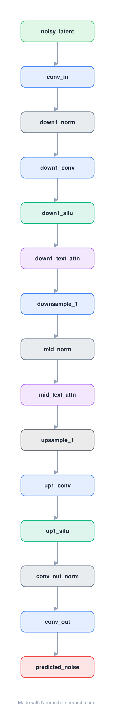

# Architecture: Diffusion U-Net (Stable Diffusion)

## Motivation

The latent-diffusion noise predictor behind Stable Diffusion: a U-Net operating on 64x64 latents, conditioned on the timestep and on text embeddings via cross-attention at every resolution.

## Core Idea

The latent-diffusion noise predictor behind Stable Diffusion: a U-Net operating on 64x64 latents, conditioned on the timestep and on text embeddings via cross-attention at every resolution.

## Architecture

### Overview

<b>Layer-by-layer (15 nodes)</b>

| # | Layer | Type | Params |
|---|---|---|---|
| 1 | noisy_latent | `input` | shape: [4, 64, 64] |
| 2 | conv_in | `conv2d` | outChannels: 320, kernelSize: 3, stride: 1, padding: 1, inChannels: 4 |
| 3 | down1_norm | `groupNorm` | numGroups: 32, numChannels: 320 |
| 4 | down1_conv | `conv2d` | outChannels: 320, kernelSize: 3, stride: 1, padding: 1, inChannels: 320 |
| 5 | down1_silu | `swish` |   |
| 6 | down1_text_attn | `crossAttention` | embedDim: 320, numHeads: 8, kvDim: 768 |
| 7 | downsample_1 | `conv2d` | outChannels: 640, kernelSize: 3, stride: 2, padding: 1, inChannels: 320 |
| 8 | mid_norm | `groupNorm` | numGroups: 32, numChannels: 640 |
| 9 | mid_text_attn | `crossAttention` | embedDim: 640, numHeads: 8, kvDim: 768 |
| 10 | upsample_1 | `upsample` | scaleFactor: 2, mode: nearest |
| 11 | up1_conv | `conv2d` | outChannels: 320, kernelSize: 3, stride: 1, padding: 1, inChannels: 640 |
| 12 | up1_silu | `swish` |   |
| 13 | conv_out_norm | `groupNorm` | numGroups: 32, numChannels: 320 |
| 14 | conv_out | `conv2d` | outChannels: 4, kernelSize: 3, stride: 1, padding: 1, inChannels: 320 |
| 15 | predicted_noise | `output` |   |

This graph ships in Neurarch's in-app template library; the copy here passes shape propagation with zero errors.

### Design Notes

- Cross-attention is the text-conditioning mechanism: image latents attend to CLIP text embeddings inside each block.
- Works in 4x64x64 VAE latent space rather than pixels, which is the "latent" in latent diffusion and why it fits on consumer GPUs.
- This is a compact reference graph of the conditioning topology, not a parameter-faithful replica of the ~860M UNet.

## Design Decisions

> **Analysis** — Observations derived from studying the architecture.

- Cross-attention is the text-conditioning mechanism: image latents attend to CLIP text embeddings inside each block.
- Works in 4x64x64 VAE latent space rather than pixels, which is the "latent" in latent diffusion and why it fits on consumer GPUs.
- This is a compact reference graph of the conditioning topology, not a parameter-faithful replica of the ~860M UNet.

## Implementation Notes

- `model.json` contains the full structural graph with real dimensions and parameters.
- Open in [Neurarch](https://www.neurarch.com/) to visualize, edit, or export training code.
- Diagrams fold repeated identical blocks with a `× N` badge; `model.json` holds all nodes at real dimensions.

## Limitations

- This package focuses on the architectural structure. Training pipelines, 
dataset preparation, and production optimizations are out of scope.

## Evolution

> See `references/related/` for predecessor and successor architectures.

