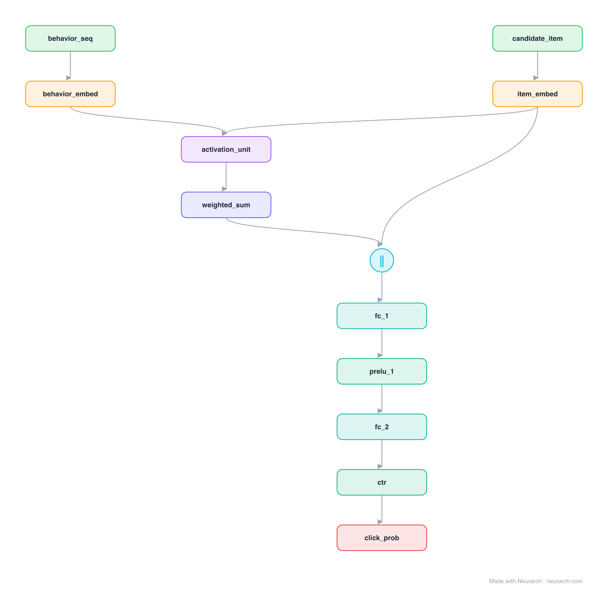

# Architecture: DIN (Deep Interest Network)

## Motivation

Alibaba's production CTR model that replaced fixed sum-pooling of a user's behaviour history with an attention "activation unit": each past behaviour is weighted by how relevant it is to the candidate item, so the user's interest vector is target-aware.

## Core Idea

Alibaba's production CTR model that replaced fixed sum-pooling of a user's behaviour history with an attention "activation unit": each past behaviour is weighted by how relevant it is to the candidate item, so the user's interest vector is target-aware.

## Architecture

### Overview

*The full graph, all 12 nodes. Vector: [diagram.svg](assets/diagram.svg).*

| Hyperparameter | Value |
|---|---|
| Type | CTR with user-behavior sequence |
| Activation unit | Attention of behaviours w.r.t. the candidate item |
| Interest | Relevance-weighted sum of behaviours (not mean pool) |
| Head | Concat interest + candidate → MLP → sigmoid |
| Key idea | Target-aware interest representation |

`model.json` is the full graph, hand-built against the official config.json.

### Design Notes

- The activation unit is a local attention between the candidate item and each historical behaviour; high-relevance behaviours dominate the pooled interest.
- This is the recsys insight that "a user's interest is multi-modal, attend to the part relevant to what you are scoring".
- Followed by DIEN (adds a GRU-based interest-evolution layer); compare with [bst](../bst/), which instead runs a full Transformer over the behaviour sequence.

### Parameter Check

Neurarch's per-layer parameter estimate over this graph: **128.0M**.

## Design Decisions

> **Analysis** — Observations derived from studying the architecture.

- The activation unit is a local attention between the candidate item and each historical behaviour; high-relevance behaviours dominate the pooled interest.
- This is the recsys insight that "a user's interest is multi-modal, attend to the part relevant to what you are scoring".
- Followed by DIEN (adds a GRU-based interest-evolution layer); compare with [bst](../bst/), which instead runs a full Transformer over the behaviour sequence.

## Implementation Notes

- `model.json` contains the full structural graph with real dimensions and parameters.
- Open in [Neurarch](https://www.neurarch.com/) to visualize, edit, or export training code.
- Diagrams fold repeated identical blocks with a `× N` badge; `model.json` holds all nodes at real dimensions.

## Limitations

- This package focuses on the architectural structure. Training pipelines, 
dataset preparation, and production optimizations are out of scope.

## Evolution

> See `references/related/` for predecessor and successor architectures.

