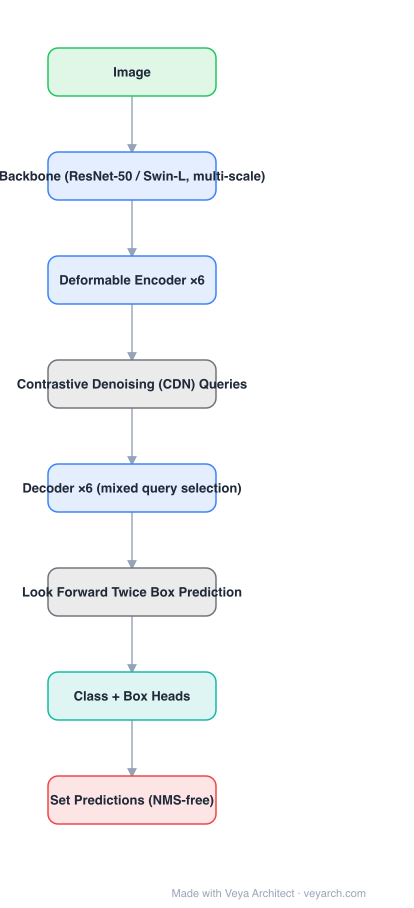

# Architecture: DINO

## Motivation

DETR's set prediction eliminates NMS, but training is slow and unstable: Hungarian matching is noisy early on, and one-to-one assignment still lets the decoder emit duplicates for the same object. DN-DETR showed that feeding **noised ground-truth boxes as queries** (denoising) stabilizes training. DINO's observation is that denoising alone is not enough: the model must also learn what **not** to predict — hence contrastive denoising with explicit negatives.

## Core Idea

Three changes on top of a deformable DETR skeleton:
1. **Contrastive denoising (CDN)** — add both positive (small noise) and negative (large noise) noised boxes as queries, and supervise the negatives to predict "no object", which is what actually suppresses duplicate predictions.
2. **Mixed query selection** — take *positional* queries from the encoder's top features but keep *content* queries learnable, avoiding the degenerate coupling of pure dynamic selection.
3. **Look forward twice** — let a later layer's box prediction supervise the earlier layer's refinement, so layer-by-layer greedy updates do not lock in a wrong box.

## Architecture

### Overview

<b>Layer-by-layer (8 nodes)</b>

| # | Layer | Type | Params |
|---|---|---|---|
| 1 | Image | `input` |  |
| 2 | Backbone (ResNet-50 / Swin-L, multi-scale) | `conv2d` |  |
| 3 | Deformable Encoder ×6 | `attention` |  |
| 4 | Contrastive Denoising (CDN) Queries | `custom` |  |
| 5 | Decoder ×6 (mixed query selection) | `attention` |  |
| 6 | Look Forward Twice Box Prediction | `custom` |  |
| 7 | Class + Box Heads | `linear` |  |
| 8 | Set Predictions (NMS-free) | `output` |  |

### Components

1. **Backbone (ResNet-50 / Swin-L)** with multi-scale features.
2. **Deformable encoder** (multi-scale deformable self-attention) — as in Deformable DETR.
3. **Mixed query selection** — positional queries chosen from encoder features by class score; content queries remain learned parameters.
4. **CDN branch** — a separate query group containing positive and negative noised versions of the ground-truth boxes and labels; negatives are supervised as ∅. The contrastive part is the differentiator vs. DN-DETR.
5. **Decoder (6 layers) with look-forward-twice** — each layer predicts a box delta that is supervised not only by the final layer's box but also by the *next* layer's refined box.
6. **Heads + Hungarian loss** — classification (focal/vfl-style) and box (L1 + GIoU) losses on the matching branch, plus the denoising losses.

### Data Flow

Image → backbone → deformable encoder → {matching queries (mixed selection), CDN queries (pos/neg noised GT)} → decoder with look-forward-twice refinement → class/box heads → set predictions (CDN branch discarded at inference).

### State / Memory

No recurrent state. The CDN branch is a training-only structure — at inference only the matching queries are used, so it costs nothing at deployment.

## Design Decisions

- **Contrastive rather than plain denoising** — teaching the model to reject near-miss boxes is what removes duplicates; reconstruction alone does not.
- **Mixed query selection** — decouple "where to look" (from the encoder) from "what to look for" (learned), which is more robust than selecting both from features.
- **Look forward twice** — fixes the greedy per-layer refinement that stacked decoder layers otherwise enforce.
- **Deformable attention retained** — keeps multi-scale features and fast convergence.

## Evolution

- **DETR** (predecessor): Hungarian matching, slow convergence, duplicates.
- **Deformable DETR**: sparse multi-scale attention, faster.
- **DAB-DETR**: queries as 4D anchor boxes. **DN-DETR**: query denoising.
- **DINO**: contrastive denoising + mixed selection + look-forward-twice; 63.3 AP COCO test-dev, first DETR-family model to lead the leaderboard.
- **Successors**: Grounding DINO (adds language), RT-DETR (real-time), D-FINE (distribution refinement), DEYO/Group-DETR (one-to-many assignment training).

## Characteristics

| Property | Value |
|---|---|
| Task | end-to-end object detection |
| Backbone | ResNet-50 / Swin-L (multi-scale) |
| Encoder | deformable multi-scale attention ×6 |
| Query init | mixed selection (encoder position + learned content) |
| Training aid | contrastive denoising (pos + neg) + look forward twice |
| Reported | 63.3 AP COCO test-dev |

## Limitations

- Best numbers require a Swin-L backbone and long schedules (12–36 epochs); real-time deployment needs a different model (RT-DETR).
- The CDN branch adds training complexity and hyperparameters (noise scales, number of denoising groups).
- Still relies on Hungarian matching, which remains the fragile part of DETR training.
- Multi-scale deformable attention is awkward to optimize on some inference runtimes.

## Implementation Notes

Essentials: (1) build the CDN group with both positive and negative noised boxes and supervise negatives as ∅ — this is the single biggest contributor, (2) initialize positional queries from encoder features but keep content queries learned, (3) implement look-forward-twice by passing the next layer's box delta into the previous layer's supervision, (4) discard the denoising branch at inference. Without the negative samples the model still produces duplicates.
