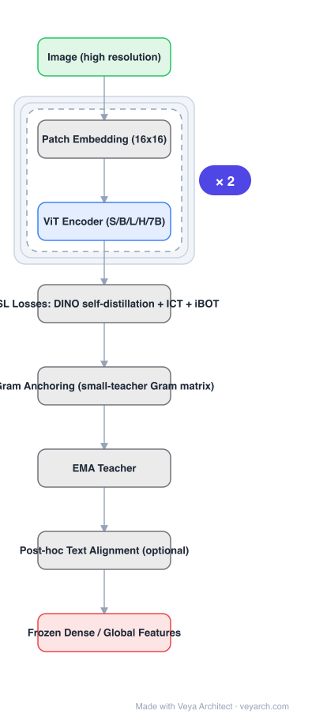

# Architecture: DINOv3

## Motivation

Self-distillation recipes (DINO + iBOT) produce excellent dense patch features, but those features **degrade** as (a) the dataset grows, (b) training lengthens, and (c) the data is uncurated. DINOv2's answer was heavy dataset curation (LVD), a continuous engineering cost that does not scale. DINOv3 asks: can web-scale *uncurated* pretraining produce curated-quality dense features?

## Core Idea

**Gram anchoring.** Alongside the usual self-supervised losses, add a term that matches the **Gram matrix** (second-order statistics) of the student's patch features to that of a **small teacher trained on a small curated dataset**, evaluated on the same images. Anchoring second-order statistics preserves the geometry/diversity of the patch-feature space without forcing a pointwise match to the teacher — leaving the student free to learn from the web-scale data while its dense features stay well-behaved over long training.

## Architecture

### Overview

<b>Layer-by-layer (8 nodes)</b>

| # | Layer | Type | Params |
|---|---|---|---|
| 1 | Image (high resolution) | `input` |  |
| 2 | Patch Embedding (16×16) | `custom` |  |
| 3 | ViT Encoder (S/B/L/H/7B) | `attention` |  |
| 4 | DINO Self-Distillation + ICT Losses | `custom` |  |
| 5 | iBOT Masked Patch Prediction | `custom` |  |
| 6 | Gram Anchoring (small-teacher Gram matrix) | `custom` |  |
| 7 | EMA Teacher | `custom` |  |
| 8 | Frozen Dense / Global Features | `output` |  |

### Components

1. **Patch embedding** — 16×16 patches; high-resolution training and inference.
2. **ViT encoder** — the model family spans ViT-S to ViT-7B (≈6.8B params); all use the same recipe, larger models are the distillation teachers for smaller ones.
3. **Self-supervised losses** — the DINOv2 objective set retained: DINO global-view self-distillation, ICT (cross-view token alignment), iBOT masked patch prediction.
4. **Gram anchoring loss** — a *small* teacher ViT trained on a *small* curated dataset provides Gram-matrix targets computed on the same training images; the student's patch-feature Gram matrix regresses toward it.
5. **EMA teacher** — momentum-updated encoder producing self-distillation targets; stop-gradient.
6. **Post-hoc adapters** — optional text alignment (CLIP-style projection head trained after pretraining) and resolution adaptation; the pure-vision core is untouched.

### Data Flow

Image → patch embedding → ViT encoder → {global [CLS] features (DINO loss), patch features (iBOT / ICT / Gram anchoring losses)} ← EMA teacher targets. After pretraining: frozen encoder serves dense heads (depth/segmentation/correspondence) directly; optional text-alignment head for retrieval/zero-shot classification.

### State / Memory

No recurrent state. The EMA teacher is a persistent momentum copy; the Gram-anchor teacher is frozen after its small-dataset training.

## Design Decisions

- **Gram (second-order) anchoring rather than feature distillation** — anchors the *structure* of the patch-feature space, not individual features, so the student can still adapt to web-scale data.
- **Anchoring instead of curation** — one small-teacher training run replaces a continuous data-filtering pipeline; performance becomes insensitive to dataset quality.
- **Post-hoc text alignment** — keeps the core self-supervised and modality-pure; language is an adapter, not a training dependency.
- **Distillation for the small models** — the 7B teacher transfers to S/B/L/H, so the whole family shares one recipe.

## Evolution

- **DINO** (2021): self-distillation with no labels; emergent dense features.
- **DINOv2** (2023): scaled with curated LVD data; strong frozen features but dense quality tied to curation.
- **DINOv3** (2025): Gram anchoring removes the curation dependency; 7B-scale training; frozen features exceed fine-tuned SOTA on many dense benchmarks.
- **Siblings**: I-JEPA (predictive SSL), CLIP/SigLIP (language-supervised), Perception Encoder (contrastive core + intermediate-layer reading).
- **Downstream**: frozen backbones for geometry foundation models (VGGT line), segmentation, correspondence.

## Characteristics

| Property | Value |
|---|---|
| Task | self-supervised visual representation (dense + global) |
| Backbone | ViT-S/B/L/H/7B, patch 16 |
| Pretraining | DINO + ICT + iBOT + **Gram anchoring**, EMA targets |
| Data | ~1.2B uncurated web images |
| Transfer | frozen evaluation; post-hoc text alignment |
| Weights license | custom DINOv3 License (code Apache-2.0) |

## Limitations

- Not generative — no pixels out; purely an encoder.
- Weight license is more restrictive than DINOv2's (revenue cap for automatic commercial use).
- 7B-scale pretraining is a major compute undertaking; the recipe's small-teacher design adds one extra model to train.
- Very high inference resolutions are still expensive (quadratic attention over long token sequences).

## Implementation Notes

Essentials: (1) keep the DINOv2 objective set unchanged and add the Gram-anchoring term computed on the student's patch features vs. the small teacher's, (2) train the anchor teacher once on a small curated set — it never updates during student training, (3) distill large→small rather than training each size independently, (4) apply text alignment only as a post-hoc stage if retrieval/zero-shot is needed.

## Relevance to Veya

The strongest available **dense visual latent** source: a frozen DINOv3 encoder is the natural shared backbone for Veya-Depth / Veya-SAM-style heads, and the VGGT line already validates ViT patch features as input to geometry models. Gram anchoring itself is a transferable recipe — whenever Veya trains its own perception backbone on uncurated robot-camera streams, anchoring dense-feature quality to a small curated teacher is how to scale data without losing patch-level geometry.
