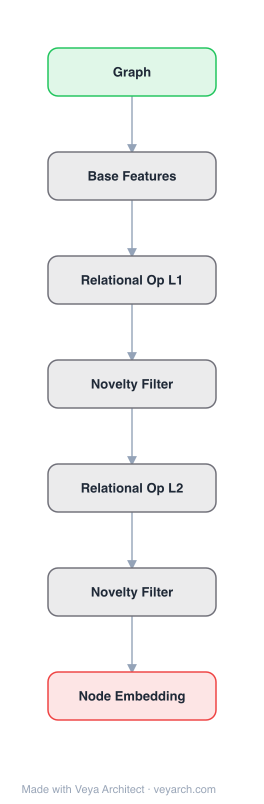

# Architecture: Deep Inductive Network Representation Learning

## Motivation

Existing network embedding methods (DeepWalk, node2vec, LINE) learn node features for a **specific graph** — the learned embeddings are tied to that graph's nodes and cannot generalize to unseen nodes or other networks. This **transductive** limitation makes them unsuitable for across-network transfer learning tasks (e.g., link classification across networks, network alignment, graph similarity). Furthermore, these methods produce **dense** feature vectors that are impractical for large graphs (too large to fit in memory), are **difficult to interpret**, cannot capture **higher-order subgraph structures**, and are computationally expensive (orders of magnitude slower than necessary). DeepGL (Deep Graph Learning) fills this gap by learning **relational functions** — not per-node embeddings — that naturally generalize to any arbitrary graph, enabling inductive learning and across-network transfer. It is space-efficient (sparse features, up to 6× less memory), fast (O(|E|) time complexity with up to 182× speedup), and learns interpretable hierarchical graph representations.

## Core Idea

Inductive graph embedding using structural features for unseen node generalization.

## Architecture

### Overview

<b>Layer-by-layer (7 nodes)</b>

| # | Layer | Type | Params |
|---|---|---|---|
| 1 | Graph | `input` |  |
| 2 | Base Features | `custom` |  |
| 3 | Relational Op L1 | `custom` |  |
| 4 | Novelty Filter | `custom` |  |
| 5 | Relational Op L2 | `custom` |  |
| 6 | Novelty Filter | `custom` |  |
| 7 | Node Embedding | `output` |  |

DeepGL is a deep hierarchical graph representation learning framework that learns **relational functions** (each representing a feature) as compositions of relational feature operators applied to base features. The framework begins by deriving a set of **base features** from the graph topology and attributes (e.g., graphlet features, degree-based features). It then iteratively applies learned **relational feature operators** over the feature values of a node's distance-ℓ neighbors to derive higher-order features from lower-order ones, forming a multi-layered hierarchical representation where each layer captures features of increasingly higher order. At each feature layer, DeepGL searches over a space of relational functions defined compositionally; features are retained only if they are **novel** (i.e., they add information not captured by existing features). This selective retention produces sparse, interpretable representations. The learned relational functions generalize to any graph, making DeepGL naturally inductive.

### Components

1. **Base Feature Derivation** — The initial feature set:
   - Derived from graph structure (e.g., graphlet counts, degree, triangle counts) and node attributes (if available)
   - Base features serve as the input to the first relational feature layer
   - Examples: node degree, triangle participation, k-cycle counts, graphlet degree vector
   - These are computed for any graph, enabling inductive generalization

2. **Relational Feature Operators** — The core building blocks:
   - A set of operators that transform features based on neighbor feature values
   - Each operator takes a feature vector and a neighborhood (distance-ℓ) as input
   - Operators include: aggregation (sum, mean, max), composition, selection
   - Applied to each feature from the previous layer to derive new higher-order features
   - The operators are the "learned" component — the framework searches over operator compositions

3. **Hierarchical Feature Layers** — Multi-layer representation:
   - Layer 1: Base features (from graph structure/attributes)
   - Layer 2: Relational operators applied to Layer 1 features over distance-1 neighbors
   - Layer ℓ: Relational operators applied to Layer (ℓ−1) features over distance-ℓ neighbors
   - Each successive layer captures higher-order structural information
   - Features at each layer are compositions of operators from previous layers

4. **Feature Selection / Novelty Filtering** — Sparsity and interpretability:
   - At each layer, candidate features are evaluated for novelty
   - A feature is retained only if it provides information not already captured by existing features
   - Novelty is measured via correlation/information-theoretic criteria
   - This produces sparse feature vectors (up to 6× less space than dense embeddings)
   - Retained features are interpretable as compositions of named operators on base features

5. **Relational Function Learning** — The inductive mechanism:
   - Each retained feature is a relational function: f(g_i) = operator(base_features(Γ(g_i)))
   - These functions are defined compositionally and can be applied to any graph
   - This is fundamentally different from learning per-node embeddings (which are graph-specific)
   - Enables across-network transfer learning: apply learned functions to a new graph

### Data Flow

1. **Input:** Graph G = (V, E) with optional node attributes A
2. **Base Feature Derivation:** Compute base features (graphlet counts, degree, etc.) for all graph elements (nodes or edges) → Feature matrix X^(0)
3. **Layer 1 Processing:** Apply relational feature operators to X^(0) over distance-1 neighborhoods → candidate features; filter for novelty → X^(1)
4. **Layer ℓ Processing:** Apply relational feature operators to X^(ℓ−1) over distance-ℓ neighborhoods → candidate features; filter for novelty → X^(ℓ)
5. **Repeat:** Continue for L layers, each producing higher-order features
6. **Output:** Sparse feature matrix X^(L) where each feature is an interpretable relational function that generalizes to any graph; can be used for node/edge classification, link prediction, transfer learning across networks

### State / Memory

- **No recurrent state:** DeepGL is a feedforward multi-layer feature learning framework; no temporal memory mechanism.
- **Learned parameters:** The relational functions (operator compositions) selected at each layer are the persistent learned state. These are function definitions, not per-node vectors, enabling inductive application.
- **Feature matrices:** Transient at each layer — X^(ℓ) is computed, used to derive X^(ℓ+1), and can be discarded if only the final layer is needed.
- **Space efficiency:** Sparse feature storage (only novel features retained) requires up to 6× less memory than dense embedding methods.

## Design Decisions

1. **Relational functions over per-node embeddings** — The fundamental design choice: DeepGL learns functions (operators on base features) rather than per-node vectors. This makes the framework naturally inductive — the same functions apply to any graph — unlike DeepWalk/node2vec which learn graph-specific embeddings. This enables across-network transfer learning, a capability no prior NRL method offered.

2. **Hierarchical composition** — Features are built hierarchically: each layer composes operators on the previous layer's features. This mirrors deep learning's principle of learning multiple levels of representation, with higher layers capturing more abstract (higher-order) structural concepts. The depth (number of layers) controls the maximum structural order captured.

3. **Novelty-based feature selection** — Rather than retaining all candidate features, DeepGL filters for novelty: a feature is kept only if it adds information not already captured. This produces sparse, non-redundant representations and improves interpretability — each retained feature represents distinct structural information.

4. **Graphlet base features** — Using graphlet (small subgraph) counts as base features provides a rich, structurally meaningful starting point that captures local topology patterns. Graphlets are well-studied in network science and provide interpretable structural signatures.

5. **Linear time complexity O(|E|)** — The framework is designed for efficiency: each layer processes edges (not node pairs), and the parallel implementation scales to large networks. This achieves up to 182× speedup over DeepWalk/node2vec.

6. **Edge and node support** — DeepGL naturally generalizes to both node and edge representation learning (DeepGL-node and DeepGL-edge variants), unlike most methods that focus only on nodes.

## Evolution

**Predecessors:**
- **DeepWalk** (Perozzi et al., 2014) — Skip-gram on random walks; transductive, dense embeddings, no transfer learning.
- **LINE** (Tang et al., 2015) — First/second-order proximity; transductive, dense embeddings.
- **node2vec** (Grover & Leskovec, 2016) — Biased random walks; transductive, dense embeddings.
- **Graphlet analysis** (Milo et al., 2002; Pržulj, 2007) — Manual graphlet feature extraction; not learned, not hierarchical.
- **Role discovery methods** (Rossi & Ahmed, 2015) — Structural role identification; inspired the inductive feature approach.

**Successors:**
- **GraphSAGE** (Hamilton et al., 2017) — Inductive GNN via neighborhood sampling and aggregation; also learns functions over neighborhoods but via neural networks.
- **GCN** (Kipf & Welling, 2017) — Spectral graph convolution; end-to-end trainable, inductive in later extensions.
- **GAT** (Veličković et al., 2018) — Attention-based inductive graph representation.
- **Graph foundation models** — The concept of learning transferable graph representations anticipates modern graph foundation model research.

## Characteristics

| Property | Value |
|----------|-------|
| Year | 2018 |
| Authors | Rossi, Zhou, Ahmed (Adobe Research, Google, Intel Labs) |
| Category | GNN/Embedding |
| Source Paper | `Deep_Inductive_Network_Representation_Learning_Rossi_Zhou_Ahmed_2018.md` |
| PaperVault Path | `GNN/02-network-embedding/Deep_Inductive_Network_Representation_Learning_Rossi_Zhou_Ahmed_2018.md` |

## Limitations

1. **Feature engineering for base features** — While relational operators are learned, the base features (graphlet counts, degree) must be pre-specified. The quality of the final representation depends on the choice and diversity of base features.
2. **Discrete feature search** — The framework searches over a discrete space of operator compositions, which is less flexible than continuous optimization (gradient descent) used by neural network-based methods. The search may miss features that continuous optimization would discover.
3. **Graphlet computation cost** — Computing graphlet base features can be expensive for large graphs, though the O(|E|) overall complexity mitigates this for the learned layers.
4. **Limited to structural features** — While the framework supports attributes, the primary design focuses on structural (topological) features. Rich attribute integration is less developed than in neural methods.
5. **No end-to-end task optimization** — DeepGL learns general-purpose representations; the feature selection is based on novelty, not task-specific objectives. Unlike GCN/GNNs, it is not trained end-to-end with a downstream task loss.
6. **Scalability of feature space** — As the number of layers increases, the candidate feature space grows combinatorially. The novelty filter controls this, but the search cost can still be significant for deep architectures.

## Implementation Notes

See `implementation/` for a minimal runnable implementation.

## Information Layers

- **Evidence:** Source paper available in `references/papers/` (Rossi, Zhou, Ahmed, 2018, "Deep Inductive Network Representation Learning," WWW '18)
- **Analysis:** DeepGL's most significant contribution is the paradigm shift from learning per-node embeddings to learning **relational functions** that generalize across networks. This anticipates the inductive learning revolution that GraphSAGE and GNNs would bring to the mainstream, but achieves it through a different mechanism — compositional feature operators with novelty-based selection rather than neural network aggregation. The hierarchical structure mirrors deep learning's multi-level representation principle. The novelty-based feature selection is a distinctive design choice that produces sparse, interpretable representations — a property that dense neural embeddings lack. The O(|E|) efficiency and 6× space savings make it practical for large networks where dense methods fail. The main limitation is the discrete feature search, which is less expressive than continuous neural optimization; this is likely why GNN-based methods eventually dominated the field despite DeepGL's earlier inductive insight.
- **Hypothesis:** The success of relational function learning suggests that the key to inductive graph representation is not the specific architecture (neural vs. compositional) but the principle of learning transferable functions over neighborhoods. The novelty-based selection implies that many features in dense embeddings are redundant — sparse, non-redundant features can match or exceed dense representations while being more interpretable and memory-efficient. The compositional approach may be rediscovered in the GNN era as a complement to neural aggregation, particularly for interpretability-critical applications.
