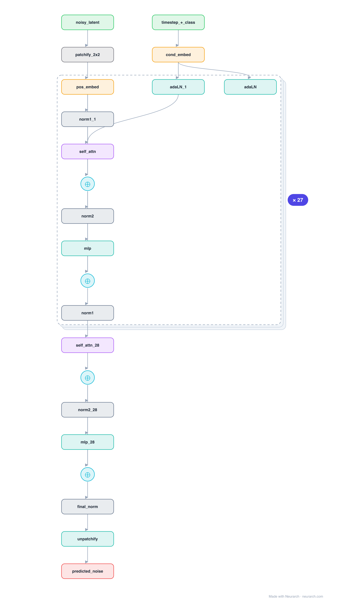

# Architecture: DiT-XL/2

## Motivation

The model that replaced the diffusion U-Net with a plain Transformer over latent patches, conditioned by adaptive LayerNorm. DiT scaled cleanly and became the backbone of Stable Diffusion 3, PixArt, and Sora-class video models.

## Core Idea

The model that replaced the diffusion U-Net with a plain Transformer over latent patches, conditioned by adaptive LayerNorm.

## Architecture

### Overview

*Identical repeated blocks are folded into one representative block with a `× N` badge, so the whole architecture fits on screen. `model.json` keeps all 204 nodes (open it in Neurarch to see and edit every layer). Vector: [diagram.svg](assets/diagram.svg).*

| Hyperparameter | Value |
|---|---|
| Type | Diffusion model, Transformer backbone |
| Parameters | 675M (XL/2) |
| Layers | 28 DiT blocks |
| Hidden size | 1152 |
| Attention | Multi-head: 16 heads |
| Conditioning | adaLN-zero from timestep + class embedding |
| Patches | 2x2 over a 32x32x4 latent |
| FFN | Dense MLP, 4608, GeLU |

`model.json` is the full graph, hand-built against the official config.json.

### Design Notes

- adaLN-zero: each block's LayerNorm scale/shift (and residual gates) are produced by a linear from the timestep + class embedding, so conditioning enters through normalization rather than cross-attention.
- Operates in VAE latent space (4x32x32) on 2x2 patches, exactly the ViT recipe applied to a denoiser.
- Replacing the U-Net (see [diffusion-unet](../diffusion-unet/)) with a Transformer is why diffusion now scales like LLMs do.

### Parameter Check

Neurarch's per-layer parameter estimate over this graph: **670.7M**.

## Design Decisions

> **Analysis** — Observations derived from studying the architecture.

- adaLN-zero: each block's LayerNorm scale/shift (and residual gates) are produced by a linear from the timestep + class embedding, so conditioning enters through normalization rather than cross-attention.
- Operates in VAE latent space (4x32x32) on 2x2 patches, exactly the ViT recipe applied to a denoiser.
- Replacing the U-Net (see [diffusion-unet](../diffusion-unet/)) with a Transformer is why diffusion now scales like LLMs do.

## Implementation Notes

- `model.json` contains the full structural graph with real dimensions and parameters.
- Open in [Neurarch](https://www.neurarch.com/) to visualize, edit, or export training code.
- Diagrams fold repeated identical blocks with a `× N` badge; `model.json` holds all nodes at real dimensions.

## Limitations

- This package focuses on the architectural structure. Training pipelines, 
dataset preparation, and production optimizations are out of scope.

## Evolution

> See `references/related/` for predecessor and successor architectures.

