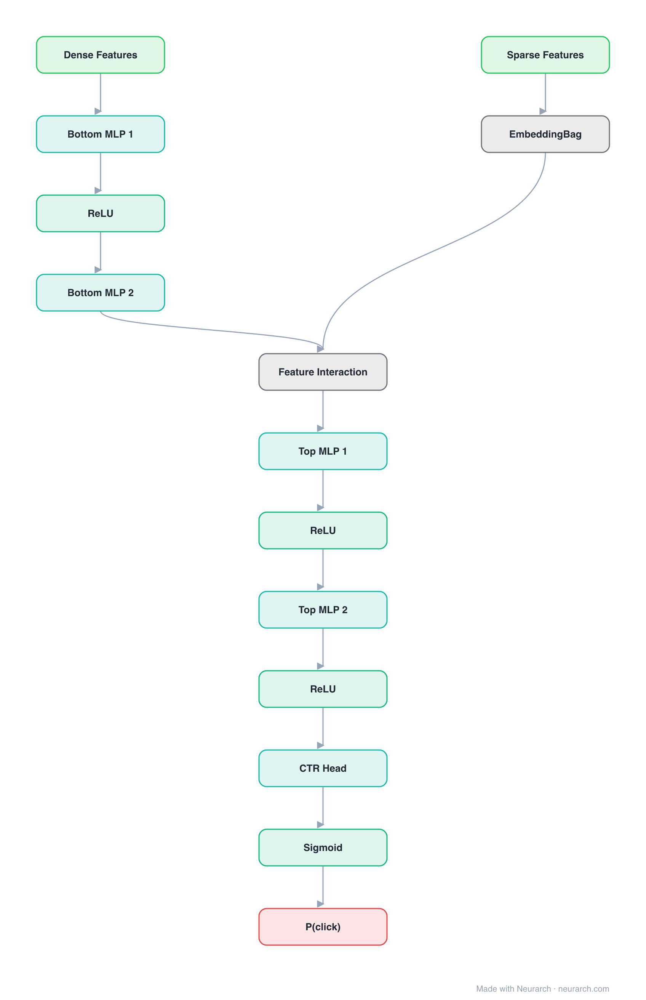

# Architecture: DLRM

## Motivation

Meta's production recommendation architecture: a bottom MLP for dense features, embedding tables for sparse features, explicit pairwise dot-product interactions, and a top MLP over the result.

## Core Idea

Meta's production recommendation architecture: a bottom MLP for dense features, embedding tables for sparse features, explicit pairwise dot-product interactions, and a top MLP over the result.

## Architecture

### Overview

<b>Layer-by-layer (14 nodes)</b>

| # | Layer | Type | Params |
|---|---|---|---|
| 1 | Dense Features | `input` | shape: [13] |
| 2 | Bottom MLP 1 | `linear` | inFeatures: 13, outFeatures: 64 |
| 3 | ReLU | `relu` |   |
| 4 | Bottom MLP 2 | `linear` | inFeatures: 64, outFeatures: 32 |
| 5 | Sparse Features | `input` | shape: [26] |
| 6 | EmbeddingBag | `embeddingBag` | vocabSize: 1000000, embeddingDim: 32 |
| 7 | Feature Interaction | `featureInteraction` | method: dot |
| 8 | Top MLP 1 | `linear` | inFeatures: 415, outFeatures: 512 |
| 9 | ReLU | `relu` |   |
| 10 | Top MLP 2 | `linear` | inFeatures: 512, outFeatures: 256 |
| 11 | ReLU | `relu` |   |
| 12 | CTR Head | `linear` | inFeatures: 256, outFeatures: 1 |
| 13 | Sigmoid | `sigmoid` |   |
| 14 | P(click) | `output` |   |

This graph ships in Neurarch's in-app template library; the copy here passes shape propagation with zero errors.

### Design Notes

- The explicit pairwise interaction layer (dot products between all embedding pairs) is the signature; it is factorization machines absorbed into a deep net.
- At production scale the embedding tables dominate parameters so heavily that DLRM training is a memory-bandwidth problem, which shaped a generation of recsys hardware.

## Design Decisions

> **Analysis** — Observations derived from studying the architecture.

- The explicit pairwise interaction layer (dot products between all embedding pairs) is the signature; it is factorization machines absorbed into a deep net.
- At production scale the embedding tables dominate parameters so heavily that DLRM training is a memory-bandwidth problem, which shaped a generation of recsys hardware.

## Implementation Notes

- `model.json` contains the full structural graph with real dimensions and parameters.
- Open in [Neurarch](https://www.neurarch.com/) to visualize, edit, or export training code.
- Diagrams fold repeated identical blocks with a `× N` badge; `model.json` holds all nodes at real dimensions.

## Limitations

- This package focuses on the architectural structure. Training pipelines, 
dataset preparation, and production optimizations are out of scope.

## Evolution

> See `references/related/` for predecessor and successor architectures.

