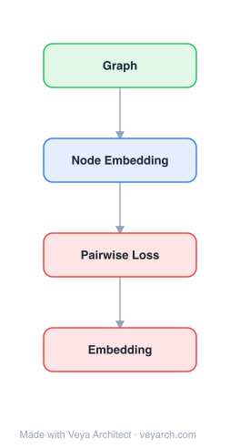

# Architecture: DNE-PL

## Motivation

Most existing network embedding methods (DeepWalk, LINE, GraRep, node2vec) are **shallow models** that work on static, **complete** networks — they purely or largely rely on topology information. However, real-world networks are often **incomplete**: parts of the links among nodes can be missing (due to privacy, data collection limitations, or network evolution). Existing topology-based methods fail on incomplete graphs because they rely on the full link structure. A more challenging case is **dynamic graphs** with new nodes joining — previous models must retrain to generate embeddings for new nodes with limited or no links (e.g., DeepWalk must regenerate all random walk sequences and retrain the Skip-Gram model). Additionally, existing methods that incorporate node properties (e.g., TADW) use shallow, separate processing of topology and attributes, failing to capture **highly nonlinear correlations** between node properties and links. DNE-PL (via MVC-DNE) fills this gap by being the first to study network embedding on incomplete networks, using a deep autoencoder framework that jointly models topology structure and node properties as two correlated views, with self-view and cross-view learning to deeply fuse the two information sources.

## Core Idea

Deep network embedding on incomplete graphs, predicting links from node properties.

## Architecture

### Overview

<b>Layer-by-layer (4 nodes)</b>

| # | Layer | Type | Params |
|---|---|---|---|
| 1 | Graph | `input` |  |
| 2 | Node Embedding | `embed` |  |
| 3 | Pairwise Loss | `loss` |  |
| 4 | Embedding | `output` |  |

MVC-DNE (Multi-View Correlation learning based Deep Network Embedding) is a deep autoencoder framework for network embedding on incomplete graphs. The architecture treats the network topology and node properties as **two correlated views** of the same nodes. The core insight is that a node's representation should reflect its characteristics in **both** views — topology (who it connects to) and properties (what attributes it has). The framework uses deep autoencoders to obtain latent representations in each view, then integrates them through both **self-view learning** (each view reconstructs itself) and **cross-view learning** (one view's features guide the encoding process of the other view). This deep fusion captures nonlinear correlations between topology and properties. Crucially, because the deep autoencoder learns a **mapping function** (not per-node embeddings), MVC-DNE can directly generate embeddings for new nodes without retraining — making it efficient for dynamic networks with new nodes.

### Components

1. **Structure View Autoencoder** — Topology-based representation:
   - A deep autoencoder that takes the network topology (adjacency vector or proximity vector) as input
   - Encodes the topology into a low-dimensional latent representation
   - Decodes back to reconstruct the topology
   - Self-view learning: the structure autoencoder learns to reconstruct structure from structure
   - Captures topological proximity patterns even when links are incomplete

2. **Property View Autoencoder** — Attribute-based representation:
   - A deep autoencoder that takes node properties (user profiles, metadata) as input
   - Encodes the properties into a low-dimensional latent representation
   - Decodes back to reconstruct the properties
   - Self-view learning: the property autoencoder learns to reconstruct properties from properties
   - Captures attribute-based similarity patterns

3. **Cross-View Learning** — Deep fusion of views:
   - The features of one view serve as labels to guide the encoding process of the other view
   - Structure view features → guide property view encoding (cross-view: structure → property)
   - Property view features → guide structure view encoding (cross-view: property → structure)
   - This captures the nonlinear correlations between topology and properties
   - Both self-view and cross-view learning are implemented in encoding and decoding stages

4. **Mapping Function** — Inductive capability:
   - The deep autoencoder learns a function f: input → latent representation
   - This function can be applied to new nodes (with properties but limited links) to generate embeddings
   - Eliminates the need for retraining when new nodes join the network
   - This is the key advantage over transductive methods (DeepWalk, LINE)

5. **Joint Optimization** — Unified objective:
   - L = L_self_structure + L_self_property + λ₁·L_cross_structure→property + λ₂·L_cross_property→structure
   - Self-view losses: reconstruction loss within each view
   - Cross-view losses: one view's features predicting the other view's encoding
   - λ₁, λ₂ balance cross-view contributions
   - Optimized via backpropagation through the deep autoencoders

### Data Flow

1. **Input:** Incomplete network G = (V, E') where E' ⊆ E (some links missing), node property matrix P ∈ ℝ^(N×D)
2. **Structure View Encoding:** Deep autoencoder encodes the (incomplete) topology of each node into latent representation z_s
3. **Property View Encoding:** Deep autoencoder encodes node properties into latent representation z_p
4. **Self-View Learning:** Each autoencoder reconstructs its own input (z_s → topology, z_p → properties)
5. **Cross-View Learning:** Structure features guide property encoding (z_s informs z_p), and property features guide structure encoding (z_p informs z_s)
6. **Joint Optimization:** Minimize the unified loss (self-view + cross-view) via backpropagation
7. **Output:** Low-dimensional node embeddings that reflect both topology and properties; the mapping function can generate embeddings for new nodes without retraining

### State / Memory

- **No recurrent state:** MVC-DNE is a feedforward deep autoencoder trained via backpropagation; no temporal memory mechanism.
- **Learned parameters:** The weights of the structure autoencoder, property autoencoder, and cross-view connection weights are the persistent learned state.
- **Inductive mapping:** The autoencoder weights define a mapping function f(properties) → embedding that can be applied to new nodes. This is a form of "learned state" that generalizes beyond the training graph.
- **Memory scaling:** O(N·d) for embeddings plus autoencoder weights (layers × dimensions), which is independent of graph size for the mapping function.

## Design Decisions

1. **Deep autoencoder over shallow models** — MVC-DNE uses deep autoencoders rather than shallow embedding models (like DeepWalk/LINE). This allows capturing **nonlinear correlations** between topology and properties — shallow methods that process the two types of data separately and combine them shallowly cannot capture these deep, nonlinear relationships.

2. **Multi-view formulation** — Treating topology and properties as two correlated views is a principled design choice. It recognizes that the two data sources are different modalities that encode related but distinct information, and that they should be fused deeply rather than concatenated shallowly.

3. **Cross-view learning** — The cross-view mechanism (one view's features guide the other view's encoding) is the key fusion mechanism. It goes beyond simple concatenation or late fusion: the two views actively inform each other's representation learning, capturing correlations that self-view learning alone would miss.

4. **Mapping function for inductive learning** — By using autoencoders (which learn a function, not per-node vectors), MVC-DNE can generate embeddings for new nodes without retraining. This is a critical advantage for dynamic networks and incomplete graphs — new nodes with properties but few links can be embedded using the learned mapping.

5. **Incomplete graph focus** — MVC-DNE is the first to explicitly study network embedding on incomplete networks. The design acknowledges that real-world networks have missing links and that properties can compensate for missing topology — the cross-view learning leverages properties to help represent nodes with insufficient links.

6. **Encoding and decoding stage cross-view** — Cross-view learning is applied in both encoding (one view guides the other's encoding) and decoding (one view guides the other's reconstruction) stages, providing deep, multi-level fusion.

## Evolution

**Predecessors:**
- **DeepWalk** (Perozzi et al., 2014) — Skip-gram on random walks; topology-only, transductive, requires complete graph.
- **LINE** (Tang et al., 2015) — First/second-order proximity; topology-only, transductive.
- **GraRep** (Cao et al., 2015) — k-order proximity factorization; topology-only, transductive.
- **node2vec** (Grover & Leskovec, 2016) — Biased random walks; topology-only, transductive.
- **TADW** (Yang et al., 2015) — Text-attributed DeepWalk; shallow text-topology fusion, transductive.
- **SDNE** (Wang et al., 2016) — Deep autoencoder for network embedding; topology-only, no property fusion.

**Successors:**
- **GraphSAGE** (Hamilton et al., 2017) — Inductive GNN via sampling and aggregation; also learns a mapping function for new nodes.
- **GCN** (Kipf & Welling, 2017) — Spectral graph convolution; end-to-end trainable, inductive in extensions.
- **DANE** (Li et al., 2017) — Dynamic attributed network embedding; similar goals for dynamic graphs with attributes.

## Characteristics

| Property | Value |
|----------|-------|
| Year | 2017 |
| Authors | Yang, Wang, Li, Zhang, Li (Beihang University, Nanjing University of Aeronautics and Astronautics) |
| Category | GNN/Embedding |
| Source Paper | `From_properties_to_links_Deep_network_embedding_on_incomplet_Wang_Profile_Li_2017.md` |
| PaperVault Path | `GNN/02-network-embedding/From_properties_to_links_Deep_network_embedding_on_incomplet_Wang_Profile_Li_2017.md` |

## Limitations

1. **Autoencoder training difficulty** — Deep autoencoders can be difficult to train, requiring careful hyperparameter tuning (layer sizes, learning rate, regularization). The quality of the learned mapping function depends on successful autoencoder optimization.
2. **Property quality dependence** — The property view's effectiveness depends on the quality and relevance of node properties. If properties are noisy, sparse, or uncorrelated with link structure, the cross-view learning may not help or may introduce noise.
3. **Scalability** — Deep autoencoders with multiple layers can be computationally expensive for large networks. The autoencoder must process all nodes, and the cross-view mechanism adds computation.
4. **Fixed property set** — The property view requires a fixed set of node properties known at training time. Adding new property types requires retraining.
5. **Incomplete graph assumption** — While MVC-DNE handles incomplete graphs, it assumes that the missing links are random or at least that properties can compensate. If missing links are systematically biased (e.g., all links of a certain type are missing), the approach may struggle.
6. **No explicit link prediction** — While the framework can be used for link prediction, the autoencoder is trained for reconstruction, not directly for link prediction. A separate link prediction model may be needed on top of the embeddings.

## Implementation Notes

See `implementation/` for a minimal runnable implementation.

## Information Layers

- **Evidence:** Source paper available in `references/papers/` (Yang, Wang, Li, Zhang, Li, 2017, "From Properties to Links: Deep Network Embedding on Incomplete Graphs," CIKM '17)
- **Analysis:** MVC-DNE's most significant contribution is being the first to explicitly study network embedding on incomplete networks — a practically important problem that prior methods ignored. The multi-view deep autoencoder framework with cross-view learning is a principled approach to deeply fusing topology and properties, going beyond the shallow fusion of TADW. The inductive mapping function (learning f(properties) → embedding) is a forward-looking design that anticipates the inductive learning paradigm later popularized by GraphSAGE. The cross-view learning mechanism (one view guides the other's encoding) is an elegant fusion strategy that captures nonlinear correlations. The main limitation is the reliance on deep autoencoders, which can be hard to train and scale. Later GNN methods would achieve similar inductive goals more elegantly through neighborhood aggregation, but MVC-DNE's insight — that properties can compensate for missing links through deep cross-view learning — remains relevant for incomplete graph scenarios.
- **Hypothesis:** The effectiveness of cross-view learning implies that topology and properties are **deeply, nonlinearly correlated** — the relationship between who a node connects to and what attributes it has is not a simple linear mapping but a complex function. This suggests that shallow fusion methods (concatenation, late fusion) fundamentally cannot capture this relationship, and deep architectures are necessary. The inductive mapping function's success implies that the property → embedding mapping is **generalizable** — the function learned on training nodes applies to new nodes, suggesting that the relationship between properties and network position is a stable, learnable function rather than a node-specific pattern. This supports the broader hypothesis that network embedding should learn **functions** (inductive) rather than **vectors** (transductive), a principle that would become central to the GNN paradigm.
