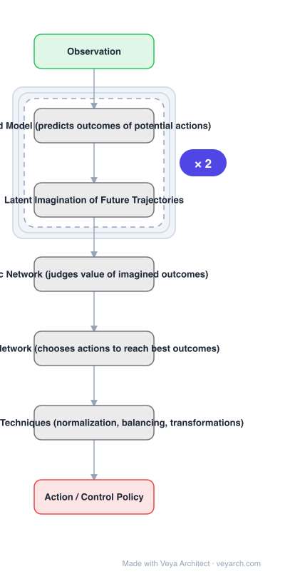

# Architecture: DreamerV3

## Motivation

Learning a world model that gives an agent rich perception and the ability to imagine the future is intuitively appealing: the world model predicts outcomes of potential actions, a critic judges their value, and an actor chooses actions to reach the best outcomes. But **robustly learning and leveraging world models to achieve strong task performance had been an open problem**. The practical consequence is that RL has typically required **specialized expert algorithms** tuned per domain.

## Core Idea

A **general** algorithm — Dreamer — that outperforms specialized expert algorithms across a wide range of domains **while using fixed hyperparameters**. It overcomes the robustness problem through **a range of robustness techniques based on normalization, balancing, and transformations**. Because those make learning robust, performance scales predictably with model size and training budget.

## Architecture

### Overview

<b>Layer-by-layer (7 nodes)</b>

| # | Layer | Type | Params |
|---|---|---|---|
| 1 | Observation | `input` |  |
| 2 | World Model (predicts outcomes of potential actions) | `custom` |  |
| 3 | Latent Imagination of Future Trajectories | `custom` |  |
| 4 | Critic Network (judges value of imagined outcomes) | `custom` |  |
| 5 | Actor Network (chooses actions to reach best outcomes) | `custom` |  |
| 6 | Robustness Techniques (normalization, balancing, transformations) | `custom` |  |
| 7 | Action / Control Policy | `output` |  |

### Components

1. **World model** — predicts the outcomes of potential actions; equips the agent with rich perception and future imagination. Learned from experience.
2. **Latent imagination** — future trajectories are imagined in the world model's latent space rather than in the real environment, which is what makes the approach sample-efficient.
3. **Critic neural network** — judges the value of each imagined outcome.
4. **Actor neural network** — chooses actions to reach the best outcomes, trained against the imagined trajectories.
5. **Robustness techniques** — normalization, balancing, and transformations; the set of techniques that makes the world-model approach actually work at scale.

### Data Flow

Environment interaction → collected experience trains the world model → actor proposes actions → world model imagines future latent trajectories → critic values the imagined outcomes → actor updated to reach better outcomes → deployed back in the environment.

### State / Memory

Unlike the vision architectures in this catalog, DreamerV3 is stateful by design: the world model maintains a latent state over time, and imagination rolls that state forward. That recurrent latent state is the mechanism behind "imagine the future".

## Design Decisions

- **One algorithm, fixed hyperparameters** — the explicit goal; generality is measured by not tuning per domain.
- **Learn a world model rather than be model-free** — imagination is what buys sample efficiency.
- **Three networks with separated roles** — world model (predict), critic (judge), actor (choose); the split is stated directly.
- **Robustness as a first-class contribution** — normalization, balancing and transformations; the paper frames these as what overcame the open problem, not as implementation detail.
- **Demonstrate scaling** — report that larger model sizes both score higher **and** need less interaction.

## Evolution

- **Model-based RL, latent imagination** (predecessors).
- **Dreamer V1 / V2** (predecessors): the earlier versions of the same line.
- **DreamerV3 (2023)**: robustness techniques enabling fixed hyperparameters across 150+ tasks.
- **Siblings**: world-model and planning agents.
- **Contrast**: specialized expert algorithms per domain — outperformed with one fixed hyperparameter set.

## Characteristics

| Property | Value |
|---|---|
| Task | general reinforcement learning / control |
| Components | world model, critic, actor |
| Robustness | normalization, balancing, transformations |
| Hyperparameters | fixed across domains |
| Evaluation | over 150 tasks, across model sizes and training budgets |
| Scaling | larger models score higher and need less interaction |

## Limitations

- The world model is learned, so model error compounds during long imagination rollouts.
- Fixed hyperparameters aid generality but forgo per-domain tuning that a specialist could exploit.
- Reporting spans 150+ tasks at aggregate level; per-task behaviour is less visible.
- Training a world model plus critic plus actor is more complex to implement than a model-free baseline.

## Implementation Notes

Essentials: (1) keep hyperparameters **fixed across domains** — that is the property being demonstrated, and per-domain tuning invalidates the comparison against specialized expert algorithms, (2) train the **world model first and imagine in its latent space**; rolling out in the real environment instead is model-free RL and loses the sample-efficiency rationale, (3) implement the critic and actor as **separate networks with distinct roles** (judge value vs. choose actions) rather than merging them, (4) include the robustness techniques — normalization, balancing and transformations — since the paper attributes overcoming the open problem to them, not to the architecture alone, (5) report scaling across model size and training budget including **interactions needed to solve a task**, since larger models are claimed to need less interaction and not just to score higher.
