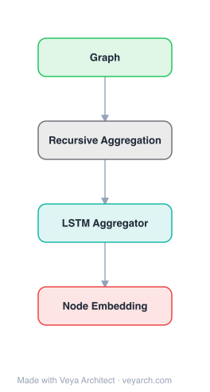

# Architecture: DRNE

## Motivation

Network embedding aims to preserve vertex similarity in an embedding space. Existing approaches almost universally define similarity via direct links or shared neighborhoods — i.e., structural equivalence. Two vertices are structurally equivalent if they share many of the same neighbors. Methods like DeepWalk, node2vec, LINE, and SDNE all preserve structural equivalence through first/second-order or higher-order proximities.

However, there are many cases where vertices have similar roles or occupy similar positions without sharing any common neighbors. For example, two mothers have the same pattern of connections (a husband and several children) but are not structurally equivalent if their relatives differ. These cases call for regular equivalence: two vertices are regularly equivalent if they have network neighbors that are themselves regularly equivalent. Regular equivalence is a relaxation of structural equivalence — it is more flexible and covers a broad range of network applications related to structural roles and node importance, yet it is largely ignored by the network embedding literature.

A straightforward way to preserve regular equivalence is to explicitly compute the regular equivalence of all vertex pairs and fit embeddings to it, but this is infeasible for large-scale networks due to high computational complexity. Replacing it with simpler centrality measures is also problematic because a single centrality captures only one aspect of network role, making it hard to learn general, task-independent embeddings. DRNE addresses this gap by exploiting the recursive definition of regular equivalence to learn embeddings via recursive neighbor aggregation.

## Core Idea

Recursive network embedding preserving regular equivalence via LSTM-based neighbor aggregation.

## Architecture

### Overview

<b>Layer-by-layer (4 nodes)</b>

| # | Layer | Type | Params |
|---|---|---|---|
| 1 | Graph | `input` |  |
| 2 | Recursive Aggregation | `custom` |  |
| 3 | LSTM Aggregator | `lstm` |  |
| 4 | Node Embedding | `output` |  |

DRNE (Deep Recursive Network Embedding) learns node embeddings that preserve regular equivalence by exploiting its recursive definition: two vertices are regularly equivalent if their neighbors are themselves regularly equivalent. Accordingly, DRNE represents each node by aggregating the embeddings of its neighbors in a recursive, non-linear way. Specifically, the neighbors of a node are transformed into an ordered sequence and fed into a layer-normalized LSTM, whose output serves as the target node's embedding. The model is trained so that the aggregated representation of a node's neighbors approximates the node's own embedding. The authors theoretically prove that several popular and typical centrality measures (which are consistent with regular equivalence) are optimal solutions of the model, and empirically show the learned embeddings well predict regular equivalence indices and multiple centrality scores. The representations can be directly used for end applications such as structural role classification.

### Components

1. **Neighbor Sequence Construction**:
   - For each node, its set of neighbors is transformed into an ordered sequence
   - The ordering provides a consistent input to the recurrent aggregator
   - Neighbors' current embeddings serve as the input sequence elements

2. **Layer-Normalized LSTM (aggregator)**:
   - A Long Short-Term Memory network with layer normalization processes the neighbor sequence
   - Layer normalization stabilizes and accelerates training of the recurrent aggregator
   - Non-linearly aggregates the neighbors' embeddings into a single vector
   - The LSTM's output (e.g., final hidden state) becomes the aggregated representation used to predict the target node's embedding
   - This recursive aggregation is the core mechanism that aligns with the recursive definition of regular equivalence

3. **Reconstruction Objective**:
   - The model is trained so that the aggregated representation of a node's neighbors approximates the node's own embedding
   - This self-referential objective encodes the recursive definition: a node's embedding is a function of its neighbors' embeddings
   - Enforces consistency between a node's role and the roles of its neighbors

4. **Degree-Based Regularization**:
   - To stabilize learning and align with centrality notions, degree information is incorporated as a regularizer
   - Helps the model converge to solutions consistent with regular-equivalence-aligned centrality measures

5. **Negative Sampling / Constraint**:
   - To avoid trivial solutions and make the embeddings discriminative, constraints or negative sampling are applied
   - Prevents all nodes from collapsing to the same representation

### Data Flow

1. **Input**: Graph G = (V, E) with adjacency matrix A
2. **Neighbor extraction**: For each node v, collect its set of neighbors N(v)
3. **Sequence ordering**: Transform N(v) into an ordered sequence of neighbor embeddings (using the current embeddings of the neighbors)
4. **LSTM aggregation**: Feed the ordered neighbor-embedding sequence into the layer-normalized LSTM → obtain an aggregated vector h_v
5. **Reconstruction**: The aggregated vector h_v is used to reconstruct/predict the embedding of node v itself
6. **Loss computation**: Minimize the reconstruction error (aggregated-from-neighbors representation vs. node's own embedding), plus degree regularization and constraints
7. **Backprop**: Update the LSTM parameters (and embeddings, depending on formulation) via gradient descent
8. **Inference**: The learned LSTM aggregator produces each node's embedding from its neighbors' embeddings; the resulting representations preserve regular equivalence and centrality, usable for structural role classification and other tasks

### State / Memory

- **Recurrent memory within aggregation**: The layer-normalized LSTM maintains hidden state across the neighbor sequence during a single aggregation pass. This is transient, per-node aggregation memory — it processes the ordered neighbors and is reset for the next node.
- **Recursive (cross-node) dependency**: A node's embedding depends on its neighbors' embeddings, which in turn depend on their neighbors' embeddings — a recursive dependency that is resolved iteratively during training. This is the structural "memory" of the network's role structure.
- **Persistent parameters**: The weights of the layer-normalized LSTM are the learned, persistent parameters. They define the aggregation function that maps a set of neighbor embeddings to a node's embedding.
- **Per-node embeddings**: Depending on the formulation, node embeddings may be persistent parameters (transductive) or derived via the aggregator. The recursive structure means embeddings are interdependent.

## Design Decisions

1. **Recursive aggregation aligned with regular equivalence** — Theoretical grounding:
   - The recursive definition of regular equivalence ("neighbors of regularly equivalent nodes are regularly equivalent") maps directly to recursive neighbor aggregation
   - The authors prove that typical centrality measures consistent with regular equivalence are optimal solutions of the model
   - Provides a principled bridge between network role theory and representation learning

2. **LSTM as the aggregator** — Non-linear, sequence-capable:
   - An LSTM naturally processes a variable-length sequence of neighbor embeddings
   - Non-linear aggregation captures complex role patterns beyond simple mean/sum pooling
   - Layer normalization stabilizes recurrent training, which is otherwise hard

3. **Layer normalization** — Training stability:
   - Recurrent networks are notoriously hard to train; layer norm stabilizes activations
   - Enables deeper/more stable aggregation without vanishing/exploding gradients
   - Critical for the recursive/iterative nature of the objective

4. **Neighbor ordering** — Consistent input:
   - Transforming the neighbor set into an ordered sequence gives the LSTM a consistent input structure
   - Ordering may be by degree or another criterion to reduce variance

5. **Reconstruction objective** — Self-referential consistency:
   - Training the aggregator so that neighbors' aggregated representation predicts the node's own embedding encodes the recursive definition directly
   - Avoids the need to explicitly compute regular equivalence (which is infeasible at scale)

6. **Degree regularization** — Centrality alignment:
   - Incorporating degree information helps the model converge to centrality-consistent solutions
   - Supports the theoretical guarantees about centrality measures

## Evolution

**Predecessors:**
- **DeepWalk** (Perozzi et al., 2014) & **node2vec** (Grover & Leskovec, 2016) — Random-walk + Skip-Gram; preserve structural equivalence.
- **LINE** (Tang et al., 2015) — First/second-order proximity; structural equivalence.
- **SDNE** (Wang et al., 2016) — Deep autoencoder; first/second-order proximity; structural equivalence.
- **M-NMF** (Wang et al., 2016) — Incorporates community structure into embedding.
- **Structural/regular equivalence theory** (Lorrain & White, 1971; White & Reitz, 1983) — The sociological foundation for regular equivalence that DRNE operationalizes.
- **Centrality measures** (degree, betweenness, eigenvector, PageRank) — Role/importance metrics that DRNE unifies into a learned representation.
- **GraphSAGE** (Hamilton et al., 2017) — Neighborhood aggregation for inductive embedding; a contemporary aggregation-based method (but focused on structural equivalence and supervised tasks).

**Successors:**
- **Role-based network embedding** — Subsequent work on structural role discovery and role-aware embeddings builds on DRNE's regular-equivalence framing.
- **Graph neural networks with recurrent aggregation** — Aggregation-based GNNs that use recurrent/sequence models over neighbors.
- **Centrality-aware graph representation learning** — Methods that explicitly incorporate centrality/role signals into learned representations.

## Characteristics

| Property | Value |
|----------|-------|
| Year | 2018 |
| Authors | Ke Tu, Peng Cui, Xiao Wang, Philip S. Yu, Wenwu Zhu (Tsinghua University / UIC) |
| Category | GNN/Embedding |
| Source Paper | `Deep_recursive_network_embedding_with_regular_equivalence_Cui_Wang_Yu_etal_2018.md` |
| PaperVault Path | `GNN/02-network-embedding/Deep_recursive_network_embedding_with_regular_equivalence_Cui_Wang_Yu_etal_2018.md` |

## Limitations

1. **Transductive** — DRNE learns embeddings for observed nodes and does not naturally generalize to unseen nodes without retraining, unlike attribute-encoder-based inductive methods.
2. **Computational cost of recursive dependency** — The interdependence between node embeddings (each depends on its neighbors') makes training iterative and potentially expensive on large graphs.
3. **Neighbor ordering sensitivity** — Transforming a neighbor set into an ordered sequence introduces an ordering choice; different orderings may affect aggregation results, and the LSTM is not permutation-invariant.
4. **Static networks only** — Designed for static graphs; does not handle networks that evolve over time.
5. **No attribute utilization** — DRNE focuses on structure-based regular equivalence and does not leverage node attributes that could complement role discovery.
6. **LSTM training difficulty** — Despite layer normalization, recurrent aggregation over large neighborhoods can still be hard to train and scale.
7. **Centrality alignment is indirect** — While the model's optimal solutions include centrality measures, the learned representation may not perfectly correspond to any single interpretable centrality, complicating analysis.

## Implementation Notes

See `implementation/` for a minimal runnable implementation. Key details:
- Each node's embedding = aggregation of its neighbors' embeddings via a layer-normalized LSTM
- Neighbors transformed into an ordered sequence before LSTM processing
- Reconstruction objective: aggregated neighbor representation ≈ node's own embedding
- Degree regularization aligns with centrality measures
- Theoretically proven: typical centrality measures (consistent with regular equivalence) are optimal solutions
- Learned embeddings predict regular equivalence indices and multiple centrality scores
- Directly usable for structural role classification
- Outperforms single centrality measures, combinations of centralities, and other network embedding methods on structural role classification
- Applicable to plain graphs (no attributes required)

## Information Layers

- **Evidence:** Source paper available in `references/papers/` (Tu, Cui, Wang, Yu, Zhu, 2018, "Deep Recursive Network Embedding with Regular Equivalence", KDD '18)
- **Analysis:** DRNE's central insight is that the recursive definition of regular equivalence can be operationalized directly as a recursive neighbor-aggregation model. Instead of explicitly computing expensive pairwise regular equivalence scores, the model learns an aggregator (a layer-normalized LSTM) that derives a node's embedding from its neighbors' embeddings — mirroring the definition "regularly equivalent nodes have regularly equivalent neighbors." The theoretical result that centrality measures are optimal solutions gives the method a principled grounding: the learned representation unifies multiple role/importance signals into a single vector. Empirically, the embeddings predict regular equivalence indices and centrality scores and outperform centrality-based and embedding baselines on structural role classification, confirming that recursive aggregation captures role structure that structural-equivalence methods miss.
- **Hypothesis:** The success of DRNE suggests that the right inductive bias for role-aware network embedding is recursion — the role of a node is defined by the roles of its neighbors, making recursive aggregation a natural fit. The unification of centrality measures into a learned representation implies that role importance is multi-dimensional and best captured jointly rather than via a single metric. A limitation is the lack of permutation invariance (LSTM over an ordered sequence), suggesting that set-/graph-attention-based aggregators could improve robustness.
