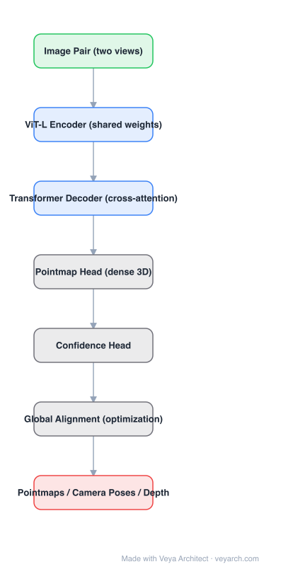

# Architecture: DUSt3R

## Motivation

Classical 3D reconstruction (SfM / MVS) is a cascade: estimate keypoints and matches, solve relative pose, triangulate, bundle-adjust. Each stage has failure modes (textureless regions, repetitive patterns) and the whole pipeline assumes calibration. DUSt3R relaxes the problem: from two unposed, uncalibrated images, learn to regress 3D directly, and let pose/depth/intrinsics be *derived* from the output.

## Core Idea

Predict **pointmaps** instead of depth or disparity. A pointmap assigns a 3D point to every pixel of a view, expressed in the coordinate frame of the other view. Because both views' pointmaps live in a shared frame, camera pose, intrinsics, and depth are all recoverable from them — the representation is richer than depth and is learnable end-to-end with a simple 3D regression loss.

## Architecture

### Overview

<b>Layer-by-layer (7 nodes)</b>

| # | Layer | Type | Params |
|---|---|---|---|
| 1 | Image Pair (two views) | `input` |  |
| 2 | ViT-L Encoder (shared weights) | `conv2d` |  |
| 3 | Transformer Decoder (cross-attention) | `attention` |  |
| 4 | Pointmap Head (dense 3D) | `custom` |  |
| 5 | Confidence Head | `custom` |  |
| 6 | Global Alignment (optimization) | `custom` |  |
| 7 | Pointmaps / Camera Poses / Depth | `output` |  |

### Components

1. **Siamese encoder (ViT-L)** — both images are encoded by a ViT-Large with **shared weights** (patch embedding, then transformer blocks). Sharing enforces a common feature space across views.
2. **Cross-attention decoder** — a transformer decoder whose blocks alternate self-attention on each view's tokens and **cross-attention between the two views**. This is where geometric reasoning happens: each view's tokens can directly attend to the other view.
3. **Pointmap head** — a regression head producing a dense 3D point per pixel for each view (X^{1,1}, X^{2,1} in view-1 coordinates; symmetric heads give X^{1,2}, X^{2,2}).
4. **Confidence head** — predicts per-pixel confidence used to weight the regression loss, letting the model de-weight ambiguous or textureless regions.
5. **Global alignment (multi-view)** — for more than two views, pairwise pointmaps are aligned into a common frame by optimization, yielding a globally consistent reconstruction.

### Data Flow

Two images → shared ViT-L encoder → two token sets → decoder with alternating self- and cross-attention → pointmap heads + confidence heads → pointmaps in a shared frame → downstream: depth, camera pose/intrinsics, dense reconstruction. For N views, pairwise passes feed global alignment.

### State / Memory

No recurrent state. For multi-view input, the "state" is the set of pairwise pointmaps consumed by the global alignment optimization, which is a post-hoc optimization step rather than a learned module.

## Design Decisions

- **Pointmap over depth**: a pointmap is view-conditioned and therefore carries the cross-view transform implicitly; depth alone would not.
- **Shared siamese weights**: halves parameters and makes the two branches symmetric, which matches the symmetric nature of two-view geometry.
- **Confidence-weighted regression**: necessary because many pixels (sky, textureless walls) have no well-defined 3D position.
- **Optimization instead of learned global fusion**: multi-view consistency is solved as alignment, keeping the learned part pairwise and simple.

## Evolution

- **SfM / MVS pipelines** (predecessors): keypoint → matching → pose → triangulation → bundle adjustment.
- **DUSt3R**: feed-forward pairwise pointmap regression, the first model to make calibration-free reconstruction practical.
- **MASt3R**: adds a second head for local features and matching, improving accuracy and enabling retrieval-like use.
- **Spann3R / Fast3R**: extend from pairs to many views in one forward pass.
- **VGGT**: large feed-forward transformer producing all 3D attributes (camera, depth, pointmaps, tracks) in one pass.

## Characteristics

| Property | Value |
|---|---|
| Task | calibration-free two-view (and multi-view) 3D reconstruction |
| Encoder | ViT-Large, shared weights |
| Decoder | transformer with alternating self-/cross-attention |
| Heads | pointmap (dense 3D) + confidence |
| Input assumptions | none on camera intrinsics or poses |
| Multi-view | pairwise inference + global alignment |

## Limitations

- The core network is pairwise; cost grows with the number of views and global alignment is required.
- Scale is only defined up to the pairwise reconstruction; metric scale needs extra information.
- No explicit camera model is learned, so pose/intrinsics are derived numerically from pointmaps.
- High-resolution reconstruction is limited by the token count and memory of the cross-attention decoder.

## Implementation Notes

The minimal form that demonstrates the idea: two images through one shared ViT encoder, a decoder with cross-attention between view tokens, and a regression head predicting 3D coordinates per pixel with a confidence-weighted L1-style loss. Add global alignment as a separate optimization step to handle more than two views.
