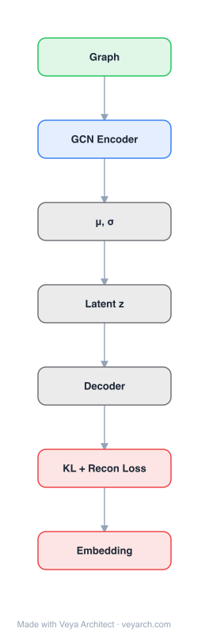

# Architecture: DVNE

## Motivation

Network embedding aims to embed a network into a low-dimensional vector space while preserving inherent structural properties. Most existing methods represent each node as a single point vector, making edge formation deterministic and solely determined by node positions. However, the formation and evolution of real-world networks are full of uncertainties: low-degree nodes contain less information and thus their representations bear more uncertainty; nodes spanning multiple communities face contradicting neighbor signals; and human behavior in social networks is multi-faceted, making edge generation inherently uncertain. Without modeling this uncertainty, learned embeddings are less effective for network analysis and inference.

Prior attempts to use Gaussian distributions for nodes (e.g., Graph2Gauss) measure distribution similarity with Kullback-Leibler (KL) divergence, which has critical drawbacks: it is asymmetric and does not satisfy the triangle inequality, so it cannot preserve transitivity in networks (especially undirected ones). These methods also treat variance as just additional mean-vector dimensions and fail to capture the intrinsic relationship between mean and variance. Finally, few preserve high-order proximity, and those that do (like Graph2Gauss) require computing shortest paths between all node pairs — unaffordable at scale.

DVNE addresses all these gaps by learning a Gaussian embedding in Wasserstein space: it uses the 2-Wasserstein distance (a true metric satisfying the triangle inequality) to preserve transitivity, employs a deep variational model to capture the intrinsic mean–variance relationship, and preserves both first- and second-order proximity to capture local and global structure, all with linear computational cost.

## Core Idea

Variational network embedding in Wasserstein space preserving second-order proximity via distribution matching.

## Architecture

### Overview

<b>Layer-by-layer (7 nodes)</b>

| # | Layer | Type | Params |
|---|---|---|---|
| 1 | Graph | `input` |  |
| 2 | GCN Encoder | `gcn_conv` |  |
| 3 | μ, σ | `custom` |  |
| 4 | Latent z | `custom` |  |
| 5 | Decoder | `custom` |  |
| 6 | KL + Recon Loss | `loss` |  |
| 7 | Embedding | `output` |  |

DVNE (Deep Variational Network Embedding in Wasserstein Space) learns, for each node, a Gaussian distribution in the Wasserstein space as its latent representation. The mean vector encodes the node's position and the variance encodes its uncertainty. The method is built on a deep variational model that minimizes the Wasserstein distance between the model distribution and the data distribution, which naturally extracts the intrinsic relationship between mean and variance. Similarity between node embeddings is measured with the 2-Wasserstein distance, which is a true metric and thus preserves transitivity. The framework preserves both first-order proximity (direct edges) and second-order proximity (shared neighborhood structure), capturing local and global network structure respectively.

### Components

1. **Deep Variational Model (Encoder)**:
   - A deep neural network that maps each node's input representation to the parameters (mean μ and variance σ²) of a Gaussian latent distribution
   - The variational formulation minimizes the Wasserstein distance between the model (posterior) distribution and the data distribution
   - This naturally couples mean and variance: the mean reflects the node's position, the variance reflects its uncertainty — they are not independent parameters but linked through the variational objective

2. **Gaussian Latent Embedding (per node)**:
   - Each node i is represented as a Gaussian N(μᵢ, σᵢ²) in the Wasserstein space
   - Mean μᵢ ∈ R^d: encodes the node's position in the embedding space
   - Variance σᵢ²: encodes the uncertainty of that position
   - The distributional representation captures uncertainty that point vectors cannot

3. **2-Wasserstein Distance (similarity measure)**:
   - The 2-Wasserstein distance between two Gaussians N(μ₁, Σ₁) and N(μ₂, Σ₂) measures their dissimilarity
   - It is a true metric: symmetric and satisfies the triangle inequality
   - Preserves transitivity in networks (friend-of-friend is more likely a friend)
   - Has a closed-form for Gaussians, enabling linear computational cost
   - Overcomes the asymmetry and triangle-inequality violation of KL divergence

4. **First-Order Proximity Preservation**:
   - Captures local structure: directly connected nodes should be close in the embedding space
   - Enforced via a loss that pulls embeddings of adjacent nodes together
   - For edge (u, v), minimizes the Wasserstein distance between their Gaussian embeddings

5. **Second-Order Proximity Preservation**:
   - Captures global structure: nodes sharing similar neighborhoods should have similar embeddings
   - Preserved through the variational model and the reconstruction/structure objective
   - Complements first-order to capture both local and global network structure

6. **Negative Sampling**:
   - To avoid O(N²) computation, non-adjacent node pairs are sampled as negatives
   - Pushes their Gaussian embeddings apart in Wasserstein space

### Data Flow

1. **Input**: Network with adjacency matrix A ∈ R^{N×N} (and optionally node features)
2. **Variational encoding**: For each node i, the deep variational encoder produces the mean μᵢ and variance σᵢ² of its Gaussian latent representation
3. **Sampling latent vectors**: Latent embeddings zᵢ are sampled from N(μᵢ, σᵢ²) via the reparameterization trick (z = μ + σε)
4. **First-order proximity loss**: For observed edges (u, v), minimize the 2-Wasserstein distance between the Gaussian embeddings of u and v
5. **Second-order proximity loss**: Preserve shared-neighborhood structure via the variational reconstruction objective
6. **Negative sampling**: Sample non-edge pairs and push their embedding distributions apart
7. **Wasserstein distance computation**: Compute closed-form 2-Wasserstein distance between Gaussian pairs
8. **Backprop**: Update encoder weights via the combined loss (first-order + second-order + variational)
9. **Inference**: Use the mean μᵢ as the node's point representation, or the full distribution N(μᵢ, σᵢ²) when uncertainty matters

### State / Memory

- **No recurrent state**: The encoder is a feedforward deep network; no temporal memory across nodes or time steps.
- **Persistent parameters**: The weights of the deep variational encoder are the learned, persistent parameters. They define the mapping from node input to Gaussian parameters.
- **Latent distributions are derived**: The per-node Gaussian parameters (μᵢ, σᵢ²) are computed by the encoder; the mean μᵢ serves as the usable embedding vector, while σᵢ² quantifies uncertainty.
- **Network structure as supervision**: The adjacency matrix (first-order) and neighborhood similarity (second-order) provide the fixed supervisory signal; they are not learned state but structure memory.

## Design Decisions

1. **2-Wasserstein distance over KL divergence** — Preserves transitivity:
   - The 2-Wasserstein distance is a true metric (symmetric, triangle inequality)
   - Triangle inequality preserves network transitivity ("friend of a friend is more likely a friend")
   - KL divergence is asymmetric and violates triangle inequality, breaking transitivity in undirected networks
   - Closed-form for Gaussians gives linear computational cost

2. **Deep variational model** — Captures intrinsic mean–variance relationship:
   - Minimizing Wasserstein distance between model and data distributions naturally couples mean and variance
   - The mean encodes position; the variance encodes uncertainty — they are meaningfully linked, not independent
   - Prior Gaussian-embedding methods treated variance as extra mean dimensions, losing this relationship

3. **First- and second-order proximity** — Local + global structure:
   - First-order (direct edges) captures local pairwise relationships
   - Second-order (shared neighborhoods) captures global community structure
   - Together they yield embeddings reflecting both local and global network structure

4. **Gaussian distributions over point vectors** — Models uncertainty:
   - Low-degree nodes, multi-community nodes, and multi-faceted behavior all produce inherent uncertainty
   - Variance captures this; point vectors cannot
   - Improves effectiveness on link prediction and multi-label classification

5. **Linear computational cost** — Scalability:
   - Closed-form 2-Wasserstein distance for Gaussians avoids the all-pairs shortest-path cost of Graph2Gauss
   - Negative sampling avoids O(N²) pairwise computation
   - Scales to large real-world networks

## Evolution

**Predecessors:**
- **DeepWalk** (Perozzi et al., 2014) & **node2vec** (Grover & Leskovec, 2016) — Random-walk + Skip-Gram point embeddings; transductive.
- **LINE** (Tang et al., 2015) — First- and second-order proximity; point embeddings.
- **SDNE** (Wang et al., 2016) — Deep autoencoder for first/second-order proximity; point embeddings.
- **Graph2Gauss** (Bojchevski & Günnemann, 2017) — First to embed nodes as Gaussian distributions; uses KL divergence (asymmetric, no triangle inequality) and requires all-pairs shortest paths — the direct predecessor whose limitations DVNE addresses.
- **Variational Autoencoders** (Kingma & Welling, 2013) — The variational inference foundation DVNE builds on.
- **Wasserstein GANs / Optimal transport** — Established the 2-Wasserstein distance as a principled distribution metric.

**Successors:**
- **Probabilistic/uncertainty-aware graph embeddings** — Subsequent work on distributional node representations builds on the Wasserstein-space formulation.
- **Graph VAE variants** — Extended variational graph embedding with Wasserstein geometry.
- **Optimal-transport-based graph learning** — Broader adoption of Wasserstein distances in graph representation learning.

## Characteristics

| Property | Value |
|----------|-------|
| Year | 2018 |
| Authors | Dingyuan Zhu, Peng Cui, Daixin Wang, Wenwu Zhu (Tsinghua University) |
| Category | GNN/Embedding |
| Source Paper | `Deep_Variational_Network_Embedding_in_Wasserstein_Space_Cui_Wang_Zhu_2018.md` |
| PaperVault Path | `GNN/02-network-embedding/Deep_Variational_Network_Embedding_in_Wasserstein_Space_Cui_Wang_Zhu_2018.md` |

## Limitations

1. **KL-divergence predecessors not fully overcome for all tasks** — While 2-Wasserstein preserves transitivity, the variational training objective still involves distributional assumptions that may not perfectly match all network generative processes.
2. **Diagonal covariance simplification** — Typically uses diagonal covariance for tractability, which cannot capture correlations between embedding dimensions, potentially understating uncertainty for some nodes.
3. **Negative sampling approximation** — Relies on negative sampling for scalability, which introduces variance in gradient estimates and may miss hard negatives.
4. **No inductive generalization** — DVNE is transductive: it learns embeddings for observed nodes and does not naturally generalize to unseen nodes without retraining (unlike attribute-encoder-based methods such as Graph2Gauss or GraphSAGE).
5. **Fixed graph assumption** — Designed for static networks; does not handle networks that evolve over time.
6. **Hyperparameter sensitivity** — Balancing first-order, second-order, and variational losses requires tuning that may not transfer across datasets.

## Implementation Notes

See `implementation/` for a minimal runnable implementation. Key details:
- Each node embedded as a Gaussian N(μᵢ, σᵢ²) in Wasserstein space
- Deep variational encoder maps node input → (μᵢ, σᵢ²)
- 2-Wasserstein distance (closed-form for Gaussians) as the similarity measure — true metric, preserves transitivity
- First-order proximity: pull adjacent nodes' embeddings together
- Second-order proximity: preserve shared-neighborhood structure
- Negative sampling for non-edges
- Linear computational cost via closed-form Wasserstein distance
- Reparameterization trick for end-to-end training
- Outperforms DeepWalk, LINE, node2vec, SDNE, Graph2Gauss on link prediction and multi-label classification
- Mean μᵢ used as point representation; variance σᵢ² quantifies uncertainty

## Information Layers

- **Evidence:** Source paper available in `references/papers/` (Zhu, Cui, Wang, Zhu, 2018, "Deep Variational Network Embedding in Wasserstein Space", KDD '18)
- **Analysis:** DVNE's key insight is that the choice of distribution distance matters as much as the choice to use distributions at all. KL divergence — used by prior Gaussian-embedding methods — is asymmetric and violates the triangle inequality, which breaks network transitivity in the embedding space. By switching to the 2-Wasserstein distance, DVNE obtains a true metric that preserves the "friend-of-a-friend" transitivity critical to social and information networks. The deep variational formulation additionally ties mean and variance together through a principled objective, so uncertainty (variance) is not a free parameter but is shaped by the data distribution. Empirically, DVNE shows substantial gains on link prediction and multi-label classification, confirming that modeling uncertainty with the right geometry improves downstream tasks.
- **Hypothesis:** The success of DVNE suggests that preserving metric properties (symmetry, triangle inequality) in the embedding space is essential for network tasks that rely on transitivity. The coupling of mean and variance through variational inference implies that uncertainty is not independent of position — nodes in ambiguous structural positions naturally acquire higher variance. A remaining limitation is the lack of inductive generalization, suggesting that combining Wasserstein-space distributions with an attribute encoder (as in Graph2Gauss) could yield a method that is both uncertainty-aware and inductive.
