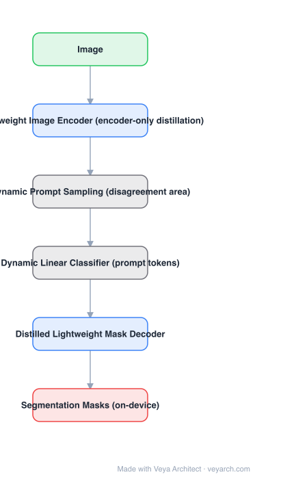

# Architecture: EdgeSAM

## Motivation

Distilling SAM for a phone has two problems that encoder-only distillation ignores: (1) uniform distillation spends equal effort on regions the student already gets right, and (2) SAM's mask decoder is not free — on-device you need it distilled too. EdgeSAM's answer is to put the **prompt back into the training loop**: sample prompts where teacher and student *disagree*, and make the student's decoder learn from those specific prompts.

## Core Idea

**Encoder-only distillation** for the image embedding (no teacher forward per prompt), plus **prompt-in-the-loop distillation**: a dynamic prompt-sampling strategy generates diverse prompt combinations drawn from the teacher-student disagreement region, and a **dynamic linear classifier** turns those prompt positions into tokens for the student. All prompt machinery is disabled at inference, so the shipped model is encoder + lightweight decoder.

## Architecture

### Overview

<b>Layer-by-layer (6 nodes)</b>

| # | Layer | Type | Params |
|---|---|---|---|
| 1 | Image | `input` |  |
| 2 | Lightweight Image Encoder (encoder-only distillation) | `conv2d` |  |
| 3 | Dynamic Prompt Sampling (disagreement area) | `custom` |  |
| 4 | Dynamic Linear Classifier (prompt tokens) | `custom` |  |
| 5 | Distilled Lightweight Mask Decoder | `attention` |  |
| 6 | Segmentation Masks (on-device) | `output` |  |

### Components

1. **Lightweight image encoder (student)** — distilled to match SAM's image embedding; the heavy teacher encoder is what we are removing from the runtime.
2. **Distilled lightweight mask decoder (student)** — the decoder is distilled as well, not only the encoder; this is what EdgeSAM adds over MobileSAM.
3. **Dynamic prompt sampling** — generates prompt sets (points/boxes) preferentially in the area where teacher and student masks disagree, focusing training signal where it matters.
4. **Dynamic linear classifier** — substitutes for SAM's prompt encoder: generates the prompt token on the fly from the prompt geometry, and is switched off at inference.
5. **Teacher (SAM, frozen)** — provides target embeddings and masks during distillation only.
6. **Disagreement-driven curriculum** — prompt combinations evolve during training as the student improves.

### Data Flow

Image → student encoder → embedding (+ teacher embedding target for the encoder loss) → dynamic prompt sampling picks prompts → dynamic linear classifier makes tokens → student decoder → mask (+ teacher mask target). At inference: image → encoder → decoder → mask, with the prompt path removed.

### State / Memory

No temporal state. The only persistent structure is the cached image embedding; the prompt-sampling and classifier modules exist only in the training graph.

## Design Decisions

- **Distill the decoder too** — the encoder is the headline cost, but a phone cannot run SAM's decoder either.
- **Prompts in the loop** — the student must be trained on the prompts it will actually receive, not on a static set.
- **Focus on disagreement** — sampling from disagreement areas is a cheap curriculum that beats uniform prompt sampling.
- **Train-time-only prompt modules** — inference keeps a plain encoder+decoder, so no dynamic-classifier cost ships.

## Evolution

- **SAM (2023)** (predecessor): ViT-H encoder + heavy decoder.
- **MobileSAM (2023)**: decoupled encoder distillation; decoder untouched.
- **EdgeSAM (2023)**: adds decoder distillation, dynamic prompt sampling, dynamic linear classifier.
- **Siblings**: EfficientSAM (SAMI pretraining), FastSAM (CNN-based), SAM-HQ (quality), RepViT-SAM (CNN encoder for SAM).
- **Successors**: MobileSAMv2 (prompt-aware sampling), on-device SAM variants in mobile SDKs.

## Characteristics

| Property | Value |
|---|---|
| Task | promptable segmentation on device |
| Encoder | lightweight, encoder-only distillation |
| Decoder | distilled lightweight decoder |
| Prompt handling | dynamic prompt sampling + dynamic linear classifier (training only) |
| Inference | plain encoder + decoder; prompt modules off |
| Reported latency | tens of ms on mobile hardware |

## Limitations

- Quality below SAM and generally below EfficientSAM at similar sizes (pretraining vs. distillation trade-off).
- The disagreement-sampling strategy adds training complexity and new hyperparameters.
- Prompt *types* are limited to what the dynamic classifier was trained for (points/boxes, as reported).
- Image-only: no video memory, no concept prompts.

## Implementation Notes

Essentials: (1) precompute teacher embeddings so encoder distillation never re-runs SAM's ViT-H, (2) implement dynamic prompt sampling against the teacher-student mask disagreement map, (3) replace the prompt encoder with a dynamic linear classifier over prompt geometry, (4) train encoder and decoder losses jointly, (5) export with the prompt modules stripped and verify latency on the target device — the claim is on-device, so measure on-device.
