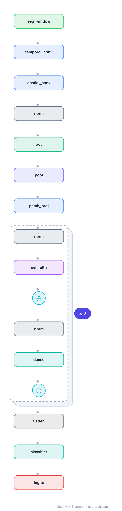

# Architecture: EEG Conformer

## Motivation

Convolution meets attention for EEG decoding: an EEGNet-style conv stem tokenizes the signal, then a Transformer encoder models long-range temporal dependencies. State of the art on motor-imagery benchmarks.

## Core Idea

Convolution meets attention for EEG decoding: an EEGNet-style conv stem tokenizes the signal, then a Transformer encoder models long-range temporal dependencies.

## Architecture

### Overview

<b>Layer-by-layer (22 nodes)</b>

| # | Layer | Type | Params |
|---|---|---|---|
| 1 | eeg_window | `input` | shape: [1, 22, 1000] |
| 2 | temporal_conv | `conv2d` | outChannels: 40, kernelSize: [1, 25], stride: 1, padding: 0, inChannels: 1 |
| 3 | spatial_conv | `conv2d` | outChannels: 40, kernelSize: [22, 1], stride: 1, padding: 0, inChannels: 40 |
| 4 | norm | `batchNorm` | normalizedShape: 40 |
| 5 | act | `elu` |   |
| 6 | pool | `avgpool2d` | kernelSize: [1, 75], stride: [1, 15] |
| 7 | patch_proj | `conv2d` | outChannels: 40, kernelSize: [1, 1], stride: 1, padding: 0, inChannels: 40 |
| 8 | norm | `layerNorm` | normalizedShape: 40 |
| 9 | self_attn | `multiHeadAttention` | embedDim: 40, numHeads: 10 |
| 10 | residual | `add` |   |
| 11 | norm | `layerNorm` | normalizedShape: 40 |
| 12 | dense | `feedForward` | embedDim: 40, ffDim: 160 |
| 13 | residual | `add` |   |
| 14 | norm | `layerNorm` | normalizedShape: 40 |
| 15 | self_attn | `multiHeadAttention` | embedDim: 40, numHeads: 10 |
| 16 | residual | `add` |   |
| 17 | norm | `layerNorm` | normalizedShape: 40 |
| 18 | dense | `feedForward` | embedDim: 40, ffDim: 160 |
| 19 | residual | `add` |   |
| 20 | flatten | `flatten` |   |
| 21 | classifier | `linear` | outFeatures: 4, inFeatures: NaN |
| 22 | logits | `output` |   |

This graph ships in Neurarch's in-app template library; the copy here passes shape propagation with zero errors.

### Design Notes

- The conv stem does what patching does for ViT: turns raw 1000Hz multichannel EEG into a short token sequence the Transformer can afford.
- Pairs with [eegnet](../eegnet/) as the "before and after attention" story for biosignal models.

## Design Decisions

> **Analysis** — Observations derived from studying the architecture.

- The conv stem does what patching does for ViT: turns raw 1000Hz multichannel EEG into a short token sequence the Transformer can afford.
- Pairs with [eegnet](../eegnet/) as the "before and after attention" story for biosignal models.

## Implementation Notes

- `model.json` contains the full structural graph with real dimensions and parameters.
- Open in [Neurarch](https://www.neurarch.com/) to visualize, edit, or export training code.
- Diagrams fold repeated identical blocks with a `× N` badge; `model.json` holds all nodes at real dimensions.

## Limitations

- This package focuses on the architectural structure. Training pipelines, 
dataset preparation, and production optimizations are out of scope.

## Evolution

> See `references/related/` for predecessor and successor architectures.

