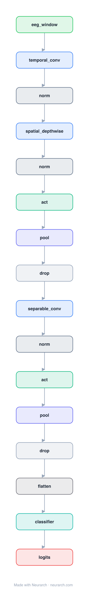

# Architecture: EEGNet

## Motivation

The compact CNN that became the universal baseline for EEG brain-computer interfaces: temporal conv, depthwise spatial conv across electrodes, separable conv, all in a few thousand parameters.

## Core Idea

The compact CNN that became the universal baseline for EEG brain-computer interfaces: temporal conv, depthwise spatial conv across electrodes, separable conv, all in a few thousand parameters.

## Architecture

### Overview

<b>Layer-by-layer (16 nodes)</b>

| # | Layer | Type | Params |
|---|---|---|---|
| 1 | eeg_window | `input` | shape: [1, 22, 1000] |
| 2 | temporal_conv | `conv2d` | outChannels: 8, kernelSize: [1, 64], stride: 1, padding: [0, 32], inChannels: 1 |
| 3 | norm | `batchNorm` | normalizedShape: 8 |
| 4 | spatial_depthwise | `depthwiseConv2d` | outChannels: 16, kernelSize: [22, 1], stride: 1, padding: 0, depthMultiplier: 2 |
| 5 | norm | `batchNorm` | normalizedShape: 16 |
| 6 | act | `elu` |   |
| 7 | pool | `avgpool2d` | kernelSize: [1, 4], stride: [1, 4] |
| 8 | drop | `dropout` | p: 0.25 |
| 9 | separable_conv | `separableConv2d` | outChannels: 16, kernelSize: [1, 16], stride: 1, padding: [0, 8] |
| 10 | norm | `batchNorm` | normalizedShape: 16 |
| 11 | act | `elu` |   |
| 12 | pool | `avgpool2d` | kernelSize: [1, 8], stride: [1, 8] |
| 13 | drop | `dropout` | p: 0.25 |
| 14 | flatten | `flatten` |   |
| 15 | classifier | `linear` | outFeatures: 4, inFeatures: NaN |
| 16 | logits | `output` |   |

This graph ships in Neurarch's in-app template library; the copy here passes shape propagation with zero errors.

### Design Notes

- Depthwise convolution across the electrode dimension learns spatial filters per temporal filter, mirroring classical CSP pipelines.
- Small enough to train on single-subject EEG datasets (hundreds of trials), which is the whole point.

## Design Decisions

> **Analysis** — Observations derived from studying the architecture.

- Depthwise convolution across the electrode dimension learns spatial filters per temporal filter, mirroring classical CSP pipelines.
- Small enough to train on single-subject EEG datasets (hundreds of trials), which is the whole point.

## Implementation Notes

- `model.json` contains the full structural graph with real dimensions and parameters.
- Open in [Neurarch](https://www.neurarch.com/) to visualize, edit, or export training code.
- Diagrams fold repeated identical blocks with a `× N` badge; `model.json` holds all nodes at real dimensions.

## Limitations

- This package focuses on the architectural structure. Training pipelines, 
dataset preparation, and production optimizations are out of scope.

## Evolution

> See `references/related/` for predecessor and successor architectures.

