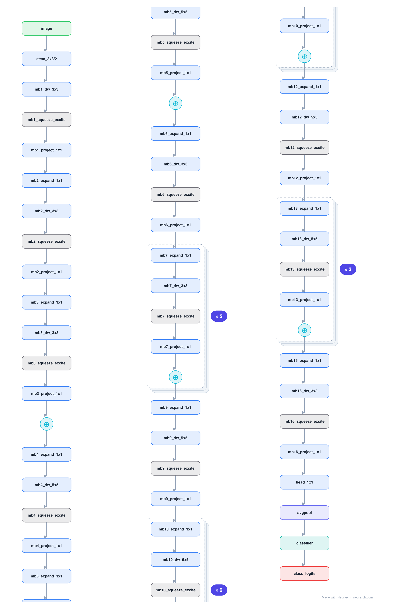

# Architecture: EfficientNet-B0

## Motivation

The baseline of the EfficientNet family: MBConv blocks (mobile inverted bottleneck with a squeeze-and-excite gate) discovered by neural architecture search, then compound-scaled into B1-B7. The accuracy-per-FLOP reference for years.

## Core Idea

The baseline of the EfficientNet family: MBConv blocks (mobile inverted bottleneck with a squeeze-and-excite gate) discovered by neural architecture search, then compound-scaled into B1-B7.

## Architecture

### Overview

*Identical repeated blocks are folded into one representative block with a `× N` badge, so the whole architecture fits on screen. `model.json` uses NAXS block templates + `repeat` directives and expands back to all 78 nodes (open it in Neurarch to see and edit every layer). Vector: [diagram.svg](assets/diagram.svg).*

| Hyperparameter | Value |
|---|---|
| Type | Efficient convolutional network |
| Parameters | 5.3M |
| Stem | 3x3/2 conv (32) |
| Body | 16 MBConv blocks (7 stages) |
| MBConv | expand 1x1 → depthwise → squeeze-excite → project 1x1 |
| Head | 1x1 conv (1280) → GAP → FC-1000 |
| Found by | Compound-scaling NAS |

`model.json` is the full graph, hand-built against the official config.json.

### Design Notes

- MBConv = MobileNetV2's inverted residual plus a squeeze-and-excite channel-attention block inside each one.
- B0 was found by NAS; B1-B7 just scale depth, width, and resolution together by a single compound coefficient.
- Compare with [mobilenet-v2](../mobilenet-v2/) (same inverted-residual core, no SE) and [resnet-50](../resnet-50/) (the non-inverted predecessor).

### Parameter Check

Neurarch's per-layer parameter estimate over this graph: **8.4M**.

## Design Decisions

> **Analysis** — Observations derived from studying the architecture.

- MBConv = MobileNetV2's inverted residual plus a squeeze-and-excite channel-attention block inside each one.
- B0 was found by NAS; B1-B7 just scale depth, width, and resolution together by a single compound coefficient.
- Compare with [mobilenet-v2](../mobilenet-v2/) (same inverted-residual core, no SE) and [resnet-50](../resnet-50/) (the non-inverted predecessor).

## Implementation Notes

- `model.json` contains the full structural graph with real dimensions and parameters, using NAXS block templates + `repeat` for repeated units.
- Open in [Neurarch](https://www.neurarch.com/) to visualize, edit, or export training code.
- Diagrams fold repeated identical blocks with a `× N` badge; `model.json` defines each repeated unit once at real dimensions and expands to all nodes.

## Limitations

- This package focuses on the architectural structure. Training pipelines, 
dataset preparation, and production optimizations are out of scope.

## Evolution

> See `references/related/` for predecessor and successor architectures.

