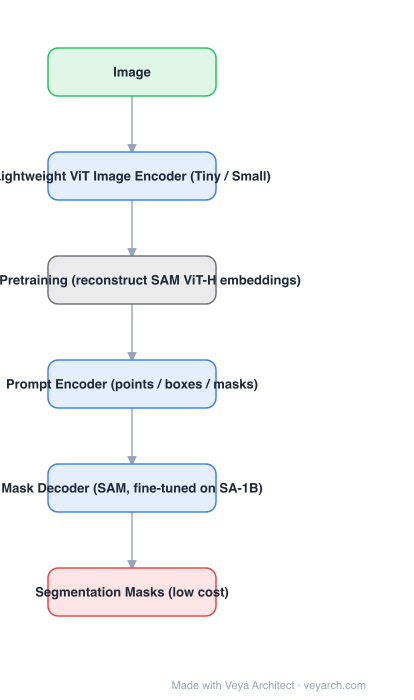

# Architecture: EfficientSAM

## Motivation

Distilling SAM (MobileSAM, EdgeSAM) works by making the student imitate the teacher. But the *real* reason SAM's ViT-H encoder is good is that it was trained on SA-1B with a segmentation objective — and a tiny ViT trained only by distillation has to learn that representation from a teacher's embeddings. EfficientSAM asks the reverse question: can we give a small ViT a **pretraining objective** that transfers SAM's representation, without labels and without distilling a whole pipeline?

## Core Idea

**SAMI** (SAM-leveraged Masked Image Pretraining): mask part of the image, run the lightweight ViT on the visible tokens, and train a decoder to **reconstruct SAM's ViT-H image embedding** for the full image — using SAM's frozen encoder as the target generator. Then pair the pretrained encoder with SAM's mask decoder and fine-tune on SA-1B.

## Architecture

### Overview

<b>Layer-by-layer (6 nodes)</b>

| # | Layer | Type | Params |
|---|---|---|---|
| 1 | Image | `input` |  |
| 2 | Lightweight ViT Image Encoder (Tiny / Small) | `conv2d` |  |
| 3 | SAMI Pretraining (reconstruct SAM ViT-H embeddings) | `custom` |  |
| 4 | Prompt Encoder (points / boxes / masks) | `embed` |  |
| 5 | Mask Decoder (SAM, fine-tuned on SA-1B) | `attention` |  |
| 6 | Segmentation Masks (low cost) | `output` |  |

### Components

1. **Lightweight ViT image encoder (student)** — a small ViT (Tiny / Small) that will replace SAM's ViT-H at inference.
2. **SAM's frozen ViT-H encoder** — used offline to produce the reconstruction target (the embedding of the *unmasked* image).
3. **SAMI reconstruction decoder** — takes the student's visible-token features plus mask tokens and predicts the SAM embedding; discarded after pretraining, which is the point (the deliverable is the encoder).
4. **Masking** — MAE-style random masking of image patches; the reconstruction target is *SAM's feature*, not pixels.
5. **SAM prompt encoder + mask decoder** — reused from SAM, fine-tuned jointly with the pretrained encoder on SA-1B.
6. **Training data** — SAMI runs on ImageNet-1K **without labels**; the SA-1B stage reintroduces masks.

### Data Flow

Image → patchify + mask → lightweight ViT (visible tokens) → SAMI decoder → predicted SAM embedding ⟷ target from frozen SAM ViT-H. After pretraining: image → lightweight ViT → embedding → SAM prompt encoder + mask decoder → masks.

### State / Memory

No recurrent state. Two training stages produce one artifact (the encoder); the SAMI decoder is thrown away, so inference cost is encoder + SAM decoder only.

## Design Decisions

- **Pretrain rather than distill** — the student's representation is learned from data (via SAM's embeddings as a target), which is a stronger signal than imitating one teacher forward pass.
- **Reconstruct SAM features, not pixels** — pixels waste capacity on texture; SAM's embedding is already segmentation-oriented.
- **Label-free pretraining** — SAM supervises, so ImageNet images suffice; no mask annotations needed at this stage.
- **Keep SAM's prompt encoder and decoder** — preserves interactive semantics and makes the model a drop-in encoder swap.

## Evolution

- **MAE (2021)** (predecessor): masked autoencoders reconstruct pixels.
- **SAM (2023)**: the source of the target embeddings.
- **EfficientSAM (2023)**: SAMI — reconstruct SAM embeddings, then fine-tune with SAM's decoder.
- **Siblings**: MobileSAM (decoupled encoder distillation), EdgeSAM (encoder-only + prompt-in-the-loop distillation), FastSAM (YOLOv8-seg CNN), SAM-HQ (quality).
- **Relation to SAM 3 / SAM 2**: orthogonal — those add concepts and video; EfficientSAM only shrinks the encoder.

## Characteristics

| Property | Value |
|---|---|
| Task | promptable segmentation at low cost |
| Encoder | lightweight ViT (Tiny / Small) |
| Pretraining | SAMI — reconstruct SAM ViT-H embeddings from masked images |
| Pretraining data | ImageNet-1K, no labels |
| Decoder | SAM mask decoder, reused |
| Fine-tuning | SA-1B |

## Limitations

- Quality is still below full SAM; the tiny encoder cannot hold everything ViT-H encodes.
- Two-stage cost: SAMI pretraining plus SA-1B fine-tuning is more pipeline than a single distillation run.
- Depends on SAM's frozen encoder being available to generate targets.
- Image-only: no video/temporal capability, no concept-level prompting.

## Implementation Notes

Essentials: (1) precompute SAM ViT-H embeddings for the pretraining corpus once (this is the expensive offline step), (2) train the small ViT + reconstruction decoder with an MAE-style mask and an embedding-space regression loss, (3) throw away the reconstruction decoder, (4) attach SAM's prompt encoder and mask decoder and fine-tune on SA-1B, (5) evaluate the *mask* metric, not the embedding MSE — matching embeddings is a proxy, not the objective.
