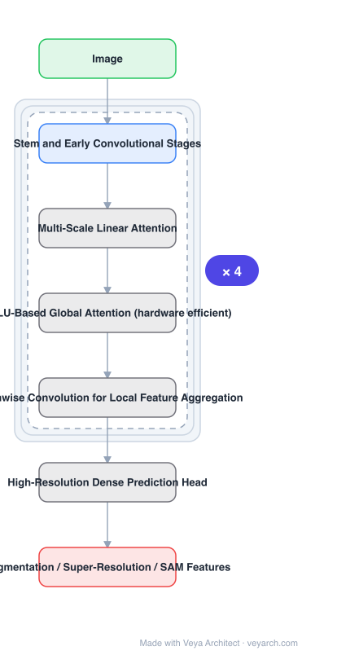

# Architecture: EfficientViT

## Motivation

High-resolution dense prediction — segmentation, super-resolution, Segment-Anything features — requires **high resolution *and* strong context extraction** at the same time. That combination is precisely what makes the state-of-the-art models too expensive for hardware deployment, and the paper notes the consequence directly: porting architectures that are efficient for *image classification* does not work, because classification-efficient designs were never optimized for high-resolution context.

## Core Idea

A **multi-scale linear attention** module that gets both desired properties — global receptive field and multi-scale learning — from **lightweight, hardware-efficient operations only**, avoiding the three costs prior models paid: heavy softmax attention, hardware-inefficient large-kernel convolution, and complicated topology.

## Architecture

### Overview

<b>Layer-by-layer (7 nodes)</b>

| # | Layer | Type | Params |
|---|---|---|---|
| 1 | Image | `input` |  |
| 2 | Stem and Early Convolutional Stages | `conv2d` |  |
| 3 | Multi-Scale Linear Attention | `custom` |  |
| 4 | ReLU-Based Global Attention (hardware efficient) | `custom` |  |
| 5 | Depthwise Convolution for Local Feature Aggregation | `custom` |  |
| 6 | High-Resolution Dense Prediction Head | `custom` |  |
| 7 | Segmentation / Super-Resolution / SAM Features | `output` |  |

### Components

1. **EfficientViT backbone** — convolutional stem and early stages, then multi-scale linear attention stages.
2. **Multi-scale linear attention** — the core module: linear (not softmax) attention providing a global receptive field, plus multi-scale learning, using hardware-efficient operations.
3. **Hardware-efficient local aggregation** — depthwise convolution handles local features, avoiding the large-kernel convolutions that are inefficient on real hardware.
4. **High-resolution dense prediction head** — downstream heads for segmentation, super-resolution and SAM-style feature extraction.

### Data Flow

High-resolution image → stem and early convolutional stages → multi-scale linear attention stages (global context at linear cost, with multi-scale aggregation) → task head at high resolution.

### State / Memory

No recurrent state. The design's efficiency argument is about avoiding the quadratic attention memory/compute at high resolution, so it can run at resolutions where softmax-attention models cannot.

## Design Decisions

- **Linear attention instead of softmax** — softmax attention is named as one of the three things prior models paid for and should not; linear attention removes the quadratic term.
- **Multi-scale learning inside the attention module** — high-resolution dense prediction needs multiple scales, so multi-scale handling is built into the attention rather than added as a separate topology.
- **Avoid large-kernel convolutions** — called out as hardware-inefficient even where they are FLOP-cheap.
- **Target dense prediction, not classification** — explicitly: classification-efficient architectures are unsuitable here.
- **Validate on several hardware tiers** — mobile CPU, edge GPU and cloud GPU, since the claim is hardware efficiency rather than FLOPs.

## Evolution

- **SegFormer, SegNeXt** (predecessors): high-resolution segmentation models that EfficientViT is benchmarked against on Cityscapes.
- **Restormer** (predecessor for super-resolution).
- **SAM** (contrast): EfficientViT gives 48.9× throughput on A100 with slightly better zero-shot instance segmentation.
- **EfficientViT (2022)**: multi-scale linear attention for high-resolution dense prediction.
- **Siblings**: MobileNetV4, RepViT, FasterNet.

## Characteristics

| Property | Value |
|---|---|
| Task | high-resolution dense prediction |
| Core module | multi-scale linear attention |
| Avoids | softmax attention, large-kernel convolution, complicated topology |
| Cityscapes | up to 13.9× / 6.2× GPU latency reduction vs SegFormer / SegNeXt, no accuracy loss |
| Super-resolution | up to 6.4× faster than Restormer, +0.11 dB PSNR |
| SAM | 48.9× throughput on A100, slightly better zero-shot COCO |

## Limitations

- Linear attention's approximation may lose accuracy on tasks needing very sharp long-range matching.
- The multi-scale design adds hyper-parameters (number of scales, aggregation) to tune per task.
- Evaluated per task with different heads; a single unified checkpoint is not the reported setting.
- Hardware efficiency is demonstrated on specific platforms; results may not hold on accelerators with different memory behaviour.

## Implementation Notes

Essentials: (1) implement attention in linear form — replacing it with softmax reintroduces the exact cost the paper removes, (2) build multi-scale learning into the attention module rather than adding a separate multi-scale topology, (3) use depthwise convolution for local aggregation and avoid large kernels, (4) benchmark at the target high resolution with real GPU latency; a low-resolution benchmark will not show the 13.9× figure, (5) report mobile CPU, edge GPU and cloud GPU separately, since the hardware-efficiency claim spans all three.
