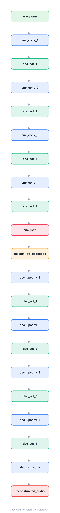

# Architecture: EnCodec

## Motivation

A neural audio codec: a convolutional encoder downsamples the waveform, residual vector quantization turns the latents into a stack of discrete codes, and a mirrored decoder reconstructs the audio. The thing that turns continuous audio into tokens an LLM can model.

## Core Idea

A neural audio codec: a convolutional encoder downsamples the waveform, residual vector quantization turns the latents into a stack of discrete codes, and a mirrored decoder reconstructs the audio.

## Architecture

### Overview

*The full graph, all 21 nodes. Vector: [diagram.svg](assets/diagram.svg).*

| Hyperparameter | Value |
|---|---|
| Type | Neural audio codec (autoencoder + quantizer) |
| Encoder | Strided Conv1D stack (downsamples the waveform) |
| Bottleneck | Residual vector quantization (discrete codes) |
| Decoder | Mirrored transposed-conv stack (reconstructs audio) |
| Use | The audio tokenizer behind audio LLMs (MusicGen, ...) |

`model.json` is the full graph, hand-built against the official config.json.

### Design Notes

- Residual vector quantization (RVQ): a cascade of codebooks where each quantizes the residual the previous one left, so a few codebooks reconstruct audio at very low bitrate.
- The encoder/decoder are SEANet-style strided conv stacks with an LSTM in the bottleneck; the discrete codes are what MusicGen / audio LLMs actually generate.
- Conceptually the audio analogue of a VAE+codebook (VQ-VAE) for images; it is why "audio language model" is even possible.

### Parameter Check

Neurarch's per-layer parameter estimate over this graph: **4.7M**.

## Design Decisions

> **Analysis** — Observations derived from studying the architecture.

- Residual vector quantization (RVQ): a cascade of codebooks where each quantizes the residual the previous one left, so a few codebooks reconstruct audio at very low bitrate.
- The encoder/decoder are SEANet-style strided conv stacks with an LSTM in the bottleneck; the discrete codes are what MusicGen / audio LLMs actually generate.
- Conceptually the audio analogue of a VAE+codebook (VQ-VAE) for images; it is why "audio language model" is even possible.

## Implementation Notes

- `model.json` contains the full structural graph with real dimensions and parameters.
- Open in [Neurarch](https://www.neurarch.com/) to visualize, edit, or export training code.
- Diagrams fold repeated identical blocks with a `× N` badge; `model.json` holds all nodes at real dimensions.

## Limitations

- This package focuses on the architectural structure. Training pipelines, 
dataset preparation, and production optimizations are out of scope.

## Evolution

> See `references/related/` for predecessor and successor architectures.

