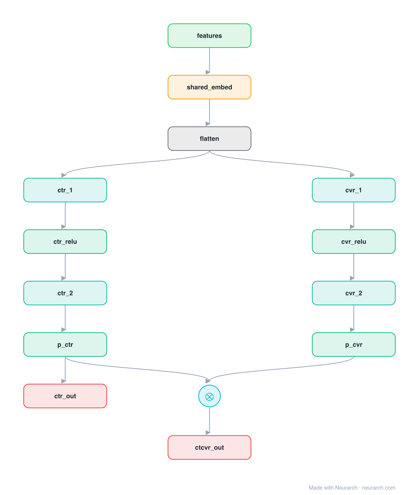

# Architecture: ESMM

## Motivation

Entire Space Multi-task Model: conversion-rate models trained only on clicked impressions suffer sample-selection bias and data sparsity. ESMM trains a pCTR and a pCVR tower (sharing embeddings) over every impression, supervising the product pCTCVR = pCTR x pCVR, so the CVR tower learns from the full space without ever needing click-only labels.

## Core Idea

Entire Space Multi-task Model: conversion-rate models trained only on clicked impressions suffer sample-selection bias and data sparsity.

## Architecture

### Overview

*The full graph, all 14 nodes. Vector: [diagram.svg](assets/diagram.svg).*

| Hyperparameter | Value |
|---|---|
| Type | CVR / post-click conversion |
| Towers | Shared embeddings feed a pCTR and a pCVR tower |
| Objective | pCTCVR = pCTR x pCVR, supervised over all impressions |
| Key idea | Train CVR over the entire space to kill sample-selection bias |

`model.json` is the full graph, hand-built against the official config.json.

### Design Notes

- The two towers share one embedding table, which also eases the data-sparsity problem for the CVR tower.
- pCVR is never supervised directly: the losses are on pCTR and on the pCTCVR product, both defined over all impressions.
- A staple of e-commerce ads ranking; pairs with the multi-task rankers [mmoe](../mmoe/) and [ple](../ple/).

### Parameter Check

This entry is a **structural reference**: its parameter mix is not recomputed by the per-layer estimator, so it carries no deviation gate. See the hyperparameter table above for the authoritative total / active parameter counts.

## Design Decisions

> **Analysis** — Observations derived from studying the architecture.

- The two towers share one embedding table, which also eases the data-sparsity problem for the CVR tower.
- pCVR is never supervised directly: the losses are on pCTR and on the pCTCVR product, both defined over all impressions.
- A staple of e-commerce ads ranking; pairs with the multi-task rankers [mmoe](../mmoe/) and [ple](../ple/).

## Implementation Notes

- `model.json` contains the full structural graph with real dimensions and parameters.
- Open in [Neurarch](https://www.neurarch.com/) to visualize, edit, or export training code.
- Diagrams fold repeated identical blocks with a `× N` badge; `model.json` holds all nodes at real dimensions.

## Limitations

- This package focuses on the architectural structure. Training pipelines, 
dataset preparation, and production optimizations are out of scope.

## Evolution

> See `references/related/` for predecessor and successor architectures.

