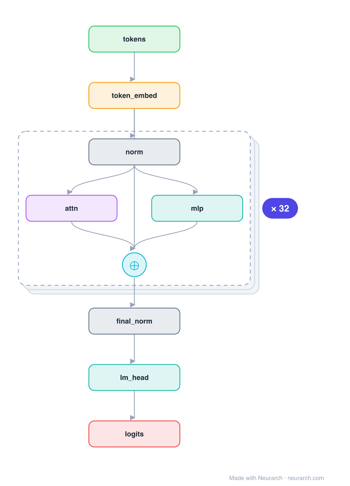

# Architecture: Falcon-7B

## Motivation

TII's 2023 open LLM, briefly the top of the Open LLM Leaderboard. Two architecture bets define it: multi-query attention (all 71 query heads share a single key/value head, shrinking the KV cache ~70x) and a parallel residual block where one LayerNorm feeds attention and the MLP at once, both summed back.

## Core Idea

TII's 2023 open LLM, briefly the top of the Open LLM Leaderboard.

## Architecture

### Overview

*Identical repeated blocks are folded into one representative block with a `× N` badge, so the whole architecture fits on screen. `model.json` uses a NAXS block template + `repeat` directive: the identical repeated layers are defined once and expand to all 133 nodes (open it in Neurarch to see and edit every layer). Vector: [diagram.svg](assets/diagram.svg).*

| Hyperparameter | Value |
|---|---|
| Type | Decoder-only transformer (causal LM) |
| Parameters | 7.2B |
| Layers | 32 |
| Hidden size | 4,544 |
| Attention | Multi-query: 71 query heads, 1 KV head, head dim 64 |
| FFN | GELU MLP, intermediate size 18,176 (4x) |
| Residual | Parallel: one LayerNorm feeds attention and MLP, both summed |
| Normalization | LayerNorm, pre-norm |
| Positions | RoPE |
| Vocabulary | 65,024 |
| Max context | 2,048 |

`model.json` is the full graph (repeated layers expressed via a NAXS block template + `repeat`), hand-built against the official config.json.

### Design Notes

- Multi-query attention: 71 query heads but only 1 KV head, the extreme end of the MHA -> GQA -> MQA spectrum.
- Parallel attention + MLP (GPT-NeoX style): both consume the same normed input and add into the residual, saving a norm per layer.
- GELU MLP (not gated SwiGLU) and no biases anywhere; RoPE for positions.

### Parameter Check

Neurarch's per-layer parameter estimate over this graph: **7.22B**.
Deviation from the authoritative count (7.22B): **-0.0%**.

## Design Decisions

> **Analysis** — Observations derived from studying the architecture.

- Multi-query attention: 71 query heads but only 1 KV head, the extreme end of the MHA -> GQA -> MQA spectrum.
- Parallel attention + MLP (GPT-NeoX style): both consume the same normed input and add into the residual, saving a norm per layer.
- GELU MLP (not gated SwiGLU) and no biases anywhere; RoPE for positions.

## Implementation Notes

- `model.json` contains the full structural graph with real dimensions and parameters, using a NAXS block template + `repeat` for the identical repeated layers.
- Open in [Neurarch](https://www.neurarch.com/) to visualize, edit, or export training code.
- Diagrams fold repeated identical blocks with a `× N` badge; `model.json` defines each repeated layer once at real dimensions and expands to all nodes.

## Limitations

- This package focuses on the architectural structure. Training pipelines, 
dataset preparation, and production optimizations are out of scope.

## Evolution

> See `references/related/` for predecessor and successor architectures.

