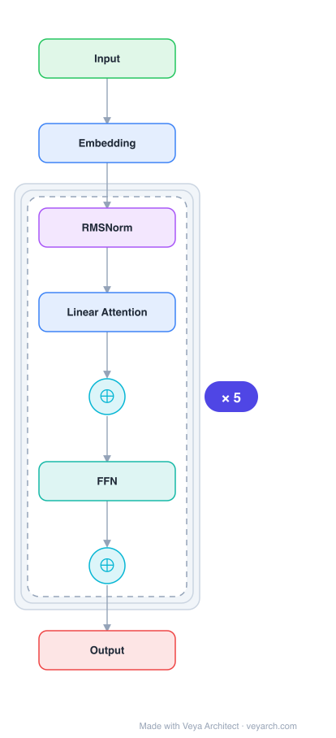

# Architecture: Fast Transformer Decoder (Multi-Query Attention)

## Motivation

While training Transformer models with multi-head attention is fast due to parallelizability across sequence length, incremental inference (autoregressive decoding) is often slow. The bottleneck is the memory-bandwidth cost of repeatedly loading the large "keys" and "values" tensors that encode the state of the attention layers. For each generated token, the entire KV cache must be loaded from memory, and with multiple attention heads, this cache is very large.

## Core Idea

A variant called multi-query attention, where the keys and values are shared across all different attention "heads", greatly reducing the size of these tensors and hence the memory bandwidth requirements of incremental decoding. This achieves much faster decoding with only minor quality degradation from the baseline.

## Architecture

### Overview

<b>Layer-by-layer (8 nodes)</b>

| # | Layer | Type | Params |
|---|---|---|---|
| 1 | Input | `input` |  |
| 2 | Embedding | `embed` |  |
| 3 | RMSNorm | `norm` |  |
| 4 | Linear Attention | `attention` |  |
| 5 | ⊕ | `residual` |  |
| 6 | FFN | `ffn` |  |
| 7 | ⊕ | `residual` |  |
| 8 | Output | `output` |  |

Multi-query attention is a modification of standard multi-head attention. In standard multi-head attention, each of the H heads has its own set of keys and values. In multi-query attention, all H heads share a single set of keys and values (one "write head"), while each head retains its own queries. This reduces the KV cache size by a factor of H, dramatically improving inference speed.

### Components

1. **Queries (Q)** — Each attention head h has its own query projection:
   - Q_h = x W^Q_h (per-head, different for each head)
   - Queries remain per-head, allowing different heads to attend to different patterns

2. **Keys (K) and Values (V)** — Shared across all heads (single "write head"):
   - K = x W^K (single projection, shared by all heads)
   - V = x W^V (single projection, shared by all heads)
   - This is the key innovation: H-fold reduction in KV cache size

3. **Attention computation** — For each head h:
   - Attention_h(Q_h, K, V) = softmax(Q_h K^T / √d_k) V
   - Each head uses the same K and V but different Q_h

### Data Flow

**Standard Multi-Head Attention (baseline):**
1. **Input**: x (token representation)
2. **Per head h**: Q_h = x W^Q_h, K_h = x W^K_h, V_h = x W^V_h
3. **Attention**: Attention_h = softmax(Q_h K_h^T / √d_k) V_h
4. **Concatenate**: output = [Attention_1; ...; Attention_H] W^O
5. **KV cache**: Store K_1, V_1, ..., K_H, V_H (H × d_k × 2 per token)

**Multi-Query Attention (proposed):**
1. **Input**: x (token representation)
2. **Shared K, V**: K = x W^K, V = x W^V (computed once, shared)
3. **Per head h**: Q_h = x W^Q_h (per-head queries)
4. **Attention**: Attention_h = softmax(Q_h K^T / √d_k) V
5. **Concatenate**: output = [Attention_1; ...; Attention_H] W^O
6. **KV cache**: Store K, V (d_k × 2 per token, H-fold reduction)

### State / Memory

- **KV cache (inference)**: The primary state during autoregressive decoding. In multi-query attention, the KV cache is H times smaller than standard multi-head attention:
  - Standard: H × d_k keys + H × d_k values per token = 2Hd_k
  - Multi-query: d_k keys + d_k values per token = 2d_k
  - Reduction factor: H (number of heads)

- **No recurrent state**: The architecture is a feedforward transformer with standard attention, just with shared K/V.

## Design Decisions

1. **Share K and V across heads** — The key insight is that during incremental decoding, the bottleneck is memory bandwidth (loading K and V tensors), not computation. By sharing K and V across all heads:
   - KV cache size reduced by factor H
   - Memory bandwidth requirements reduced proportionally
   - Quality degradation is minor (heads can still specialize via different queries)

2. **Keep per-head queries** — Queries remain per-head because:
   - Different heads need to attend to different positions
   - Per-head queries allow head specialization
   - Only K and V (which are loaded repeatedly) need sharing

3. **"One write-head is all you need"** — The title reflects the insight that a single set of K/V projections (one "write head") is sufficient, while multiple "read heads" (queries) provide the necessary diversity.

4. **Minor quality degradation** — The trade-off is acceptable: significant speed improvement with only minor quality loss, making it practical for production inference.

## Evolution

**Predecessors:**
- **Transformer** (Vaswani et al., 2017) — Multi-head attention architecture.
- **Neural Attention** (Bahdanau et al., 2014) — Attention mechanism.
- **Memory networks** — Prior work on memory-efficient attention.

**Successors:**
- **Grouped-Query Attention (GQA)** — Intermediate between multi-head and multi-query (groups of heads share K/V).
- **Multi-Head Latent Attention (MLA)** — DeepSeek's low-rank compression of K/V.
- **FlashAttention** — Hardware-aware attention optimization.
- **Most production LLMs** — Multi-query or GQA is now standard for efficient inference.

## Characteristics

| Property | Value |
|----------|-------|
| Year | 2019 |
| Authors | Noam Shazeer (Google) |
| Category | DL/Transformer |
| Source Paper | `Fast_transformer_decoding_one_write_head_is_all_you_need_Need_Shazeer_2019.md` |
| PaperVault Path | `DL-Architectures/01-transformers/Fast_transformer_decoding_one_write_head_is_all_you_need_Need_Shazeer_2019.md` |

## Limitations

1. **Quality degradation** — Sharing K and V across heads reduces the model's ability to have heads specialize on different key/value patterns. The degradation is minor but non-zero.

2. **Training vs. inference asymmetry** — The benefit is primarily for inference (decoding), not training (which is already parallelizable). The architecture change affects both but benefits only inference.

3. **Expressiveness trade-off** — With shared K/V, heads can only differ in what they attend to (via different queries), not in what information they extract (since V is shared).

4. **Fixed sharing** — All heads must share the same K/V; no adaptive or partial sharing is explored.

5. **Head count sensitivity** — The quality degradation may increase with more heads, as the sharing constraint becomes more restrictive.

## Implementation Notes

See `implementation/` for a minimal runnable implementation. Key details:
- Standard multi-head: H sets of (Q_h, K_h, V_h) per layer
- Multi-query: H sets of Q_h, but single shared (K, V) per layer
- KV cache: 2d_k per token (vs. 2Hd_k for standard)
- Attention: Attention_h = softmax(Q_h K^T / √d_k) V (shared K, V)
- Output: concat([Attention_1, ..., Attention_H]) W^O
- Speed: much faster incremental decoding due to H-fold KV cache reduction
- Quality: minor degradation from baseline
- Now standard in production LLMs (via GQA or direct multi-query)
- Code at Google (original implementation)

## Information Layers

- **Evidence:** Source paper available in `references/papers/` (Shazeer, 2019, "Fast Transformer Decoding: One Write-Head is All You Need")
- **Analysis:** The key insight is that the inference bottleneck for Transformers is memory bandwidth, not computation. During incremental decoding, the KV cache must be loaded for every generated token, and with H heads, this cache is H times larger than necessary. By sharing K and V across heads, multi-query attention reduces the KV cache by a factor of H with only minor quality loss. The title "one write-head is all you need" captures the essence: multiple "read heads" (queries) provide diversity, but a single "write head" (shared K/V) is sufficient for storing information.
- **Hypothesis:** The success of multi-query attention suggests that the K/V representations across heads are largely redundant — different heads attend to different positions but extract similar types of information. Grouped-Query Attention (GQA), which shares K/V among groups of heads rather than all heads, may represent the optimal trade-off point between multi-head (no sharing) and multi-query (full sharing).
