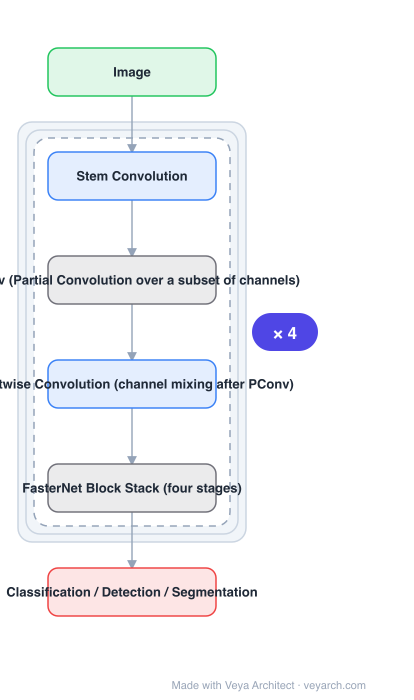

# Architecture: FasterNet

## Motivation

Efficient network design equated "fewer FLOPs" with "faster", but measured latency does not follow: CycleMLP-B1 has half the FLOPs of ResNet50 yet runs slower (116.1 ms vs 73.0 ms). FasterNet attributes this to **FLOPS** — floating-point operations *per second*. DWConv and GConv reduce FLOPs but have low FLOPS because they cause frequent memory access, so the reduction never materializes as wall-clock speed.

## Core Idea

Design for high FLOPS rather than low FLOPs. Reexamining DWConv shows **frequent memory access** is the culprit, so the paper proposes **PConv (partial convolution)**: a regular convolution applied to only a subset of input channels, leaving the rest untouched. PConv has lower FLOPs than a regular convolution but higher FLOPS than DWConv/GConv, and still extracts spatial features well.

## Architecture

### Overview

<b>Layer-by-layer (6 nodes)</b>

| # | Layer | Type | Params |
|---|---|---|---|
| 1 | Image | `input` |  |
| 2 | Stem Convolution | `conv2d` |  |
| 3 | PConv (Partial Convolution over a subset of channels) | `custom` |  |
| 4 | Pointwise Convolution (channel mixing after PConv) | `conv2d` |  |
| 5 | FasterNet Block Stack (four stages) | `custom` |  |
| 6 | Classification / Detection / Segmentation | `output` |  |

### Components

1. **PConv (partial convolution)** — exploits redundancy within feature maps by applying a regular convolution to only part of the input channels and leaving the remaining ones untouched; reduces computation and memory access simultaneously.
2. **Pointwise convolution** — follows PConv for channel mixing, completing the block.
3. **FasterNet family** — four stages of PConv-based blocks, with variants from T0 to L.
4. **Multi-task validation** — classification, detection and segmentation, all reported with latency and throughput rather than FLOPs alone.

### Data Flow

Image → stem convolution → four stages of FasterNet blocks (PConv for spatial mixing over a channel subset, then pointwise convolution for channel mixing, with residual connections) → task head.

### State / Memory

No recurrent state. The design's entire concern is memory *traffic* — PConv exists to reduce memory accesses, which is what raises FLOPS even when FLOPs fall.

## Design Decisions

- **Optimize FLOPS, not FLOPs** — the framing contribution: low-FLOPs operators with high memory traffic are slow, and this discrepancy had been noticed before but left unresolved.
- **Regular convolution on a channel subset** — keeps the operator dense and hardware-friendly where it runs, instead of depthwise.
- **Leave remaining channels untouched** — the redundancy exploitation that makes the FLOPs reduction free.
- **Report latency and throughput per device** — GPU, CPU and ARM figures are given because FLOPs would hide the result.

## Evolution

- **DWConv / GConv-based efficient networks** (predecessors and the object of the critique).
- **MobileViT, CycleMLP** (contrast): low-FLOPs models named as running slower than their FLOP counts suggest.
- **FasterNet (2023)**: PConv-based, optimized for FLOPS.
- **Siblings**: MobileNetV4, RepViT, StarNet, EfficientViT.
- **Contrast**: Swin-B — FasterNet-L matches its accuracy at much higher throughput.

## Characteristics

| Property | Value |
|---|---|
| Task | efficient classification / detection / segmentation |
| Core operator | PConv (partial convolution over a channel subset) |
| Objective | higher FLOPS (memory access reduction), not just lower FLOPs |
| T0 result | 2.8×/3.3×/2.4× faster than MobileViT-XXS on GPU/CPU/ARM, +2.9% top-1 |
| L result | 83.5% top-1, on par with Swin-B, +36% GPU throughput, 37% less CPU time |

## Limitations

- The optimal fraction of channels to convolve is a hyper-parameter that varies by stage and device.
- PConv's advantage depends on hardware memory behaviour; on accelerators with different memory characteristics the FLOPS argument is weaker.
- Classification, detection and segmentation are validated, but dense high-resolution prediction is not the focus.
- Gains are relative to DWConv/GConv baselines; compared against dense-convolution models the trade differs.

## Implementation Notes

Essentials: (1) implement PConv as a regular convolution on the first *n* channels with the remainder passed through unchanged — do not substitute a depthwise convolution, which is the exact operator being replaced, (2) follow with a pointwise convolution so channels mix, (3) profile memory access, not FLOPs: the claim is about FLOPS and a FLOPs-only benchmark will show nothing, (4) sweep the convolved-channel fraction per stage, since the redundancy is not uniform across depths, (5) report GPU, CPU and ARM latency/throughput separately — a single-device number cannot support a FLOPS claim.
