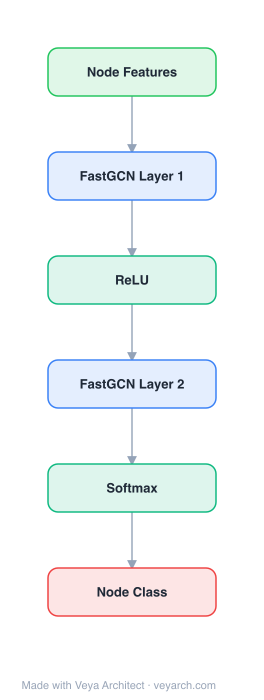

# Architecture: FastGCN

## Motivation

The graph convolutional networks (GCN) recently proposed by Kipf and Welling are an effective graph model for semi-supervised learning, elegantly summarized by `H^(l+1) = σ(ÂH^(l)W^(l))`, where `Â` is a normalization of the graph adjacency matrix. However, this model has two fundamental limitations. First, it was originally designed to be learned with the simultaneous presence of both training and test data (transductive setting)—the adjacency matrix encodes pairwise relationships for all data at once, which is impractical for constantly expanding graphs (new social network members, new products, new drugs).

Second, and more severely, the recursive neighborhood expansion across layers incurs expensive computations in batched training. For dense and power-law graphs, the expansion of the neighborhood for a single vertex quickly fills up a large portion of the graph. A standard mini-batch training then involves a large amount of data for every batch, even with a small batch size. Scalability is a pressing issue for GCN to be applicable to large, dense graphs.

To address both challenges, FastGCN reinterprets graph convolutions as **integral transforms of embedding functions under probability measures**. This view provides a principled mechanism for inductive learning: graph vertices are treated as iid samples of some probability distribution, and the loss and each convolution layer are written as integrals with respect to vertex embedding functions. The integrals are then evaluated through Monte Carlo approximation, enhanced with importance sampling, yielding a batched training scheme that is orders of magnitude more efficient while maintaining comparable accuracy.

## Core Idea

Fast learning of GCNs via stochastic sampling of graph convolution layers for large-scale graphs.

## Architecture

### Overview

<b>Layer-by-layer (6 nodes)</b>

| # | Layer | Type | Params |
|---|---|---|---|
| 1 | Node Features | `input` |  |
| 2 | FastGCN Layer 1 | `gcn_conv` | sampling: neighbor |
| 3 | ReLU | `relu` |  |
| 4 | FastGCN Layer 2 | `gcn_conv` | sampling: neighbor |
| 5 | Softmax | `softmax` |  |
| 6 | Node Class | `output` |  |

FastGCN is built on the observation that the standard GCN architecture `H^(l+1) = σ(ÂH^(l)W^(l))` can be reinterpreted in a functional form. Instead of viewing `H^(l)` as a matrix of all vertex embeddings, FastGCN treats vertices as iid samples from a probability space `(V', F, P)` and writes each convolution layer as an integral transform: `h̃^(l+1)(v) = ∫ Â(v,u) h^(l)(u) W^(l) dP(u)`. The loss becomes an expectation `L = E_{v~P}[g(h^(M)(v))] = ∫ g(h^(M)(v)) dP(v)`. This functional generalization separates training and test data naturally (inductive learning).

The integrals are evaluated through Monte Carlo approximation: for each layer `l`, `t_l` iid samples are drawn and the integral is approximated by a sample average. This yields a batched training algorithm where, for each batch, vertices are subsampled in a bootstrapping manner in each layer to approximate the convolution. The consistency of this estimator is proven (Theorem 1): as sample sizes `t_0, t_1, ..., t_M → ∞`, the estimator converges to the true loss with probability one.

To reduce the variance of the Monte Carlo estimator, FastGCN employs importance sampling: instead of sampling uniformly from `P`, it alters the sampling distribution to `Q` where vertices with higher "importance" (proportional to `||Â(:,u)||²`) are sampled more frequently. This yields a controllable per-batch computational cost and orders-of-magnitude speedup over both GCN and GraphSAGE, while maintaining highly comparable prediction accuracy.

### Components

- **Functional generalization of GCN**: Rewrites the matrix-form GCN (`H^(l+1) = σ(ÂH^(l)W^(l))`) as integral transforms of embedding functions: `h̃^(l+1)(v) = ∫ Â(v,u) h^(l)(u) W^(l) dP(u)`, `h^(l+1)(v) = σ(h̃^(l+1)(v))`, with loss `L = ∫ g(h^(M)(v)) dP(v)`. Here `u` and `v` are independent random variables tied to the same probability measure `P`, and `Â(v,u)` corresponds to the `(v,u)` element of the normalized adjacency matrix. This is the key reformulation that enables sampling.

- **Monte Carlo estimator**: For each layer `l`, draws `t_l` iid samples `u_1^(l), ..., u_{t_l}^(l) ~ P` and approximates the integral: `h̃_{t_{l+1}}^(l+1)(v) := (1/t_l) Σ_{j=1}^{t_l} Â(v, u_j^(l)) h_{t_l}^(l)(u_j) W^(l)`. The sample loss `L_{t_0,...,t_M} := (1/t_M) Σ_{i=1}^{t_M} g(h_{t_M}^(M)(u_i))` is a consistent estimator of the true loss (Theorem 1).

- **Batched training (Algorithm 1)**: For each batch, uniformly sample `t_l` vertices per layer; compute the batch loss and batch gradient via chain rule on each `H^(l)`. The batch gradient `∇H̃^(l+1)(v,:)` involves the sampled vertices from the next layer, propagating gradients through the sampled subgraph.

- **Importance sampling (Algorithm 2)**: Instead of uniform sampling, draws vertices according to a probability mass function `q(u) = ||Â(:,u)||² / Σ_{u'∈V} ||Â(:,u')||²`. This distribution is proportional to `b(u)²` where `b(u) = ∫ Â(v,u) dP(v)` (the column norm of `Â`). It is the same for all layers (no layer dependency), making it cheap to precompute. The scaling inside the summation changes to account for the ratio `dP(u)/dQ(u)`.

- **Precomputation optimization**: Since `ÂH^(0)` (the product in the bottom layer) does not change during training, it can be precomputed rather than sampled, substantially decreasing training time while maintaining comparable accuracy.

- **Full-architecture inference**: For inference on new vertices, the embedding can be computed using the full GCN architecture (more straightforward and easier to implement) or approximated through sampling as in training.

### Data Flow

1. **Input**: A graph `G = (V, E)` (assumed to be an induced subgraph of a larger graph `G'` with vertex set `V'` under probability measure `P`), input features `H^(0) = X`, normalized adjacency `Â`, number of layers `M`, sample sizes `{t_l}` per layer.
2. **Precompute (one-time)**: Compute `ÂH^(0)` for the bottom layer (constant throughout training) to avoid sampling this layer. Compute the importance sampling distribution `q(u) = ||Â(:,u)||² / Σ ||Â(:,u')||²` for all vertices.
3. **For each batch** (one epoch):
   - **Sample vertices per layer**: For each layer `l`, sample `t_l` vertices `u_1^(l), ..., u_{t_l}^(l)` according to distribution `q` (importance sampling) or uniformly (basic version).
   - **Forward pass (layer-by-layer)**: For `l = 0, ..., M-1`, compute `H^(l+1)(v,:) = σ((1/t_l) Σ_{j=1}^{t_l} [Â(v, u_j^(l)) / q(u_j^(l))] H^(l)(u_j^(l),:) W^(l))` for each sampled vertex `v` in the next layer. The `1/q(u_j)` factor corrects for the biased sampling.
   - **Compute batch loss**: `L_batch = (1/t_M) Σ_{i=1}^{t_M} g(H^(M)(u_i^(M),:))` over the top-layer sampled vertices.
   - **Backward pass**: Compute batch gradient `∇L_batch` via chain rule on each `H^(l)`, propagating gradients through the sampled subgraph: `∇H̃^(l+1)(v,:) = (n/t_l) Σ_j Â(v,u_j) ∇H^(l)(u_j,:) W^(l)` if `v` is sampled in the next layer.
   - **SGD step**: `W ← W - η ∇L_batch`.
4. **Inference**: For a new vertex, compute its embedding using the full GCN architecture (using all neighbors) or approximate via sampling. The full architecture is generally more straightforward and easier to implement.

### State / Memory

Stateless. FastGCN is a feed-forward architecture with no recurrent state or memory mechanism. Each batch independently samples vertices per layer, computes the forward pass through the sampled subgraph, and updates parameters via SGD. The sampling distribution `q(u)` (proportional to column norms of `Â`) is precomputed once and fixed throughout training—it is a static property of the graph, not a learned or evolving state. The precomputed `ÂH^(0)` product is also a static constant. No node states are propagated to equilibrium, and no memory cells persist between batches.

## Design Decisions

- **Reinterpret graph convolutions as integral transforms**: The foundational design decision. Instead of viewing GCN as matrix multiplication `ÂH^(l)W^(l)`, FastGCN treats vertices as iid samples from a probability distribution and writes each layer as `∫ Â(v,u) h^(l)(u) W^(l) dP(u)`. This functional view provides a principled mechanism for inductive learning and enables Monte Carlo estimation.

- **Sample vertices, not neighbors**: The critical distinction from GraphSAGE. GraphSAGE samples a fixed number of neighbors *per vertex* per layer, so the total involved vertices grows as the *product* of per-layer sample sizes. FastGCN samples vertices *independently per layer* (bootstrapping), so the total involved vertices is at most the *sum* of per-layer sample sizes. This is what yields the order-of-magnitude computational savings.

- **Importance sampling over uniform sampling**: The optimal sampling distribution `Q*` (Theorem 3) involves `|x(u)|` (the embedding magnitude), which changes every iteration and is expensive to compute. As a practical compromise, FastGCN uses `q(u) ∝ ||Â(:,u)||²` (Proposition 4), which depends only on the graph structure (column norms of `Â`), is the same for all layers, and is precomputed once. This may not always reduce variance vs. uniform, but is "almost always helpful" in practice.

- **Precompute the bottom layer**: Since `ÂH^(0)` does not change during training (the input features are fixed), precomputing this product rather than sampling the bottom layer substantially decreases training time while maintaining comparable accuracy.

- **Use full GCN for inference**: For inference, using the full GCN architecture (all neighbors) is more straightforward and easier to implement than sampling. The sampling approach is primarily a *training* optimization; at inference, the full graph is available and accuracy is prioritized.

- **Consistency guarantee**: The estimator is proven consistent (Theorem 1): as sample sizes → ∞, the estimator converges to the true loss with probability one, via recursive application of the law of large numbers and the continuous mapping theorem. This provides theoretical justification that sampling does not bias the solution.

## Evolution

**Predecessors:**
- **GCN** (Kipf & Welling, 2017) — the base model. FastGCN directly generalizes its architecture `H^(l+1) = σ(ÂH^(l)W^(l))` to the functional/integral-transform view. GCN is transductive and suffers from the recursive neighborhood expansion problem.
- **Spectral graph convolutions** — Bruna et al. (2013), Henaff et al. (2015), Defferrard et al. (2016). These define parameterized filters in the spectral domain inspired by graph Fourier transform; they learn whole-graph feature representations.
- **Factorization-based embeddings** — Laplacian eigenmaps (Belkin & Niyogi, 2001), GraRep (Cao et al., 2015), HOPE (Ou et al., 2016). These learn training and test representations jointly (transductive).
- **Random walk-based methods** — DeepWalk (Perozzi et al., 2014), node2vec (Grover & Leskovec, 2016), LINE (Tang et al., 2015). Compute node representations through neighborhood exploration.
- **SDNE** (Wang et al., 2016) — a deep neural network architecture capturing nonlinearity within graphs.
- **GraphSAGE** (Hamilton et al., 2017) — the most directly related work; also proposes sampling to reduce computational footprint. FastGCN's sampling scheme is "more economic" (samples vertices rather than neighbors), yielding substantial savings.

**Successors:**
- The paper notes that the integral-transform view generalizes to many graph models based on first-order neighborhoods, including MoNet (Monti et al., 2017) and message-passing neural networks (Scarselli et al., 2009; Gilmer et al., 2017). Generalizing the Monte Carlo ingredients and investigating variance reduction for these models is flagged as a "possibly rewarding avenue of future research."

## Characteristics

| Property | Value |
|----------|-------|
| Year | 2018 |
| Authors | Chen et al. |
| Category | GNN/Architecture |
| Source Paper | `FASTGCN_Chen_2018.md` |
| PaperVault Path | `GNN/03-gnn-architectures/FASTGCN_Chen_2018.md` |

## Limitations

- **Marginal benefit on small graphs**: For small graphs, the sample size (the product across layers in GraphSAGE's scheme, or the sum in FastGCN's) is comparable to the graph size, so the improvement is marginal. Moreover, sampling overhead may adversely affect timing on small graphs—the authors of GraphSAGE noted that their improved implementation compared more favorably on the smallest graph (Cora).

- **Importance sampling is a compromise**: The optimal sampling distribution (Theorem 3) involves `|x(u)|` (embedding magnitudes), which constantly changes during training and is expensive to compute. FastGCN uses a compromise distribution `q(u) ∝ ||Â(:,u)||²` (Proposition 4) that depends only on graph structure. The resulting variance "may or may not be smaller than" uniform sampling variance, though it is "almost always helpful" in practice. There is no guarantee of variance reduction.

- **Sampling introduces variance**: The Monte Carlo estimator has inherent variance that decreases only as sample sizes increase. With too few samples, accuracy degrades; with more samples, training time increases. There is a trade-off between efficiency and accuracy that must be tuned per dataset.

- **Two-layer architecture only**: The experiments use two-layer networks "as usual." Deeper architectures may face different variance/efficiency trade-offs that are not explored.

- **Same sampling distribution for all layers**: The importance distribution `q(u)` has no dependency on `l` (layer), meaning it is the same for all layers. A layer-specific distribution might better capture the varying importance of vertices at different depths, but this is not investigated.

- **Generalization to other architectures is left as future work**: While the integral-transform view theoretically generalizes to MoNet and message-passing neural networks, the paper only empirically validates it on the GCN architecture. Whether and how variance reduction improves the estimator for these other architectures is unexplored.

## Implementation Notes

See `implementation/` for a minimal runnable implementation.

## Information Layers

- **Evidence:** Source paper available in `references/papers/`
- **Analysis:** FastGCN's key insight—reframing graph convolution as an integral transform—transforms the scalability problem from an algorithmic hack into a principled statistical estimation problem. The vertex-sampling (vs. neighbor-sampling) distinction is mathematically simple but practically profound: sum vs. product of sample sizes across layers. The importance distribution `q(u) ∝ ||Â(:,u)||²` is a pragmatic compromise that avoids the per-iteration cost of the optimal distribution while still reducing variance in practice. The consistency theorem (Theorem 1) provides theoretical assurance that sampling does not bias the solution asymptotically. Empirically, FastGCN achieves order-of-magnitude speedups over GraphSAGE with comparable F1 scores (e.g., 0.850 vs. 0.829 on Cora, 0.937 vs. 0.923 on Reddit).
- **Hypothesis:** The layer-invariant sampling distribution may be suboptimal for deep networks where vertex importance varies significantly across layers. A layer-adaptive distribution that updates during training (tracking the evolving `|x(u)|`) could further reduce variance, but the computational overhead may negate the gains. The precomputation of `ÂH^(0)` is a practical optimization that may not transfer to settings with dynamic input features (e.g., temporal graphs).
