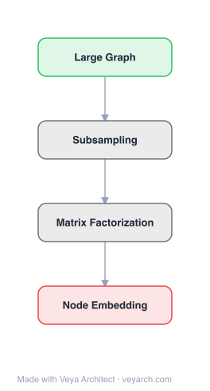

# Architecture: FastNE

## Motivation

Many Network Representation Learning (NRL) methods have been proposed (Spectral Clustering, DeepWalk, LINE, GraRep, TADW), but they vary widely in approach, making it hard to understand their relationships and improve them systematically. The paper identifies a key unifying insight: most NRL methods can be decomposed into a **two-step framework** — (1) proximity matrix construction and (2) dimension reduction. Analyzing the first step reveals that NRL methods can be improved by encoding **higher-order proximities** into the proximity matrix. However, accurately computing high-order proximity matrices is expensive (time-consuming) and not scalable for large networks. GraRep explicitly factorizes k-order proximity matrices but suffers from severe inefficiency. FastNE (via the NEU algorithm) fills this gap by proposing a method that **implicitly approximates higher-order proximities** using existing low-order embeddings as a basis, with a theoretical approximation bound, at negligible computational cost (<1% of training time). NEU can be applied as a post-processing step to **any** NRL method to enhance its performance.

## Core Idea

Fast network embedding enhancement using high-order proximity matrices.

## Architecture

### Overview

<b>Layer-by-layer (4 nodes)</b>

| # | Layer | Type | Params |
|---|---|---|---|
| 1 | Large Graph | `input` |  |
| 2 | Subsampling | `custom` |  |
| 3 | Matrix Factorization | `custom` |  |
| 4 | Node Embedding | `output` |  |

NEU (Network Embedding Update) is not a standalone NRL method but a **universal enhancement algorithm** that can be applied on top of any existing NRL method to improve its embeddings. The core insight is that existing NRL methods (DeepWalk, LINE, etc.) encode low-order proximities (first-order, second-order) in their embeddings. NEU leverages these low-order embeddings to **implicitly approximate higher-order proximities** through a simple algebraic update, without explicitly computing expensive high-order proximity matrices. The theoretical foundation is that the high-order proximity matrix A^k (k-step random walk transition probabilities) can be approximated by combining the low-order embeddings in a specific way. NEU applies a closed-form update to the embedding matrix, and the resulting embeddings implicitly approximate higher-order proximities with a provable approximation bound. The entire NEU procedure takes less than 1% of the training time of methods like DeepWalk and LINE, making it a negligible-cost enhancement.

### Components

1. **Proximity Matrix Construction (existing NRL step)** — The base NRL method:
   - Any NRL method (DeepWalk, LINE, GraRep, node2vec, etc.) first builds a proximity matrix M where M_ij encodes proximity between vertices i and j
   - First-order proximity: adjacency matrix A (direct edges)
   - Second-order proximity: common neighbors / 2-step random walk probability A²
   - k-order proximity: A^k (k-step random walk transition matrix)
   - Most methods use only first or second-order proximity

2. **Dimension Reduction (existing NRL step)** — Embedding learning:
   - The proximity matrix M is factorized/reduced to obtain d-dimensional embeddings
   - Methods: eigenvector computation (Spectral Clustering), SVD (GraRep), skip-gram (DeepWalk), etc.
   - Produces embedding matrix R ∈ ℝ^(|V|×d) encoding low-order proximity

3. **NEU Update (the enhancement)** — Implicit high-order approximation:
   - Takes the low-order embedding R from any NRL method as input
   - Applies an algebraic update that implicitly approximates higher-order proximities
   - The update combines R with itself in a way that approximates A^(2k) from A^k information
   - Theoretical approximation bound guarantees the quality of the approximation
   - Closed-form computation — no iterative optimization needed
   - Time complexity: O(|V|·d²), negligible compared to NRL training time

4. **Unified Framework** — Theoretical contribution:
   - Summarizes Spectral Clustering, DeepWalk, TADW, LINE, GraRep into a unified two-step framework
   - Shows that all these methods differ only in: (a) which proximity matrix they construct, and (b) which dimension reduction algorithm they use
   - This unification reveals that higher-order proximity is the key differentiator for quality

### Data Flow

1. **Input:** Network G = (V, E) with adjacency matrix A
2. **Base NRL Method:** Apply any NRL method (e.g., DeepWalk, LINE) to learn initial embeddings R ∈ ℝ^(|V|×d) encoding low-order proximity
3. **NEU Update:** Apply the algebraic update to R to produce enhanced embeddings R' that implicitly approximate higher-order proximities:
   - R' = update(R) where the update function combines R to approximate A^(2k) from A^k
   - The update is a closed-form matrix operation, no iterative optimization
4. **Output:** Enhanced embeddings R' ∈ ℝ^(|V|×d) with implicit high-order proximity approximation, ready for downstream tasks (node classification, link prediction)

### State / Memory

- **No recurrent state:** NEU is a closed-form algebraic update; no iterative optimization or temporal memory.
- **Input/Output:** Takes existing embedding matrix R as input, produces enhanced R' as output. No additional learned parameters.
- **Memory:** O(|V|·d) for the embedding matrix, same as the base NRL method. The NEU update itself requires only temporary computation, no additional persistent memory.
- **Stateless enhancement:** NEU is a pure function of the input embeddings — given the same input, it always produces the same output.

## Design Decisions

1. **Universal enhancement over standalone method** — NEU is designed as a post-processing enhancement applicable to any NRL method, rather than a new standalone method. This maximizes practical impact: practitioners can keep using their preferred NRL method and simply apply NEU to boost performance.

2. **Implicit approximation over explicit computation** — Rather than explicitly computing A^k (which is expensive and dense for large k), NEU implicitly approximates higher-order proximities through algebraic operations on the low-order embeddings. This avoids the scalability problem of GraRep while achieving similar benefits.

3. **Closed-form update** — The NEU update is a closed-form algebraic operation, not an iterative optimization. This makes it extremely fast (<1% of training time) and deterministic — no convergence issues, no hyperparameter tuning for the update itself.

4. **Theoretical approximation bound** — NEU provides a provable approximation bound: the enhanced embeddings are guaranteed to approximate higher-order proximities within a bounded error. This is not just an empirical heuristic but a theoretically grounded method.

5. **Unified framework analysis** — The paper's unified two-step framework (proximity matrix construction + dimension reduction) is a design decision that provides theoretical clarity. By showing that all NRL methods fit this framework, the analysis of "how to improve NRL" reduces to "how to build a better proximity matrix" — and the answer is "higher-order proximity."

6. **Use of low-order embeddings as basis** — NEU uses the existing low-order embeddings (already encoding A^k for small k) as a basis to approximate higher-order information. This avoids recomputing proximity from scratch, leveraging the work already done by the base NRL method.

## Evolution

**Predecessors:**
- **Spectral Clustering** (Tang & Liu, 2011) — Eigenvector computation on normalized Laplacian; first-order proximity.
- **DeepWalk** (Perozzi et al., 2014) — Skip-gram on random walks; implicitly low-order proximity.
- **LINE** (Tang et al., 2015) — First/second-order proximity; explicitly low-order.
- **GraRep** (Cao et al., 2015) — Explicit k-order proximity factorization; better but expensive. GraRep demonstrated that higher-order proximity improves quality, motivating NEU.
- **TADW** (Yang et al., 2015) — Matrix factorization with text; low-order proximity.

**Successors:**
- **NetMF** (Qiu et al., 2018) — Unified matrix factorization framework connecting DeepWalk, LINE, node2vec theoretically; formalizes the proximity matrix connection.
- **GCN** (Kipf & Welling, 2017) — Graph convolutional networks capture higher-order structure via layer stacking (K-layer GCN ≈ K-hop aggregation).
- **AROPE** (Zhang et al., 2018) — Arbitrary-order proximity embedding via random matrix polynomial.

## Characteristics

| Property | Value |
|----------|-------|
| Year | 2017 |
| Authors | Yang, Sun, Liu, Tu (Tsinghua University) |
| Category | GNN/Embedding |
| Source Paper | `Fast_network_embedding_enhancement_via_high_order_proximity_Yang_Liu_Tu_2017.md` |
| PaperVault Path | `GNN/02-network-embedding/Fast_network_embedding_enhancement_via_high_order_proximity_Yang_Liu_Tu_2017.md` |

## Limitations

1. **Approximation, not exact** — NEU approximates higher-order proximities, not computes them exactly. The approximation bound guarantees quality within a margin, but there may be cases where exact higher-order structure (as in GraRep) performs better.
2. **Dependent on base method quality** — NEU enhances existing embeddings; if the base NRL method produces poor embeddings (e.g., due to insufficient training or inappropriate hyperparameters), NEU's enhancement builds on a weak foundation.
3. **Fixed approximation order** — The NEU update approximates a specific higher-order proximity (doubling the effective order). Further enhancement requires repeated application, which may compound approximation error.
4. **No attribute or label integration** — NEU focuses purely on topological proximity enhancement. It does not incorporate node attributes, labels, or other side information.
5. **Theoretical bound may be loose** — While a theoretical approximation bound exists, it may be loose in practice. The actual quality of approximation may vary across networks with different structural properties.
6. **No deep architecture** — NEU is an algebraic update, not a deep learning method. It cannot learn complex nonlinear transformations of the embedding space that neural methods might.

## Implementation Notes

See `implementation/` for a minimal runnable implementation.

## Information Layers

- **Evidence:** Source paper available in `references/papers/` (Yang, Sun, Liu, Tu, 2017, "Fast Network Embedding Enhancement via High Order Proximity Approximation," IJCAI '17); source code at https://github.com/thunlp/NEU
- **Analysis:** NEU's most significant contribution is the unified two-step framework that demystifies the relationship between NRL methods: all methods are "proximity matrix construction + dimension reduction," and the key differentiator is the order of proximity captured. This insight is both theoretically clarifying and practically actionable — it identifies higher-order proximity as the lever for improvement. The NEU algorithm itself is elegantly simple: a closed-form algebraic update that implicitly approximates higher-order proximity at negligible cost. The theoretical approximation bound provides rigor uncommon in NRL enhancement methods. The universal applicability (works with any base NRL method) maximizes practical impact. The main limitation is that it remains an algebraic post-processing step — it cannot learn adaptive, task-specific transformations. Later GNN methods would capture higher-order structure natively through layer stacking (K-layer GCN ≈ K-hop aggregation), making explicit enhancement less necessary. But NEU's unifying framework insight remains influential, anticipating NetMF's theoretical unification.
- **Hypothesis:** The consistent improvement from higher-order proximity across all tested NRL methods suggests that low-order proximity is a fundamental bottleneck in NRL — the first/second-order information captured by DeepWalk/LINE is insufficient, and higher-order structure (multi-hop neighborhoods) carries significant additional signal. The fact that implicit approximation (NEU) matches explicit computation (GraRep) in quality suggests that the embedding dimension d is sufficient to encode higher-order information compactly — the information is there, it just needs the right algebraic transformation to surface. The negligible cost of NEU implies that the "hard work" of NRL is in the low-order embedding (proximity matrix construction + factorization), and higher-order enhancement is a "cheap correction" on top. This suggests that future NRL methods should focus on efficient low-order embedding and apply NEU-like post-processing for higher-order structure.
