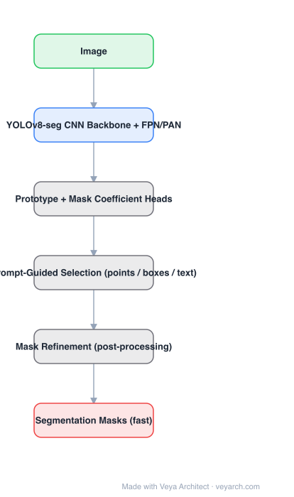

# Architecture: FastSAM

## Motivation

SAM's accuracy comes with a ViT-H encoder that is far too slow for interactive or edge use. FastSAM's observation: SAM's *task* can be decomposed. Instance segmentation — "propose masks for everything" — is a solved, cheap CNN problem (YOLOv8-seg); the promptable part is really a **selection** problem over those candidates. So do the expensive part once, prompt-free, and make prompting a cheap second stage.

## Core Idea

Two stages: (1) **all-instance segmentation** with a CNN (YOLOv8-seg with YOLACT-style prototype heads) producing a pool of mask candidates in one forward pass, (2) **prompt-guided selection** — for a point, box, or text prompt, pick the candidate that matches. No transformer decoder is involved in answering a prompt.

## Architecture

### Overview

<b>Layer-by-layer (6 nodes)</b>

| # | Layer | Type | Params |
|---|---|---|---|
| 1 | Image | `input` |  |
| 2 | YOLOv8-seg CNN Backbone + FPN/PAN | `conv2d` |  |
| 3 | Prototype + Mask Coefficient Heads | `custom` |  |
| 4 | Prompt-Guided Selection (points / boxes / text) | `custom` |  |
| 5 | Mask Refinement (post-processing) | `custom` |  |
| 6 | Segmentation Masks (fast) | `output` |  |

### Components

1. **YOLOv8-seg backbone + FPN/PAN** — standard CSP-Darknet-style CNN with multi-scale fusion; the whole heavy pass is prompt-independent.
2. **Detection heads** — boxes and classes for all instances.
3. **Prototype + mask-coefficient heads** (YOLACT-style) — the detector predicts a small coefficient vector per instance; masks are formed by linearly combining a bank of prototype masks. This is the cheap substitute for SAM's transformer mask decoder.
4. **Prompt-guided selection** — for a point prompt, find the candidate whose mask contains it (and resolve ambiguity by part/whole hierarchy as SAM does); for a box, match by IoU/region; for text, match by CLIP-style similarity with the candidate region.
5. **Optional mask refinement** — a matting/refinement step can improve boundary fidelity at extra cost.
6. **Training** — reported to use only about **2% (1/50)** of SA-1B, which is feasible precisely because the model is a CNN detector rather than a foundation model.

### Data Flow

Image → CNN backbone/neck → detection + prototype heads → pool of candidate masks → prompt matching (point/box/text) → selected mask → optional refinement.

### State / Memory

No recurrent state and no cached image embedding — the candidate pool *is* the persistent structure: once computed, any number of prompts can be answered without re-running the network.

## Design Decisions

- **Decompose the task** — separate "propose masks" (expensive, prompt-free) from "select a mask" (cheap, prompt-dependent).
- **CNN + prototypes instead of a transformer decoder** — masks cost a linear combination, not cross-attention.
- **Amortize over prompts** — one forward pass serves unlimited prompts, which is the real latency win.
- **Accept lower mask quality** — the trade is explicit: speed for boundary fidelity.

## Evolution

- **YOLACT / YOLOv8-seg** (predecessors): real-time instance segmentation with prototypes.
- **FastSAM**: reuse those for "segment anything" with prompt-based selection, trained on a slice of SA-1B.
- **Siblings**: MobileSAM (distilled encoder, same SAM decoder), EfficientSAM (masked-image-pretraining distillation), EdgeSAM (encoder-only distillation for on-device), SAM-HQ (quality-focused, slower).
- **Contrast with SAM 3**: SAM 3 goes toward concepts and video; FastSAM goes toward latency.

## Characteristics

| Property | Value |
|---|---|
| Task | promptable segmentation (fast) |
| Backbone | YOLOv8-seg CNN + FPN/PAN |
| Mask mechanism | prototype masks + per-instance coefficients |
| Prompt handling | post-hoc candidate selection (point / box / text) |
| Training data | ~2% of SA-1B |
| Amortization | one forward pass, any number of prompts |

## Limitations

- Mask quality and boundary fidelity are below SAM, especially for thin structures and small objects.
- Quality is bounded by the detector: if YOLOv8-seg misses an instance, no prompt can recover it.
- Text prompting is weaker than dedicated open-vocabulary models (Grounding DINO, SAM 3) because it rides on region-level CLIP similarity.
- No video/temporal modeling, and the prompt semantics differ from SAM's (selection, not generation).

## Implementation Notes

Essentials: (1) start from a YOLOv8-seg model with prototype heads, (2) precompute the candidate pool once per image and cache it, (3) implement prompt selection as geometric matching (point-in-mask, box IoU) plus CLIP similarity for text, (4) keep an optional refinement path for quality-sensitive use. Do not re-run the backbone per prompt — that defeats the entire design.
