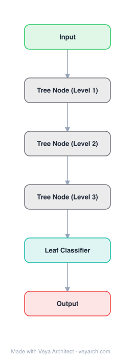

# Architecture: FFF (Fast Feedforward Networks)

## Motivation

The feedforward layer is a parameter-heavy building block of transformer models. Growing to tens of thousands of hidden neurons in recent years, the cost of feedforward layer inference is a significant bottleneck. Prior approaches to modularization (Mixture of Experts) scale down inference time by a constant but remain linear in the width of the feedforward layer, and rely on noisy gating that complicates training.

## Core Idea

A log-time alternative to feedforward networks. FFF divides the input space into disjoint regions by means of a differentiable binary tree and performs simultaneous learning and inference by accessing only O(log N) neurons. This breaks the linear link between layer size and inference cost, achieving up to 220× speedup over standard feedforward networks and 6× over MoE, with noiseless conditional execution.

## Architecture

### Overview

<b>Layer-by-layer (6 nodes)</b>

| # | Layer | Type | Params |
|---|---|---|---|
| 1 | Input | `input` |  |
| 2 | Tree Node (Level 1) | `custom` |  |
| 3 | Tree Node (Level 2) | `custom` |  |
| 4 | Tree Node (Level 3) | `custom` |  |
| 5 | Leaf Classifier | `linear` |  |
| 6 | Output | `output` |  |

FFF replaces the standard feedforward layer with a binary tree structure. Each node in the tree contains a linear classifier that routes the input to either the left or right child. Leaf nodes contain actual neurons (linear transformations + activation). During inference, only the O(log N) nodes along the path from root to a single leaf are evaluated, rather than all N neurons.

### Components

1. **Differentiable Binary Tree** — The core structure that divides the input space into disjoint regions. Each internal node contains a linear classifier that determines routing direction.

2. **Internal Nodes (Routing Nodes)** — Each contains a linear classifier:
   - Input: x ∈ R^d
   - Output: routing decision (left or right child)
   - Routing is differentiable (soft routing during training, hard routing during inference)

3. **Leaf Nodes (Neurons)** — Each leaf contains:
   - A linear transformation: W_i ∈ R^{d×d'}
   - An activation function (e.g., ReLU, GELU)
   - Only one leaf is activated per inference (the one reached by the routing path)

4. **Tree Depth** — A tree of depth D has 2^D leaves. Inference evaluates D nodes (logarithmic in number of neurons).

### Data Flow

1. **Input**: x ∈ R^d
2. **Root node**: Apply linear classifier → route left or right
3. **Internal nodes**: At each node, apply classifier → route left or right (D steps total)
4. **Leaf node**: Apply the neuron at the reached leaf → output
5. **Output**: y = activation(W_leaf × x)

**Training (soft routing):**
- At each node, compute soft routing probabilities
- All leaves contribute weighted by their routing probabilities
- Gradients flow through all paths

**Inference (hard routing):**
- At each node, make binary routing decision
- Only one path is evaluated (D nodes total)
- O(log N) computation vs. O(N) for standard feedforward

### State / Memory

- **No explicit memory mechanism**: FFF is a feedforward architecture without recurrent state.
- **Tree parameters**: The binary tree structure (routing classifiers + leaf neurons) is persistent model parameters.
- **Routing path**: During inference, the routing path (sequence of left/right decisions) is transient state.

## Design Decisions

1. **Binary tree structure** — Using a binary tree ensures:
   - Logarithmic inference time: O(log N) vs. O(N)
   - Disjoint input space partitioning (each input reaches exactly one leaf)
   - Differentiable training via soft routing

2. **Noiseless conditional execution** — Unlike MoE which uses noisy gating for load balancing, FFF uses deterministic routing:
   - No noise during training
   - Simpler training dynamics
   - No load balancing issues (tree structure ensures balanced partitioning)

3. **Soft routing during training, hard during inference** — This allows gradient flow during training while maintaining log-time inference.

4. **Single-leaf activation** — Only one leaf neuron is evaluated per inference, maximizing efficiency.

5. **Tree depth control** — The tree depth D directly controls the trade-off between model capacity (2^D neurons) and inference cost (D evaluations).

## Evolution

**Predecessors:**
- **Feedforward layers** — Standard MLP with O(N) inference.
- **Mixture of Experts (MoE)** (Shazeer et al., 2017) — Prior modularization with noisy gating, O(k) inference for k experts.
- **Conditional computation** (Bengio et al., 2015) — Early work on conditional execution.
- **Hierarchical mixture of experts** — Prior tree-structured approaches.

**Successors:**
- FFF variants for vision transformers.
- Improved tree-based conditional computation.
- Hardware-optimized FFF implementations.

## Characteristics

| Property | Value |
|----------|-------|
| Year | 2023 |
| Authors | Belcak, Wattenhofer (ETH Zürich) |
| Category | DL/Transformer |
| Source Paper | `Fast_Feedforward_Networks_Belcak_Wattenhofer_2023.md` |
| PaperVault Path | `DL-Architectures/01-transformers/Fast_Feedforward_Networks_Belcak_Wattenhofer_2023.md` |

## Limitations

1. **Tree depth vs. capacity trade-off** — Deeper trees provide more capacity (2^D leaves) but require more routing steps; shallow trees are fast but limited.
2. **Routing errors** — Hard routing during inference may make suboptimal decisions compared to soft routing during training.
3. **Single-path limitation** — Only one leaf is activated, potentially missing useful information from other paths.
4. **Training-inference mismatch** — Soft routing during training vs. hard routing during inference may cause quality degradation.
5. **Tree structure rigidity** — The fixed binary tree structure may not adapt well to all data distributions.

## Implementation Notes

See `implementation/` for a minimal runnable implementation. Key details:
- Binary tree of depth D → 2^D leaf neurons
- Internal nodes: linear classifiers for routing
- Leaf nodes: linear transformation + activation
- Training: soft routing (differentiable, all paths contribute)
- Inference: hard routing (single path, O(log N) computation)
- Up to 220× faster than standard feedforward
- Up to 6× faster than MoE
- Can use as little as 1% of neurons while preserving 94.2% performance
- Noiseless conditional execution (no noisy gating)
- Code at github.com/pbelcak/fastfeedforward

## Information Layers

- **Evidence:** Source paper available in `references/papers/` (Belcak & Wattenhofer, 2023, "Fast Feedforward Networks")
- **Analysis:** FFF's key innovation is recognizing that feedforward inference can be made logarithmic rather than linear. The binary tree structure is a natural fit: it partitions the input space into disjoint regions, with each region handled by a single neuron. The noiseless routing is a significant advantage over MoE, which requires noisy gating for load balancing. The ability to use only 1% of neurons while preserving 94.2% performance validates the sparsity hypothesis — most neurons are irrelevant for any given input.
- **Hypothesis:** The binary tree structure may not be optimal for all data distributions; adaptive tree structures could improve performance. The training-inference mismatch (soft vs. hard routing) could be mitigated by distillation or straight-through estimators. The FFF approach may be particularly valuable for edge deployment where inference cost is critical.
