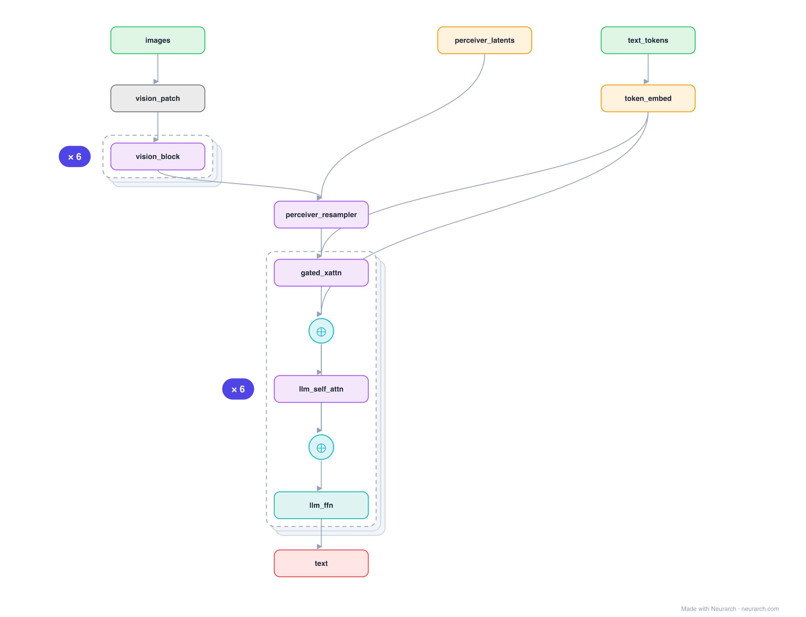

# Architecture: Flamingo

## Motivation

The visual-language model that handles interleaved images and text and does few-shot in-context learning. A Perceiver Resampler compresses image features to a few tokens, and gated cross-attention layers spliced into a frozen LLM let the text attend to them.

## Core Idea

The visual-language model that handles interleaved images and text and does few-shot in-context learning.

## Architecture

### Overview

*Identical repeated blocks are folded into one representative block with a `× N` badge, so the whole architecture fits on screen. `model.json` uses NAXS block templates + `repeat` directives and expands back to all 43 nodes (open it in Neurarch to see and edit every layer). Vector: [diagram.svg](assets/diagram.svg).*

| Hyperparameter | Value |
|---|---|
| Type | Few-shot visual language model |
| Vision encoder | Frozen (NFNet / CLIP) |
| Resampler | Perceiver: learned latents cross-attend vision features → fixed tokens |
| LLM | Frozen, with gated cross-attention layers inserted between blocks |
| Key idea | Interleave image + text, tanh-gated x-attn so init = pure LLM |

`model.json` is the full graph, hand-built against the official config.json.

### Design Notes

- Perceiver Resampler: a fixed set of learned latents cross-attend the variable-length vision features, so any image (or video) becomes a constant 64 visual tokens.
- tanh gating: the inserted cross-attention starts at zero contribution (gate = 0), so the model begins as exactly the frozen LLM and learns to use vision gradually, which is what made training stable.
- The ancestor of the "freeze the LLM, splice in vision via cross-attention" branch of MLLMs; contrast with the prefix-token approach of [llava-1.5-7b](../llava-1.5-7b/).

### Parameter Check

Neurarch's per-layer parameter estimate over this graph: **1.90B**.

## Design Decisions

> **Analysis** — Observations derived from studying the architecture.

- Perceiver Resampler: a fixed set of learned latents cross-attend the variable-length vision features, so any image (or video) becomes a constant 64 visual tokens.
- tanh gating: the inserted cross-attention starts at zero contribution (gate = 0), so the model begins as exactly the frozen LLM and learns to use vision gradually, which is what made training stable.
- The ancestor of the "freeze the LLM, splice in vision via cross-attention" branch of MLLMs; contrast with the prefix-token approach of [llava-1.5-7b](../llava-1.5-7b/).

## Implementation Notes

- `model.json` contains the full structural graph with real dimensions and parameters, using NAXS block templates + `repeat` for repeated units.
- Open in [Neurarch](https://www.neurarch.com/) to visualize, edit, or export training code.
- Diagrams fold repeated identical blocks with a `× N` badge; `model.json` defines each repeated unit once at real dimensions and expands to all nodes.

## Limitations

- This package focuses on the architectural structure. Training pipelines, 
dataset preparation, and production optimizations are out of scope.

## Evolution

> See `references/related/` for predecessor and successor architectures.

