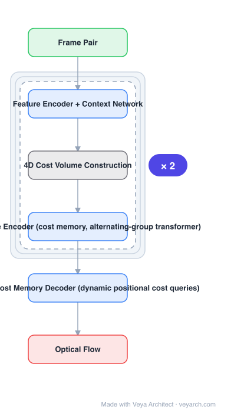

# Architecture: FlowFormer

## Motivation

RAFT-family models look up a local cost volume with convolutions and refine many times; the cost volume is treated as a tensor to convolve over, never as something with global structure. Transformers could model that structure, but a 4D cost volume is too large to tokenize naively. FlowFormer's contribution is to make the cost volume transformer-addressable and to decode flow by querying it.

## Core Idea

Encode the 4D cost volume into a compact **cost memory** with a transformer encoder (**alternating-group** attention keeps the computation tractable), then decode with **recurrent dynamic positional cost queries**: for each source pixel, a query built from the local 9×9 cost patch around the *current* flow estimate retrieves information from the cost memory, and a ConvGRU regresses the flow residual.

## Architecture

### Overview

<b>Layer-by-layer (6 nodes)</b>

| # | Layer | Type | Params |
|---|---|---|---|
| 1 | Frame Pair | `input` |  |
| 2 | Feature Encoder + Context Network | `conv2d` |  |
| 3 | 4D Cost Volume Construction | `custom` |  |
| 4 | Cost Volume Encoder (cost memory, alternating-group transformer) | `attention` |  |
| 5 | Recurrent Cost Memory Decoder (dynamic positional cost queries) | `attention` |  |
| 6 | Optical Flow | `output` |  |

### Components

1. **Feature encoder + context network** — per-image features and a context/appearance feature map (as in RAFT).
2. **4D cost volume** — all-pairs correlation between the two frames.
3. **Cost volume encoder (alternating-group transformer)** — tokenizes the cost volume into a compact **cost memory**; groups alternate along the two spatial axes so attention stays affordable.
4. **Dynamic positional cost query** — per source pixel: crop a 9×9 cost patch centred at the current flow estimate, encode it with an FFN, add the positional embedding of that location, and use it as the query over the cost memory.
5. **Recurrent cost memory decoder (ConvGRU)** — takes retrieved cost features + cost patch + context + current flow, regresses a flow residual; keys/values are computed once and reused across iterations.
6. **Convex upsampler** — flow is estimated at reduced resolution and upsampled learnably, supervised at every iteration with increasing weights.

### Data Flow

Frame pair → features + cost volume → cost volume encoder → cost memory → (per iteration) dynamic positional cost queries → retrieved cost features → ConvGRU residual → updated flow → convex upsampling → optical flow.

### State / Memory

The recurrent flow estimate and the ConvGRU hidden state are the per-iteration state; the **cost memory** (encoded cost volume) is the persistent structure that replaces repeated cost lookups.

## Design Decisions

- **Encode the cost volume, do not convolve it** — the transformer-native reformulation of RAFT's correlation volume.
- **Alternating-group attention** — the trick that makes a 4D volume tokenizable at reasonable cost.
- **Dynamic positional queries** — queries are rebuilt each iteration from the current estimate, so attention follows the flow.
- **Reuse keys/values** — the cost memory does not need re-encoding per iteration, which is the stated efficiency benefit.
- **Supervise every iteration** — standard RAFT practice, kept.

## Evolution

- **PWC-Net** (coarse-to-fine) and **RAFT** (iterative refinement over a local cost volume) (predecessors).
- **GMA-RAFT** (motion-aware appearance): the ConvGRU refinement design FlowFormer follows.
- **FlowFormer (2022)**: cost memory + dynamic positional cost queries.
- **Siblings**: GMFlow (global matching, few refinements), SEA-RAFT (fewer changes, more speed), DICL, GLU-Net.
- **Successor**: FlowFormer++ (improved generalization/efficiency).

## Characteristics

| Property | Value |
|---|---|
| Task | optical flow |
| Cost representation | 4D cost volume encoded into a cost memory |
| Encoder | alternating-group transformer |
| Decoder | recurrent ConvGRU with dynamic positional cost queries |
| Upsampling | learnable convex upsampler |
| Supervision | all recurrent iterations, increasing weights |

## Limitations

- Transformer encoding of the cost volume is more expensive per iteration than a simple lookup; speed depends on iteration count.
- Still iterative: latency scales with the number of refinements chosen at inference.
- Trained on synthetic data (FlyingChairs/FlyingThings) then fine-tuned — the standard domain-gap caveat applies.
- Two-frame only: no temporal context beyond the pair.

## Implementation Notes

Essentials: (1) construct the full 4D cost volume before encoding it — the encoder needs all-pairs costs, not a local window, (2) implement alternating-group attention for the cost volume encoder, or memory will explode, (3) rebuild the cost query each iteration from the 9×9 crop at the current flow estimate, (4) compute cost-memory keys/values once and reuse them across iterations, (5) supervise all iterations with increasing weights and report both accuracy and iterations-vs-latency, since the iteration count is the deployment knob.
