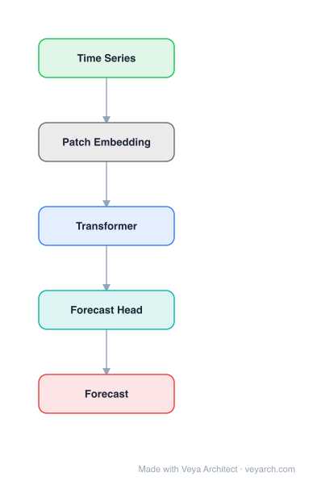

# Architecture: Financial Multimodal Time Series Forecasting

## Motivation

The paper addresses **financial time series forecasting** — predicting stock price movements from multiple information sources. This is challenging because financial markets exhibit **multi-modality** (historical price series, media news, knowledge graph relations) and **lead-lag effects** (correlated but asynchronous price movements across related equities). For example, when "Qualcomm sues Apple" hits the market, not only do Qualcomm and Apple prices move, but upstream/downstream firms (Samsung, Foxconn) also react at different speeds. Prior quantitative methods rely on historical price data alone; NLP-enhanced methods use news text but do not capture inter-equity relations; knowledge-graph-enhanced methods encode entity relations but do not unify multi-modal inputs. The financial industry additionally requires models to be **interpretable and compliant** for regulatory reasons.

MAGNN (Multi-modality Graph Neural Network) fills this gap by learning lead-lag effects from multi-modal inputs (historical prices, media events, knowledge graph relations) in a unified heterogeneous graph neural framework, with a two-phase attention mechanism for interpretability.

## Core Idea

Financial time series forecasting using multi-modality graph neural networks.

## Architecture

### Overview

<b>Layer-by-layer (5 nodes)</b>

| # | Layer | Type | Params |
|---|---|---|---|
| 1 | Time Series | `input` |  |
| 2 | Patch Embedding | `custom` |  |
| 3 | Transformer | `attention` |  |
| 4 | Forecast Head | `linear` |  |
| 5 | Forecast | `output` |  |

MAGNN is a heterogeneous graph attention network for financial time series prediction. Multi-modality sources (historical prices, media news events, financial knowledge graph relations) are defined as source nodes and the predicted equity as the target node in a heterogeneous graph. A **two-phase attention mechanism** — inner-modality attention (learning contributions of graph-structured sources within each modality) and inter-modality attention (learning dynamic weights among modalities) — infers internal sequential patterns and inter-source lead-lag relations. The learned informative features are fed into a prediction layer for price movement forecasting.

### Components

- **Heterogeneous graph construction:** Multi-modality sources are encoded as nodes in a heterogeneous graph: historical price nodes, media event nodes (extracted from news via NLP and stored in a Financial Knowledge Graph, FinKG), and relation nodes from the FinKG. Edges represent lead-lag relationships. The predicted equity is the target node.
- **Inner-modality attention:** Within each modality (e.g., within the set of media event nodes), a graph attention mechanism learns different contributions of graph-structured sources to the target node. This captures internal sequential patterns and identifies which specific sources within a modality are most predictive.
- **Inter-modality attention:** Dynamically learns weights among different modalities (prices, news, KG relations) for the target prediction. This addresses the fact that different modalities contribute differently in different time periods — e.g., news may dominate during event-driven periods, while price patterns dominate in calm markets.
- **Prediction layer:** The learned multi-modal features are fed into a prediction layer for price movement forecasting (classification of up/down movement).

### Data Flow

1. **Input:** Historical price series for target equities, raw news text, and a Financial Knowledge Graph (FinKG) encoding entity relations.
2. **Event extraction:** Extract structural event tuples and relations from raw news via NLP; store in FinKG.
3. **Heterogeneous graph construction:** Build a graph with price nodes, event nodes, and KG relation nodes as sources, and the target equity as the target node; edges encode lead-lag relationships.
4. **Inner-modality attention:** Within each modality, apply graph attention to learn source-level contributions to the target.
5. **Inter-modality attention:** Dynamically weight the contributions of different modalities based on the current market context.
6. **Prediction:** Feed the learned features into the prediction layer for price movement classification.
7. **Training:** Supervised on labeled price movements; the two-phase attention provides interpretability for regulatory compliance.

### State / Memory

Stateless at inference (the model processes a fixed input window). The heterogeneous graph is constructed per input from the available price, news, and KG data. The attention mechanisms provide adaptive per-inference weighting but no recurrent hidden state. Temporal memory is limited to the input window and the lead-lag relationships encoded in the graph structure.

## Design Decisions

- **Heterogeneous graph unifying multi-modal sources:** Rather than processing each modality (prices, news, KG) in separate pipelines, MAGNN encodes all sources as nodes in a single heterogeneous graph, enabling cross-modal lead-lag relationship learning.
- **Two-phase attention for interpretability:** The financial industry requires explainable models for regulatory compliance. Inner-modality attention explains which sources within a modality matter; inter-modality attention explains which modality dominates — providing end-to-end interpretability.
- **Lead-lag effect as graph edges:** Modeling the lead-lag effect (asynchronous price diffusion) as edges in the heterogeneous graph captures a phenomenon that standard time series models cannot represent.
- **Financial Knowledge Graph (FinKG) for relation encoding:** Using a domain-specific KG to encode entity relations (e.g., founder, competitor, supplier) provides semantic context that distinguishes events like "Steve Jobs quits Apple" from "David Peter leaves Starbucks."

## Evolution

**Predecessors:**
- Traditional quantitative models using historical price data and technical indicators.
- LSTM/GRU-based price prediction — temporal modeling without inter-equity relations.
- NLP-enhanced models using news sentiment — text features without relational structure.
- Knowledge graph embedding methods (TransE, TransH) — relation encoding without temporal dynamics.

**Successors:**
- Multi-modal financial graph models incorporating real-time news streams and dynamic KG updates.
- Transformer-based financial forecasting with cross-asset attention.
- Models extending the lead-lag graph paradigm to other domains (supply chain, commodity markets).

## Characteristics

| Property | Value |
|----------|-------|
| Year | 2022 |
| Authors | Cheng et al. |
| Category | GNN/TimeSeries |
| Source Paper | `Financial_time_series_forecasting_with_multi_modality_graph_Recognition_2022.md` |
| PaperVault Path | `GNN/06-gnn-for-time-series/Financial_time_series_forecasting_with_multi_modality_graph_Recognition_2022.md` |

## Limitations

- **Lead-lag graph construction dependency:** The quality of the heterogeneous graph depends on the accuracy of event extraction from news and the completeness of the FinKG; errors in NLP or KG gaps propagate to the model.
- **Static lead-lag edges:** Lead-lag relationships are encoded as fixed graph edges; in reality, lead-lag dynamics change over time (e.g., new supply chain relationships, M&A activity).
- **Binary price movement prediction:** The prediction layer classifies up/down movement; real-world trading requires magnitude, confidence intervals, and risk assessment.
- **Interpretability vs. performance trade-off:** The two-phase attention adds interpretability but also adds model complexity and potential overfitting on smaller datasets.
- **Market regime sensitivity:** Financial markets are non-stationary and regime-switching; a model trained in one regime may degrade significantly in another.

## Implementation Notes

See `implementation/` for a minimal runnable implementation.

## Information Layers

- **Evidence:** Source paper available in `references/papers/`
- **Analysis:** MAGNN's contribution is the principled unification of multi-modal financial data (prices, news, KG) in a single heterogeneous graph with a two-phase attention mechanism that provides both performance and regulatory-required interpretability. The lead-lag effect modeling as graph edges captures a real financial phenomenon that flat time series models miss. The deployment in a major financial service provider validates practical utility.
- **Hypothesis:** The static lead-lag edges may not capture evolving inter-firm relationships; dynamic graph construction (e.g., from rolling-window correlation or causal discovery) could improve adaptability. The binary movement prediction could be extended to probabilistic forecasting for risk management. Market regime detection and regime-specific expert routing (similar to MoE architectures) could address non-stationarity.
