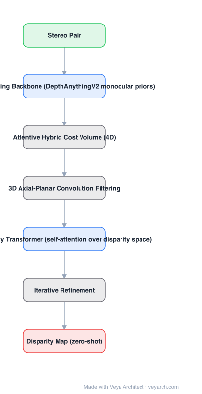

# Architecture: FoundationStereo

## Motivation

Stereo networks had neither the data nor the priors to behave like foundation models: they were trained on ~40K synthetic pairs (Scene Flow) and fine-tuned per target domain, so none could be used off-the-shelf. Two specific gaps are blamed — **impoverished training data** and an **architecture** that does not exploit the rich monocular priors now available from internet-scale pretraining.

## Core Idea

A large foundation model for stereo: train on **1M high-fidelity synthetic pairs** with an automatic **self-curation** pipeline; inject real-image monocular priors from **DepthAnythingV2** via a **side-tuning** feature backbone; and process the 4D cost volume with an **Attentive Hybrid Cost Volume** module — 3D axial-planar convolution plus a disparity transformer.

## Architecture

### Overview

<b>Layer-by-layer (7 nodes)</b>

| # | Layer | Type | Params |
|---|---|---|---|
| 1 | Stereo Pair | `input` |  |
| 2 | Side-Tuning Backbone (DepthAnythingV2 monocular priors) | `attention` |  |
| 3 | Attentive Hybrid Cost Volume (4D) | `custom` |  |
| 4 | 3D Axial-Planar Convolution Filtering | `custom` |  |
| 5 | Disparity Transformer (self-attention over disparity space) | `attention` |  |
| 6 | Iterative Refinement | `custom` |  |
| 7 | Disparity Map (zero-shot) | `output` |  |

### Components

1. **Side-tuning feature backbone** — adapts internet-scale rich priors from DepthAnythingV2 (trained on real monocular images) into the stereo setup, mitigating the sim-to-real gap.
2. **Large-scale synthetic dataset (1M pairs)** — high diversity and photorealism, with an automatic self-curation pipeline that iteratively removes the ambiguous samples domain randomization inevitably produces.
3. **Attentive Hybrid Cost Volume (AHCF)** — two parts:
   - **3D Axial-Planar Convolution (APC)** — decouples standard 3D convolution into separate spatial- and disparity-oriented 3D convolutions, enlarging receptive fields for volume feature aggregation.
   - **Disparity Transformer (DT)** — self-attention over the entire disparity space inside the cost volume, providing long-range context.
4. **Iterative refinement** — the resulting features give a better disparity initialization and stronger features for refinement.

### Data Flow

Stereo pair → side-tuning backbone (DepthAnythingV2 priors) → 4D cost volume → AHCF (APC filtering + disparity transformer) → better initialization → iterative refinement → disparity map.

### State / Memory

No recurrent design beyond the iterative refinement loop. The 4D cost volume is the large intermediate structure; the monocular priors enter through the side-tuning branch rather than a stored cache.

## Design Decisions

- **Scale and curate the synthetic data** — 1M pairs, and prune bad ones automatically, since domain randomization generates ambiguous samples.
- **Side-tune rather than fine-tune the prior model** — DepthAnythingV2 is trained on real monocular images; side-tuning adapts it without destroying it.
- **Decouple 3D convolution by axis** — APC gets larger receptive fields at lower cost than a full 3D conv.
- **Attend over disparity** — the DT gives global reasoning across the disparity dimension, which local filtering cannot.
- **Target zero-shot explicitly** — no per-domain fine-tuning is the acceptance criterion.

## Evolution

- **PSMNet / GA-Net** (predecessors): cost volume + 3D convolutions.
- **RAFT-Stereo / IGEV / CREStereo**: recurrent refinement, still per-domain fine-tuned.
- **FoundationStereo (2025)**: foundation-model scale, monocular priors, AHCF, zero-shot.
- **Variants**: Fast-FoundationStereo (real-time).
- **Contrast**: prior stereo networks fine-tuned per target domain.

## Characteristics

| Property | Value |
|---|---|
| Task | stereo matching (zero-shot) |
| Data | 1M high-fidelity synthetic pairs + self-curation |
| Priors | DepthAnythingV2 via side-tuning backbone |
| Cost volume | Attentive Hybrid Cost Volume: APC + Disparity Transformer |
| Fine-tuning | none required per domain |
| Result | comparable or better than per-domain fine-tuned prior work; better on in-the-wild data |

## Limitations

- Large model: heavier than RAFT-Stereo/IGEV for real-time deployment (Fast-FoundationStereo addresses this).
- Depends on synthetic data realism; self-curation helps but does not eliminate the sim-to-real gap.
- Requires rectified stereo pairs and calibration.
- Zero-shot is relative: in-domain fine-tuning still helps on a specific target domain.

## Implementation Notes

Essentials: (1) generate a large, diverse synthetic set and run the self-curation loop — ambiguous samples from domain randomization must be pruned, (2) add the side-tuning branch from DepthAnythingV2 rather than fine-tuning the monocular model directly, (3) implement APC as two separated 3D convolutions (spatial then disparity) inside the cost volume, (4) add the disparity transformer over the full disparity dimension, (5) evaluate zero-shot on in-the-wild data with no fine-tuning, and compare against fine-tuned baselines — that is the claim.
