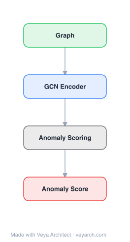

# Architecture: GAD (Graph Anomaly Detection)

## Motivation

The paper addresses **anomaly detection in multivariate time series from interconnected sensors** — a critical task for securing Cyber-Physical Systems (CPS) such as power grids, water treatment plants, and data centres against faults and attacks. As sensor networks grow in complexity and dimensionality, manual monitoring becomes infeasible, necessitating automated anomaly detection that is both accurate and **explainable** (so operators can diagnose root causes). Prior unsupervised methods (autoencoders, GANs, LSTM-based) detect anomalies but **do not explicitly learn which sensors are related to one another**, limiting their ability to model complex, nonlinear inter-sensor relationships and to explain detected anomalies by identifying which relationships were violated.

GAD (specifically, the Graph Deviation Network, GDN) fills this gap by combining **structure learning** (to discover inter-sensor relationships) with **graph neural networks** (to model and predict sensor behavior based on these relationships) and **attention weights** (to provide explainability for detected anomalies).

## Core Idea

GNN-based anomaly detection in multivariate time series using attention-based forecasting deviation.

## Architecture

### Overview

<b>Layer-by-layer (4 nodes)</b>

| # | Layer | Type | Params |
|---|---|---|---|
| 1 | Graph | `input` |  |
| 2 | GCN Encoder | `gcn_conv` |  |
| 3 | Anomaly Scoring | `custom` |  |
| 4 | Anomaly Score | `output` |  |

GDN (Graph Deviation Network) is an unsupervised anomaly detection framework with four main components: (1) **Sensor Embedding** — uses embedding vectors to flexibly capture the unique characteristics of each sensor; (2) **Graph Structure Learning** — learns the relationships between pairs of sensors and encodes them as edges in a graph; (3) **Graph Attention-Based Forecasting** — learns to predict the future behavior of each sensor based on an attention function over its neighboring sensors in the learned graph; (4) **Graph Deviation Scoring** — identifies and explains deviations from the learned sensor relationships. Anomalies are detected when the forecast deviation (difference between predicted and actual sensor values) exceeds a threshold.

### Components

- **Sensor embeddings:** Each sensor `i` is assigned a learnable embedding vector `v_i` that captures its unique characteristics (e.g., a pressure sensor vs. a flow-rate sensor have different behaviors). This addresses the limitation of standard GNNs that use the same model parameters for all nodes.
- **Graph structure learning:** Learns a directed graph of relationships between sensors. For each sensor pair `(i, j)`, a similarity score is computed from their embeddings, and the top-k most related sensors are selected as neighbors for each sensor. The graph is learned jointly with the forecasting model, not provided as input.
- **Graph attention-based forecasting:** Uses a graph attention mechanism where each sensor attends to its learned neighbors. The attention weights determine how much each neighbor contributes to predicting the target sensor's future value. This captures the nonlinear, inter-sensor dependencies that simpler models miss.
- **Graph deviation scoring:** Computes the deviation between predicted and actual sensor values. The aggregate deviation score across sensors serves as the anomaly score. The attention weights and learned graph structure provide explainability — the subgraph over which a deviation is detected, along with the attention weights, indicate which sensors and relationships are responsible for the anomaly.

### Data Flow

1. **Input:** Multivariate time series from N sensors over a window of T time steps.
2. **Sensor embedding:** Each sensor is mapped to a learnable embedding vector capturing its characteristics.
3. **Graph structure learning:** Compute pairwise sensor similarity from embeddings; select top-k neighbors per sensor to form a directed relationship graph.
4. **Graph attention forecasting:** For each sensor, attend to its neighbors using learned attention weights and predict its next-step value based on the aggregated neighborhood information.
5. **Deviation scoring:** Compute the deviation between predicted and actual values; aggregate across sensors to produce an anomaly score.
6. **Anomaly detection:** If the score exceeds a threshold (set via validation on normal data), flag an anomaly. The attention weights and detected subgraph provide root-cause explanation.
7. **Training:** Unsupervised on normal (anomaly-free) data; the model learns to predict normal sensor behavior, so anomalies manifest as large deviations.

### State / Memory

Stateless at inference (the model predicts one-step-ahead from a fixed window). The learned sensor embeddings and graph structure are persistent model parameters. The attention mechanism provides adaptive per-inference weighting but no recurrent hidden state. Temporal memory is limited to the input window length.

## Design Decisions

- **Learning the sensor relationship graph (not pre-defined):** In sensor networks, the inter-sensor relationships are initially unknown and must be discovered from data. Jointly learning the graph with the forecasting model ensures the structure reflects predictive relationships.
- **Per-sensor embeddings:** Addresses the limitation that different sensors have fundamentally different behaviors (pressure vs. flow rate); standard GNNs use shared parameters, which cannot distinguish sensor types.
- **Attention-based neighbor weighting:** Unlike fixed-weight graph convolution, attention learns which neighbors are most predictive for each sensor, improving both accuracy and explainability.
- **Deviation-based scoring (unsupervised):** By training on normal data and detecting deviations, the approach does not require labeled anomalies — essential since labeled anomalies are rare and varied.
- **Explainability via attention and learned graph:** The attention weights and the subgraph over which a deviation is detected allow operators to trace which sensors and relationships caused the anomaly flag.

## Evolution

**Predecessors:**
- Autoencoders (AE), VAEs — reconstruction-error-based anomaly detection; no explicit inter-sensor relationship modeling.
- LSTM-based anomaly detection (e.g., Hundman et al., 2018) — temporal prediction per series; no inter-sensor structure.
- GAN-based anomaly detection (Li et al., 2019) — adversarial; no relationship graph.
- GCN (Kipf & Welling, 2017), GAT (Veličković et al., 2018) — graph neural network foundations; require pre-defined graphs.

**Successors:**
- GDN-based extensions incorporating dynamic graph learning and multi-scale temporal attention.
- Models combining graph structure learning with transformer architectures for sensor anomaly detection.
- Root-cause analysis frameworks building on the attention-based explainability paradigm.

## Characteristics

| Property | Value |
|----------|-------|
| Year | 2021 |
| Authors | Deng & Hooi |
| Category | GNN/TimeSeries |
| Source Paper | `Graph_Neural_Network_Based_Anomaly_Detection_in_Multivariate_Deng_Hooi_2021.md` |
| PaperVault Path | `GNN/06-gnn-for-time-series/Graph_Neural_Network_Based_Anomaly_Detection_in_Multivariate_Deng_Hooi_2021.md` |

## Limitations

- **One-step-ahead prediction:** The forecasting model predicts only the next time step; anomalies that develop gradually over multiple steps may not trigger large single-step deviations.
- **Fixed learned graph:** The sensor relationship graph is learned during training on normal data and is static at inference; it cannot adapt to evolving sensor relationships in non-stationary environments.
- **Threshold sensitivity:** The anomaly threshold is set on validation data; in practice, threshold selection involves a precision-recall trade-off that may require domain-specific tuning.
- **Unsupervised assumption:** Training on "normal" data assumes the training period is anomaly-free; contaminated training data can corrupt the learned graph and degrade detection.
- **Limited temporal modeling:** The attention-based forecasting captures spatial (inter-sensor) relationships well but has limited temporal depth compared to dedicated temporal models (e.g., temporal convolutions or transformers).

## Implementation Notes

See `implementation/` for a minimal runnable implementation.

## Information Layers

- **Evidence:** Source paper available in `references/papers/`
- **Analysis:** GDN's contribution is the principled combination of structure learning, graph attention forecasting, and deviation scoring for explainable anomaly detection. The per-sensor embedding addresses a real GNN limitation (shared parameters across heterogeneous nodes), and the attention-based explainability is practically valuable for operators who must diagnose anomalies. The unsupervised, deviation-based approach is well-suited to the rare-anomaly, no-labels setting of CPS monitoring.
- **Hypothesis:** The static learned graph may fail when sensor relationships evolve (e.g., due to maintenance, reconfiguration, or seasonal changes). Dynamic or online graph learning could improve robustness. The one-step-ahead prediction may miss slow-developing anomalies; multi-horizon or attention-based temporal modeling could extend detection sensitivity. The reliance on an anomaly-free training period is a practical limitation that semi-supervised or robust training methods could mitigate.
