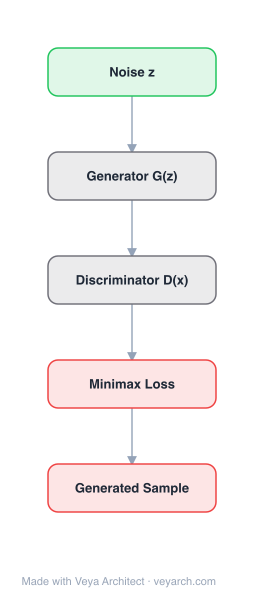

# Architecture: GAN

## Motivation

Generative algorithms aim to model the true data distribution and generate new samples from it. Prior to GANs, generative approaches fell into two categories: **explicit density models** (maximum likelihood estimation, approximate inference, Markov chain methods) and **implicit density models** (ancestral sampling, Markov chain-based sampling). Explicit density models suffered from computational tractability issues — they could fail to represent the complexity of true data distributions and struggled with high-dimensional data. Implicit density models were inefficient, requiring costly Markov chain sampling.

GANs were proposed to overcome these disadvantages. The core idea behind adversarial learning is that the generator tries to create realistic examples to deceive the discriminator, while the discriminator tries to distinguish fake examples from real examples. Both improve through adversarial learning. This framework gives GANs notable advantages: (1) parallelizable generation (impossible for PixelCNN and fully visible belief networks), (2) few restrictions on generator design, and (3) subjectively better sample quality than other methods.

## Core Idea

Generative adversarial network: generator and discriminator trained in minimax game for data generation.

## Architecture

### Overview

<b>Layer-by-layer (5 nodes)</b>

| # | Layer | Type | Params |
|---|---|---|---|
| 1 | Noise z | `input` |  |
| 2 | Generator G(z) | `custom` |  |
| 3 | Discriminator D(x) | `custom` |  |
| 4 | Minimax Loss | `loss` |  |
| 5 | Generated Sample | `output` |  |

GANs consist of two models: a **generator** `G(z, θ_g)` and a **discriminator** `D(x, θ_d)`, both typically implemented as neural networks. The generator maps noise `z ~ p_z(z)` from a prior distribution to data space, trying to capture the true data distribution `p_g`. The discriminator outputs a single scalar representing the probability that `x` came from the data rather than the generator. The two models are trained simultaneously in a minimax game: the discriminator is trained to maximize the probability of correctly labeling both real and generated samples, while the generator is trained to minimize `log(1 - D(G(z)))`.

### Components

1. **Generator (G)** — A differentiable function (neural network with parameters `θ_g`) representing a mapping from noise space to data space: `G(z, θ_g)`, where `z` is a noise variable sampled from a prior `p_z(z)`. The generator tries to capture the distribution `p_g` of true data. Generator architectures vary widely: DCGANs use transposed convolutions, StyleGAN uses adaptive instance normalization, BigGAN scales up with larger batches and deeper architectures.

2. **Discriminator (D)** — A neural network with parameters `θ_d` that outputs a single scalar `D(x)` denoting the probability that `x` came from the data rather than the generator. The discriminator is trained to maximize the probability of giving the correct label to both training data and fake samples. Architectures range from simple binary classifiers to multi-scale or multi-discriminator setups.

3. **Noise Prior (p_z)** — A prior distribution on the input noise variable `z`, typically a Gaussian or uniform distribution. The generator transforms this noise into samples that match the data distribution.

4. **Objective Function** — The original minimax objective: `min_G max_D V(D, G) = E_{x~p_data}[log D(x)] + E_{z~p_z}[log(1 - D(G(z)))]`. At the optimum, this is equivalent to minimizing the Jensen-Shannon (JS) divergence between `p_data` and `p_g`.

### Data Flow

1. **Noise sampling**: Noise `z` is sampled from the prior `p_z(z)`.
2. **Generation**: The generator `G(z, θ_g)` maps the noise to a generated sample `G(z)`.
3. **Discrimination (real)**: Real data samples `x ~ p_data(x)` are fed to the discriminator `D(x)`, which outputs the probability of being real.
4. **Discrimination (fake)**: Generated samples `G(z)` are fed to the discriminator `D(G(z))`, which outputs the probability of being real.
5. **Loss computation**: The discriminator loss maximizes correct classification of both real and fake; the generator loss minimizes `log(1 - D(G(z)))` (or equivalently maximizes `log(D(G(z)))` in the non-saturating formulation).
6. **Alternating updates**: Generator and discriminator are updated alternately, with each trying to outperform the other. The optimization terminates at a saddle point that is a minimum with respect to the generator and a maximum with respect to the discriminator (Nash equilibrium).

### State / Memory

- **No persistent state between training iterations**: GANs do not maintain recurrent state; each forward pass is independent.
- **Generator and discriminator as adversarial state**: The two networks serve as each other's training signal — the discriminator's state (its learned ability to distinguish real from fake) provides the gradient for the generator, and vice versa.
- **Noise as stochastic input**: The noise `z` provides the stochasticity for generation; there is no deterministic state propagation.

## Design Decisions

1. **Minimax (adversarial) objective** — The fundamental design choice: instead of directly specifying a likelihood or distance metric, the generator and discriminator are pitted against each other. The optimal discriminator is `D*_G(x) = p_data(x) / (p_data(x) + p_g(x))`, and at the optimum, the objective reduces to `2·JS(p_data || p_g) - 2·log 2`, connecting GANs to Jensen-Shannon divergence minimization.

2. **Non-saturating generator loss** — In practice, the original minimax objective can suffer from gradient vanishing early in training (when the generator is poor, the discriminator rejects samples with high confidence, saturating `log(1 - D(G(z)))`). The non-saturating heuristic trains `G` to maximize `log(D(G(z)))` instead, providing larger gradients early in learning. This has the same fixed point but much stronger gradients initially.

3. **Implicit density model** — GANs do not explicitly model the data density `p(x)`; they learn to generate samples that match the data distribution through the adversarial game. This avoids the computational tractability issues of explicit density models but makes likelihood evaluation difficult.

4. **Parallelizable generation** — Unlike autoregressive models (PixelCNN, FVBNs) that generate samples sequentially, GANs generate the entire sample in a single forward pass of the generator. This enables fast generation.

5. **Flexible generator design** — The generator can be any differentiable function, giving few restrictions on architecture. This enabled the explosion of GAN variants: DCGAN (convolutional), StyleGAN (style-based), BigGAN (large-scale), conditional GANs, CycleGAN (unpaired translation), etc.

6. **Variants addressing training instability** — The original GAN suffers from mode collapse (generating limited variety) and training instability. Key variants address this: WGAN uses Wasserstein distance for smoother gradients; WGAN-GP adds gradient penalty; LSGAN uses least-squares loss; SN-GAN uses spectral normalization; f-GAN generalizes to f-divergences.

## Evolution

**Predecessors:**
- **Predictability Minimization (Schmidhuber)** — The concept of two neural networks competing against each other predates GANs; predictability minimization is the most relevant prior work.
- **Explicit density models (MLE, VAEs, Boltzmann machines)** — Generative models that explicitly model the data density but suffer from computational limitations.
- **Implicit density models (ancestral sampling, Markov chains)** — Generate samples without explicit density but are inefficient.

**Successors:**
- **DCGAN (2015)** — Used convolutional architectures, establishing stable training practices for image generation.
- **WGAN (2017)** — Used Wasserstein distance for more stable training and meaningful loss curves.
- **StyleGAN (2018–2019)** — Introduced style-based generation with adaptive instance normalization for high-quality face generation.
- **BigGAN (2018)** — Scaled up GANs with large batches and truncation tricks for state-of-the-art image generation.
- **CycleGAN** — Unpaired image-to-image translation using cycle consistency.
- **Diffusion models (DDPM, 2020)** — Eventually surpassed GANs in sample quality, becoming the dominant generative paradigm for images.

## Characteristics

| Property | Value |
|----------|-------|
| Year | 2014 |
| Authors | Goodfellow et al. |
| Category | DL/GAN-KAN |
| Source Paper | `Unknown_Gui_Sun_Wen_etal_2001.md` |
| PaperVault Path | `DL-Architectures/06-gan-kan/Unknown_Gui_Sun_Wen_etal_2001.md` |

## Limitations

1. **Mode collapse** — The generator may produce a limited variety of samples, outputting repeated but "safe" samples rather than diverse outputs. This is related to the asymmetry of KL divergence in the non-saturating loss: `KL(p_g || p_data) → 0` when `p_data → 1, p_g → 0` (low penalty for missing modes) but `KL(p_g || p_data) → ∞` when `p_data → 0, p_g → 1` (high penalty for implausible samples).

2. **Training instability** — The minimax game is difficult to balance; the generator and discriminator must improve at similar rates. If the discriminator becomes too strong, gradients vanish for the generator. If too weak, the generator receives poor learning signal. Nash equilibrium is difficult to reach.

3. **No explicit likelihood** — GANs are implicit density models; they cannot evaluate the likelihood `p(x)` of a given sample, making model evaluation and comparison difficult. Inception Score and FID are used as proxies but have their own limitations.

4. **Gradient vanishing in minimax formulation** — When the discriminator is optimal, the generator's gradient `∇_θ log(1 - D(G(z)))` can vanish, especially early in training when the generator is poor and the discriminator can easily reject samples.

5. **Evaluation difficulty** — Unlike likelihood-based models where perplexity or NLL provides a clear metric, GAN evaluation relies on proxy metrics (Inception Score, FID, precision/recall) that may not capture all aspects of generation quality.

6. **Hyperparameter sensitivity** — GAN training is notoriously sensitive to architecture choices, learning rates, and training schedules. Finding stable configurations often requires extensive experimentation.

## Implementation Notes

See `implementation/` for a minimal runnable implementation.

Key implementation details from the paper:
- Original objective: `min_G max_D V(D,G) = E_{x~p_data}[log D(x)] + E_{z~p_z}[log(1-D(G(z)))]`
- Optimal discriminator: `D*_G(x) = p_data(x) / (p_data(x) + p_g(x))`
- At optimum: `C(G) = 2·JS(p_data || p_g) - 2·log 2`
- Non-saturating generator loss: `J(G) = E_{z~p_z}[-log(D(G(z)))]`
- Maximum likelihood approximation: `J(G) = E_{z~p_z}[-D(G(z))/(1-D(G(z)))]`
- Key variants: InfoGAN (disentangled representations via mutual information), cGAN (conditional generation), WGAN (Wasserstein distance), CycleGAN (unpaired translation), LSGAN (least-squares loss), SN-GAN (spectral normalization)
- Applications: image synthesis, super-resolution, text-to-image, video generation, domain adaptation, NLP, music

## Information Layers

- **Evidence:** Source paper available in `references/papers/` — a comprehensive survey covering GAN algorithms, theory, and applications. All architectural details (objective functions, variants, training dynamics) are directly stated.
- **Analysis:** GANs' key innovation is the adversarial training framework: by pitting generator against discriminator, the model learns to generate realistic samples without explicitly modeling the data density. The connection to Jensen-Shannon divergence provides theoretical grounding, while the non-saturating loss addresses practical gradient issues. The framework's flexibility (any differentiable generator/discriminator) enabled an explosion of variants.
- **Hypothesis:** The eventual dominance of diffusion models over GANs for image generation suggests that the adversarial training paradigm's instability and evaluation difficulties may be fundamental limitations. However, GANs retain advantages in generation speed (single forward pass vs. iterative denoising), and hybrid approaches (e.g., using adversarial loss to refine diffusion samples) may combine the strengths of both paradigms.
