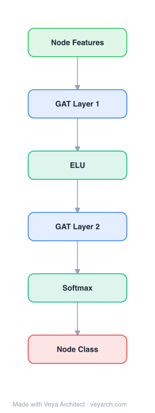

# Architecture: GAT (Graph Attention Network)

## Motivation

Convolutional Neural Networks (CNNs) have been highly successful on grid-structured data such as images and sequences, efficiently reusing local filters across all input positions. However, many real-world tasks involve data that lies in irregular domains—3D meshes, social networks, telecommunication networks, biological networks, and brain connectomes—data that is naturally represented as graphs. Extending neural networks to operate on arbitrarily structured graphs became a pressing research problem.

Prior approaches fell into two broad categories. **Spectral approaches** (Bruna et al., 2014; Henaff et al., 2015; Defferrard et al., 2016; Kipf & Welling, 2017) define convolutions in the Fourier domain via eigendecomposition of the graph Laplacian. While progressively improved—through smooth filter parameterization, Chebyshev expansion, and 1-step neighborhood restriction—these methods all share a critical limitation: the learned filters depend on the Laplacian eigenbasis, which depends on the graph structure. A model trained on one graph structure cannot be directly applied to a graph with a different structure. **Non-spectral (spatial) approaches** (Duvenaud et al., 2015; Atwood & Towsley, 2016; Hamilton et al., 2017) operate directly on groups of spatially close neighbors, but face the challenge of defining an operator that works with different-sized neighborhoods while maintaining weight sharing.

GAT addresses these shortcomings simultaneously by introducing a masked self-attention mechanism that computes dynamic, data-driven edge weights without requiring costly matrix operations (such as eigendecomposition or inversion) or knowing the graph structure upfront. This makes the model applicable to both transductive and inductive problems, including tasks where the model must generalize to completely unseen graphs. The attention mechanism also enables assigning different importances to different nodes within the same neighborhood—a leap in model capacity over methods like GCNs that use fixed, structure-defined weights.

## Core Idea

Graph convolution with masked self-attention, learning dynamic edge weights instead of fixed spectral filters.

## Architecture

### Overview

<b>Layer-by-layer (6 nodes)</b>

| # | Layer | Type | Params |
|---|---|---|---|
| 1 | Node Features | `input` |  |
| 2 | GAT Layer 1 | `gat_conv` | heads: 8, outDim: 8 |
| 3 | ELU | `relu` |  |
| 4 | GAT Layer 2 | `gat_conv` | heads: 1, outDim: 10 |
| 5 | Softmax | `softmax` |  |
| 6 | Node Class | `output` |  |

GAT is built by stacking graph attentional layers, each of which computes new node representations by attending over the features of neighboring nodes. The architecture follows a self-attention strategy inspired by the success of attention mechanisms in sequence-based tasks (Bahdanau et al., 2015; Vaswani et al., 2017): instead of fixed spectral filters or uniform neighbor aggregation, each node learns to assign different importance to different neighbors through a shared attention mechanism.

The key insight is that the attention mechanism is applied in a shared manner to all edges in the graph and does not depend on upfront access to the global graph structure or features of all nodes. This means the graph need not be undirected (edges can simply be omitted where absent), and the model is directly applicable to inductive learning—including evaluation on completely unseen graphs. The sole layer utilized throughout all GAT architectures in the paper is a single graph attentional layer, which can be stacked to construct arbitrary-depth networks.

The architecture achieves state-of-the-art or matching results across four established benchmarks: the transductive Cora, Citeseer, and Pubmed citation networks, and an inductive protein-protein interaction (PPI) dataset where test graphs remain completely unseen during training.

### Components

- **Shared linear transformation**: A weight matrix `W ∈ R^(F'×F)` is applied to every node, transforming input node features `h = {h₁, ..., h_N}` (each `h_i ∈ R^F`) into a higher-level representation of dimension `F'`. This shared transformation provides the initial expressive power to lift features into a richer space.

- **Attention mechanism `a`**: A shared attentional mechanism `a : R^F' × R^F' → R` computes raw attention coefficients `e_ij = a(W h_i, W h_j)` that indicate the importance of node `j`'s features to node `i`. In the paper's experiments, `a` is a single-layer feedforward neural network parametrized by a weight vector `ã ∈ R^(2F')`, applying the LeakyReLU nonlinearity (negative input slope α = 0.2) to the concatenation `[W h_i || W h_j]`.

- **Masked attention**: To inject the graph structure, masked attention restricts `e_ij` computation to nodes `j ∈ N_i` (the first-order neighbors of `i`, including `i` itself). In its most general form the model allows every node to attend to every other node, dropping all structural information; masking reintroduces locality.

- **Softmax normalization**: Coefficients are normalized across all choices of `j` using softmax: `α_ij = softmax_j(e_ij) = exp(e_ij) / Σ_{k∈N_i} exp(e_ik)`, making them easily comparable across different nodes.

- **Feature aggregation**: The normalized attention coefficients compute a linear combination of neighbor features to produce the output: `h'_i = σ(Σ_{j∈N_i} α_ij W h_j)`, where `σ` is a nonlinearity (e.g., ELU).

- **Multi-head attention**: To stabilize learning, `K` independent attention mechanisms execute the transformation in parallel; their outputs are concatenated on intermediate layers (yielding `K·F'` features per node) and averaged on the final prediction layer (before applying the final softmax/sigmoid). This mirrors the multi-head approach of Vaswani et al. (2017).

### Data Flow

1. **Input**: A set of node features `h = {h₁, ..., h_N}`, `h_i ∈ R^F`, and the graph structure (adjacency / neighborhood sets `N_i`).
2. **Linear transformation**: Apply the shared weight matrix `W ∈ R^(F'×F)` to every node, producing `W h_i ∈ R^F'` for all `i`.
3. **Attention coefficient computation**: For each node `i` and each neighbor `j ∈ N_i`, compute raw coefficients `e_ij = LeakyReLU(ãᵀ[Wh_i || Wh_j])` using the shared attention vector `ã`.
4. **Masked attention**: Only compute `e_ij` for first-order neighbors `j ∈ N_i` (including self), injecting the graph structure.
5. **Softmax normalization**: Normalize coefficients: `α_ij = exp(e_ij) / Σ_{k∈N_i} exp(e_ik)`, yielding per-neighbor attention weights that sum to 1.
6. **Aggregation**: Compute the output feature for each node as `h'_i = σ(Σ_{j∈N_i} α_ij W h_j)`.
7. **Multi-head execution (intermediate layers)**: Repeat steps 2–6 independently `K` times with separate parameters; concatenate the `K` outputs → `h'_i ∈ R^(K·F')`.
8. **Multi-head execution (final layer)**: Repeat steps 2–6 `K` times; average the outputs → `h'_i ∈ R^F'`, then apply the final nonlinearity (softmax/sigmoid for classification).
9. **Stacking**: Feed `h'` as input to the next graph attentional layer; repeat for the desired depth.
10. **Output**: Node-level predictions (e.g., class probabilities) for transductive or inductive tasks.

### State / Memory

Stateless. Each graph attentional layer is a pure feed-forward transformation: it computes output features deterministically from the current input features and learned parameters, with no recurrent state, memory cells, or iterative fixed-point propagation. Unlike earlier GNNs (Scarselli et al., 2009; Li et al., 2016) that propagate node states until equilibrium via gated recurrent units, GAT layers are applied in a single forward pass. The only "memory" is the learned weight matrix `W`, attention vector `ã`, and (for multi-head) the per-head parameters—standard model parameters, not sequence/state memory.

## Design Decisions

- **Attention over fixed spectral filters**: Rather than defining convolution filters in the spectral domain (which depend on the Laplacian eigenbasis and thus the graph structure), GAT uses a learned attention mechanism that computes edge weights dynamically from node features. This decouples the model from a specific graph structure, enabling inductive generalization to unseen graphs—a fundamental limitation of all spectral approaches (Bruna et al., 2014; Defferrard et al., 2016; Kipf & Welling, 2017).

- **Masked (local) attention**: The model could allow every node to attend to every other node, but this would drop all structural information. Masked attention restricts computation to first-order neighbors `N_i`, injecting locality while keeping the mechanism efficient and parallelizable across all edges. The graph need not be undirected—edges are simply omitted where absent.

- **Single-layer attention network with LeakyReLU**: The attention mechanism `a` is deliberately a lightweight single-layer feedforward network with LeakyReLU (negative slope α = 0.2). This keeps the per-edge computation cheap while still providing sufficient expressive power. The framework is agnostic to the particular choice of attention mechanism.

- **Softmax normalization**: Normalizing attention coefficients via softmax makes them comparable across nodes with different neighborhood sizes, a necessity for graphs with varying node degrees.

- **Multi-head attention (concatenation on hidden layers, averaging on output)**: Following Vaswani et al. (2017), `K` independent heads stabilize the learning process. Concatenation on intermediate layers increases feature dimensionality (`K·F'`); averaging on the final layer keeps the output dimension at `F'` and is more sensible before the prediction nonlinearity.

- **No eigendecomposition or matrix inversion**: The design avoids costly matrix operations entirely. Time complexity per head is `O(|V|FF' + |E|F')`, on par with GCNs, while being parallelizable across all nodes and edges.

## Evolution

**Predecessors:**
- **Spectral graph convolutions** — Bruna et al. (2014) defined convolution in the Fourier domain via eigendecomposition of the graph Laplacian; Henaff et al. (2015) introduced smooth spectral filter parameterization; Defferrard et al. (2016) proposed Chebyshev expansion to avoid computing eigenvectors; Kipf & Welling (2017) simplified to 1-step neighborhood filters (GCN). All share the limitation that filters depend on the graph's Laplacian eigenbasis.
- **Non-spectral/spatial approaches** — Duvenaud et al. (2015), Atwood & Towsley (2016, Diffusion-CNN), and Niepert et al. (2016) defined convolutions directly on spatially close neighbors, with challenges around varying neighborhood sizes and weight sharing.
- **MoNet** (Monti et al., 2016) — a unified spatial approach generalizing CNN architectures to graphs; GAT can be reformulated as a particular instance of MoNet, but uses node features (rather than structural properties) for similarity computation.
- **GraphSAGE** (Hamilton et al., 2017) — inductive method sampling fixed-size neighborhoods and aggregating via mean/LSTM/pool. GAT improves on it by attending to the entire neighborhood (no fixed-size sampling) and not assuming any sequential ordering (unlike the LSTM aggregator).
- **Self-attention** (Bahdanau et al., 2015; Vaswani et al., 2017) — the attention architecture conceptually inspires GAT's masked self-attention strategy on graph-structured data.

**Successors:**
- The paper notes extending GAT to graph classification (not just node classification) and incorporating edge features as future work—subsequent architectures (e.g., GATv2, simplified GAT) built on this foundation.

## Characteristics

| Property | Value |
|----------|-------|
| Year | 2018 |
| Authors | Veličković et al. |
| Category | GNN/Architecture |
| Source Paper | `Graph_Attention_Networks_Networks_2018.md` |
| PaperVault Path | `GNN/03-gnn-architectures/Graph_Attention_Networks_Networks_2018.md` |

## Limitations

- **Sparse matrix batching constraint**: A sparse-matrix version of the GAT layer exists (reducing storage to linear in nodes+edges), but the tensor manipulation framework used only supports sparse matrix multiplication for rank-2 tensors, limiting batching capabilities—especially for datasets with multiple graphs. Addressing this is flagged as important future work.

- **GPU benefit may be marginal for sparse graphs**: Depending on the regularity of the graph structure, GPUs may not offer major performance benefits over CPUs in sparse scenarios, because the computation pattern (scatter-gather over irregular neighborhoods) does not fully exploit GPU parallelism.

- **Receptive field bounded by depth**: The "receptive field" of the model is upper-bounded by the number of layers, as with GCN and similar models. Reaching distant nodes requires deep stacking, which can be mitigated by skip connections (He et al., 2016) but is not natively addressed.

- **Redundant computation in distributed settings**: Parallelizing across all graph edges, especially in a distributed manner, may involve significant redundant computation because neighborhoods of different nodes highly overlap in graphs of interest.

- **Attention interpretability is unproven**: While learned attention weights may offer interpretability benefits (as in machine translation), the paper notes that properly interpreting them requires further domain knowledge about the dataset, and such analysis is left for future work.

- **No edge features**: The original GAT formulation does not incorporate edge features (which could indicate relationships among nodes), limiting the variety of problems it can tackle. Incorporating edge features is noted as a relevant extension.

## Implementation Notes

See `implementation/` for a minimal runnable implementation.

## Information Layers

- **Evidence:** Source paper available in `references/papers/`
- **Analysis:** GAT's core innovation—replacing fixed spectral/spatial filters with learned, data-driven attention weights—resolves the structural dependency of spectral methods and the fixed-neighborhood limitation of GraphSAGE simultaneously. The masked-attention design is elegant: structure is injected only through neighborhood masking, keeping the mechanism agnostic to global graph topology. Multi-head attention stabilizes training but multiplies parameters by K. Empirically, the Const-GAT ablation (constant attention, same architecture) underperforms GAT by 3.9% F1 on PPI, directly validating that learned attention weights—not just the architecture—drive the gains.
- **Hypothesis:** The attention coefficients may encode meaningful edge-level importance, but the paper does not rigorously validate interpretability. Whether attention weights correlate with domain-specific edge semantics (e.g., citation strength, biological interaction type) remains an open question. Additionally, the receptive-field limitation suggests GAT may underperform on tasks requiring long-range dependencies unless combined with skip connections or deeper architectures.
