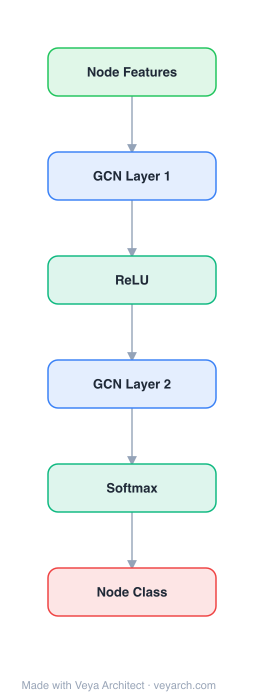

# Architecture: GCN (Graph Convolutional Network)

## Motivation

The paper addresses **semi-supervised node classification** in graph-structured data — the task of assigning labels to nodes (e.g., documents in a citation network) when labels are available for only a small subset. Prior approaches framed this as graph-based semi-supervised learning with explicit graph Laplacian regularization (Zhu et al., 2003; Belkin et al., 2006), adding a regularization term `L = L0 + λLreg` to the loss. This formulation relies on the assumption that connected nodes share labels, which restricts modeling capacity because graph edges need not encode mere similarity — they may carry richer relational information.

A second line of prior work — skip-gram-inspired graph embeddings like DeepWalk, LINE, and node2vec — learns node representations from random walks but requires a multi-step pipeline (walk generation, embedding, then separate semi-supervised training) where each step is optimized independently, making end-to-end optimization difficult. Planetoid (Yang et al., 2016) improved this by injecting label information, but the pipeline fragmentation remained.

GCN's key insight is to **encode the graph structure directly into a neural network model `f(X, A)`** conditioned on both node features `X` and the adjacency matrix `A`, training end-to-end on a supervised target `L0` without explicit graph regularization. This lets gradient information from labeled nodes propagate through the graph structure, learning representations for both labeled and unlabeled nodes simultaneously. The gap it fills: a simple, scalable, end-to-end trainable model that unifies graph structure and node features, outperforming multi-step pipelines in both accuracy and wall-clock time.

## Core Idea

Spectral graph convolution via localized first-order approximation, enabling efficient semi-supervised node classification.

## Architecture

### Overview

<b>Layer-by-layer (6 nodes)</b>

| # | Layer | Type | Params |
|---|---|---|---|
| 1 | Node Features | `input` |  |
| 2 | GCN Layer 1 | `gcn_conv` | outChannels: 16 |
| 3 | ReLU | `relu` |  |
| 4 | GCN Layer 2 | `gcn_conv` | outChannels: 10 |
| 5 | Softmax | `softmax` |  |
| 6 | Node Class | `output` |  |

GCN is a multi-layer neural network that performs **spectral graph convolutions** via a localized first-order approximation. Rather than computing expensive eigendecompositions of the graph Laplacian (Bruna et al., 2014) or truncated Chebyshev polynomial expansions (Defferrard et al., 2016), GCN simplifies to a single per-layer propagation rule that aggregates each node's (renormalized) neighborhood features through a learned linear transform followed by a non-linearity. The graph structure is shared across all layers via a pre-computed normalized adjacency matrix `Â = D̃^(−1/2) Ã D̃^(−1/2)`.

A typical two-layer GCN for node classification takes the form `Z = f(X, A) = softmax(Â ReLU(Â X W^(0)) W^(1))`, where the first layer produces hidden activations and the second produces class logits. The model is trained end-to-end with cross-entropy on labeled nodes using gradient descent. Because the propagation rule is linear in the number of edges `O(|E|)` and uses sparse matrix multiplication, GCN scales to graphs with millions of edges while requiring only a single weight matrix per layer.

### Components

- **Graph propagation layer (the core operator):** Each layer applies the propagation rule `H^(l+1) = σ(D̃^(−1/2) Ã D̃^(−1/2) H^(l) W^(l))`, where `Ã = A + I_N` adds self-connections, `D̃` is the degree matrix of `Ã`, `W^(l)` is a layer-specific trainable weight matrix, and `σ` is a non-linearity (ReLU). This single operator both aggregates neighborhood features and transforms them.
- **Renormalized adjacency `Â`:** A pre-processing step computes `Â = D̃^(−1/2) Ã D̃^(−1/2)` once and reuses it across layers. The "renormalization trick" (from `I_N + D^(−1/2) A D^(−1/2)`) bounds eigenvalues to avoid numerical instability/explosive gradients.
- **Weight matrices `W^(l)`:** One trainable matrix per layer mapping the `D`-dimensional input to `F`-dimensional output (e.g., `C×H` for input-to-hidden, `H×F` for hidden-to-output). Parameters are shared across all nodes (not degree-specific), unlike Duvenaud et al. (2015).
- **Activation function:** ReLU `max(0, ·)` applied between hidden layers; softmax applied row-wise at the output layer for multi-class classification.
- **Loss function:** Cross-entropy error over labeled nodes: `L = −Σ_{l∈Y_L} Σ_f Y_{lf} ln Z_{lf}`, where `Y_L` is the set of labeled node indices.
- **Regularization:** Dropout (applied to layer inputs and the adjacency matrix during training) and L2 weight decay on the first layer's weight matrix.

### Data Flow

1. **Input:** Node feature matrix `X ∈ R^(N×C)` (e.g., bag-of-words for documents) and graph adjacency matrix `A` (binary or weighted, undirected).
2. **Pre-processing:** Compute `Ã = A + I_N` (add self-loops), degree matrix `D̃`, and the normalized operator `Â = D̃^(−1/2) Ã D̃^(−1/2)`. Row-normalize input features `X`.
3. **First (hidden) layer:** Compute `H^(1) = ReLU(Â X W^(0))`, aggregating each node's own and neighbors' features through the normalized adjacency, then applying a linear transform `W^(0) ∈ R^(C×H)` and ReLU. Dropout is applied to inputs.
4. **Second (output) layer:** Compute `Z = softmax(Â H^(1) W^(1))`, producing class logits `Z ∈ R^(N×F)` and normalizing row-wise via softmax.
5. **Loss:** Evaluate cross-entropy only over labeled node indices `Y_L`; backpropagate through the full model (gradients flow through `Â` to all nodes, labeled or not).
6. **Training:** Full-batch gradient descent (Adam, lr=0.01) with early stopping (window 10 epochs), Glorot initialization, dropout, and L2 regularization. Each epoch processes the entire graph at once; complexity is `O(|E|CHF)`.

### State / Memory

Stateless at inference. The normalized adjacency `Â` is a fixed pre-computation (the graph structure is static and shared across layers). During training, the only learned state is the per-layer weight matrices `W^(l)`; there is no recurrent hidden state or memory module. Stochasticity is introduced via dropout rather than stateful sampling.

## Design Decisions

- **First-order approximation of spectral convolutions:** Instead of the full spectral filter `gθ ⋆ x = U gθ U^T x` (which requires eigendecomposition, `O(N²)`), or the K-th order Chebyshev expansion (Defferrard et al., 2016), GCN limits to `K=1` — a linear function on the Laplacian spectrum. Stacking multiple such layers recovers richer filters while reducing overfitting on wide degree distributions and allowing deeper models for a fixed compute budget.
- **Single shared weight matrix per layer:** Unlike Duvenaud et al. (2015) which learns degree-specific matrices, GCN uses one weight matrix per layer and handles varying degrees via adjacency normalization — enabling scalability.
- **Renormalization trick (`I_N + D^(−1/2) A D^(−1/2)` → `D̃^(−1/2) Ã D̃^(−1/2)`):** Avoids the eigenvalue range issue in the naive 1st-order model (which can lead to exploding/vanishing gradients) and empirically improves both accuracy and efficiency.
- **λ_max ≈ 2 approximation:** The largest eigenvalue of the normalized Laplacian is approximated as 2, letting network parameters adapt to the scale during training — removing a pre-computation step.
- **End-to-end supervised training (no explicit graph regularization):** By conditioning `f(X, A)` on the adjacency matrix, the model learns structure-aware representations directly from the supervised loss, eliminating the separate embedding + classifier pipeline.
- **Full-batch gradient descent:** Chosen because datasets fit in memory and the sparse adjacency representation keeps memory at `O(|E|)`. Mini-batch SGD is noted as future work.

## Evolution

**Predecessors:**
- Spectral graph CNNs (Bruna et al., 2014) — introduced spectral convolutions on graphs via eigendecomposition, but `O(N²)` complexity limited scale.
- ChebNet (Defferrard et al., 2016) — fast localized spectral filters via Chebyshev polynomial approximation, `O(|E|)` but with explicit K-order parameterization.
- Graph-based semi-supervised learning with Laplacian regularization (Zhu et al., 2003; Belkin et al., 2006; Weston et al., 2012).
- Graph embedding methods: DeepWalk (Perozzi et al., 2014), LINE (Tang et al., 2015), node2vec (Grover & Leskovec, 2016), Planetoid (Yang et al., 2016).
- Early graph neural networks (Gori et al., 2005; Scarselli et al., 2009) as recurrent models requiring fixed-point convergence.

**Successors:**
- GraphSAGE (Hamilton et al., 2017) — inductive, sampling-based generalization of neighborhood aggregation.
- GAT (Veličković et al., 2018) — attention-based neighbor weighting replacing the fixed normalization.
- FastGCN (Chen et al., 2018) and Stochastic GCN — sampling methods to enable mini-batch training.
- DGI (Veličković et al., 2018) — unsupervised extension via mutual information maximization.
- The propagation rule became the foundation for the broader "message passing" framework (Gilmer et al., 2017).

## Characteristics

| Property | Value |
|----------|-------|
| Year | 2017 |
| Authors | Kipf & Welling |
| Category | GNN/Architecture |
| Source Paper | `GCN_ICLR_Networks_Kipf_2025.md` |
| PaperVault Path | `GNN/03-gnn-architectures/GCN_ICLR_Networks_Kipf_2025.md` |

## Limitations

- **Memory grows linearly with dataset size:** Full-batch gradient descent requires the entire graph in memory; very large graphs that exceed GPU memory require CPU training or approximations. Mini-batch SGD needs to materialize the K-th order neighborhood for a K-layer GCN.
- **No native edge feature support:** The framework is limited to undirected graphs (weighted or unweighted). Directed edges and edge features require workarounds (e.g., representing them as bipartite graph nodes, as done for NELL).
- **Locality assumption:** A K-layer GCN aggregates only the K-th order neighborhood, implicitly assuming locality and equal importance of self-connections vs. neighbor edges. A trade-off parameter `λ` in `Ã = A + λI_N` could help but is not learned by default.
- **Transductive setting:** The original formulation assumes the entire graph (including test nodes) is available at training time; inductive prediction on entirely unseen nodes requires extensions (addressed by GraphSAGE).
- **Fixed aggregation weights:** Neighbor contributions are determined solely by graph degree normalization, not learned — a limitation later addressed by attention-based methods (GAT).

## Implementation Notes

See `implementation/` for a minimal runnable implementation.

## Information Layers

- **Evidence:** Source paper available in `references/papers/`
- **Analysis:** GCN's elegance lies in collapsing spectral graph convolution theory into a single normalized adjacency propagation rule. The renormalization trick is the key practical innovation — it bounds eigenvalues without extra computation. The model's `O(|E|)` complexity and shared weights make it the canonical baseline for all subsequent graph neural networks.
- **Hypothesis:** The first-order limitation (K-hop receptive field = K layers) may cause under-reaching on graphs requiring long-range dependencies; deeper GCNs suffer from oversmoothing where all node representations converge — an open problem motivating residual/skip connections in successors.
