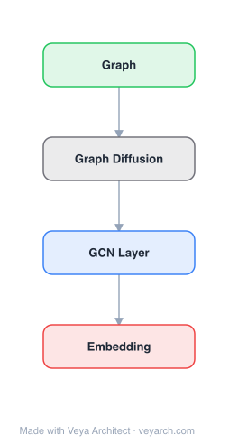

# Architecture: Generative Distribution Embeddings

## Motivation

Many real-world problems require reasoning across multiple scales, demanding models that operate not on single data points but on entire distributions. In applications ranging from single-cell genomics to DNA sequence design, the relevant unit of analysis is not an individual sample (e.g., a single cell) but the distribution from which it is drawn (e.g., the cell state or the patient they were sampled from). These settings are fundamentally hierarchical: we observe sets of samples from latent distributions, which themselves are drawn from a meta-distribution. Without directly modeling these distributions, population-level signals can be lost in the noise.

Prior approaches to distribution representation — such as kernel mean embeddings (KME) and the Wasserstein Wormhole — either lack a generative component, are restricted to fixed architectures, or do not formally connect distribution representation to generative modeling. The fundamental challenge GDE addresses is how to learn representations at the level of distributions, not just individual data points, in a way that is both generative and theoretically grounded.

## Core Idea

Embedding method representing each data point as a learned distribution rather than a point vector.

## Architecture

### Overview



<details>
<summary><b>Layer-by-layer (4 nodes)</b></summary>

| # | Layer | Type | Params |
|---|---|---|---|
| 1 | Graph | `input` |  |
| 2 | Graph Diffusion | `custom` |  |
| 3 | GCN Layer | `gcn_conv` |  |
| 4 | Embedding | `output` |  |

</details>
GDE lifts the standard autoencoder framework to the space of distributions. Instead of encoding a single data point and decoding it back, GDE encodes a **set of samples** (an empirical distribution) into a latent space and replaces the decoder with a **conditional generative model** that reconstructs the distribution by sampling. The framework couples a distribution-invariant encoder `E` with a conditional generator `G`, trained jointly so that `G(E(S))` approximates the true distribution `P` from which the set `S` was drawn.

Formally, given `n` sets of samples `S_{i,m} = {x_{ij}}_{j=1}^m`, each drawn i.i.d. from an unknown distribution `P_i`, the goal is to learn an encoder–generator pair `(E, G)` such that:

```
G(E(S_{i,m})) --d--> P_i  as  m -> infinity
```

This limit reflects the key property: the encoder must distill structural information about `P_i` from finite, noisy observations.

### Components

1. **Distribution-Invariant Encoder (E)** — Maps a finite set of samples `S_m` to a latent representation. The encoder must satisfy two constraints that together imply **distributional invariance**: (i) *Permutation invariance*: `E(S) = E(π(S))` for any permutation `π`; (ii) *Proportional invariance*: `E(S) = E(S^k)` for any `k` (duplicating samples does not change the encoding). Together these mean the encoder depends only on the empirical measure `P_m = (1/m) Σ δ_{x_j}`, i.e., `E(S_m) = φ(P_m)` for some measurable map `φ`. In practice, mean-pooled graph neural networks (GNNs) with skip-connections or attention-based encoders satisfy this property.

2. **Conditional Generative Model (G)** — Replaces the traditional decoder. Any conditional generative model can be repurposed: VAEs, DDPMs (denoising diffusion probabilistic models), GANs, Sinkhorn-based generators, sliced Wasserstein models, or autoregressive sequence models. The generator minimizes a divergence `d` between the true distribution and the decoded sample: `min_{E,G} E_{P~Q} E_{S_m~P^{⊗m}} [d(P, G(E(S_m)))]`.

3. **Label-to-Distribution Grouping** — When the input is a labeled dataset `D = {(x_k, y_k)}` rather than pre-grouped sets, GDE groups data points into sets whose empirical distributions approximate draws from the meta-distribution `Q`. Grouping strategies depend on label structure: discrete labels (group by class identity), continuous/structured labels (similarity kernel sampling), or noisy labels (inverting the noise model via likelihood weights).

4. **Prior-Weighting Mechanism** — The meta-distribution `Q` shapes the learned geometry. Non-uniform `Q` warps the latent space: regions with higher prior density expand to preserve finer distinctions, while lower-density regions contract. This allows task-relevant structure to be induced by strategic choice of `Q`.

### Data Flow

1. **Set construction**: Input data points are grouped into sets `S_{i,m}` whose empirical distributions approximate draws from the meta-distribution `Q`, using label-based grouping, kernel sampling, or noise-model inversion.
2. **Encoding**: The distribution-invariant encoder `E` maps each set `S_{i,m}` to a latent representation, abstracting away sampling noise and capturing distribution-level structure.
3. **Generation**: The conditional generative model `G` samples from the latent representation to reconstruct the distribution, minimizing a divergence `d` between generated and true distributions.
4. **Joint optimization**: `E` and `G` are trained jointly so that `G(E(S))` converges to the true distribution `P` as sample size increases.
5. **Downstream use**: The learned latent embeddings serve as distribution representations for downstream tasks (classification, regression, prediction), with latent distances approximating Wasserstein distances.

### State / Memory

- **No recurrent state**: GDE is not a sequential model; it processes sets in a single forward pass through the encoder.
- **Latent space as statistical manifold**: The encoder embeds distributions as points on a learned statistical manifold `M = supp(Q)`, a submanifold of the Wasserstein space `P_2(X)`. The latent space serves as a persistent geometric representation of distribution-level structure.
- **Generator memory**: The conditional generative model maintains its own internal state (e.g., diffusion noise schedule, VAE latent variables) during generation, but this is decoupled from the encoder's representation.

## Design Decisions

1. **Distributional invariance as the core constraint** — Motivated through a statistical decision-theoretic lens: any encoder-generator pair that consistently recovers the data-generating distribution must encode exactly the information in the empirical distribution — no more, no less (Proposition 1). This is stronger than permutation invariance alone; it also requires proportional invariance (insensitivity to sample duplication).

2. **Any conditional generative model can be repurposed** — A key contribution is the observation that any conditional generative model (VAE, DDPM, GAN, autoregressive) can be repurposed to learn distributional representations. This makes the framework modular and allows domain-specific generative models to be bootstrapped into GDEs. The best-performing combination in benchmarks was mean-pooled GNNs with skip-connections coupled with DDPM generators.

3. **Latent geometry approximates Wasserstein space** — Empirically, GDE latent L2 distances correlate with true W2 distances (rank correlation ρ = 0.96 for Gaussians, ρ = 0.76 for Gaussian mixtures), and linear latent interpolation approximately recovers optimal transport geodesics. This positions the encoder as an approximate isometric embedding of the statistical manifold.

4. **Prior-weighting for task-relevant geometry** — The learned embedding geometry is prior-weighted: it reflects not only intrinsic distributional distances but also the sampling density induced by `Q`. By choosing `Q` strategically (via task-informed sampling), the latent space can be shaped to reflect meaningful distinctions for downstream objectives.

5. **Predictive sufficient statistics** — GDEs behave as approximate predictive sufficient statistics: `E(S_m)` asymptotically determines `P`, separating signal (structure of `P`) from sampling noise. This is formalized through the notion of asymptotic predictive sufficiency from Bayesian decision theory.

## Evolution

**Predecessors:**
- **Kernel Mean Embeddings (KME)** — Nonparametric approach representing probability measures as points in a reproducing kernel Hilbert space (RKHS). GDEs nest KME as a particular choice of distributionally invariant encoder, but KME lacks a generative component.
- **Wasserstein Wormhole** — A specific instantiation of GDE using an attention-based encoder and a generator that samples a fixed number of points, with Euclidean distances matching Sinkhorn divergences. GDE generalizes this.
- **Summary statistics learning** — Methods from likelihood-free inference that learn summary statistics maximally informative about generative model parameters. GDE generalizes these under a common framework with the objective of re-sampling the encoded distribution.

**Successors:**
- GDE is a recent framework (2025); its modularity (any encoder + any generator) suggests future work will explore new encoder-generator combinations and extend to additional domains beyond computational biology.

## Characteristics

| Property | Value |
|----------|-------|
| Year | 2025 |
| Authors | Fishman et al. |
| Category | DL/Transformer |
| Source Paper | `Generative_Distribution_Embeddings_Fishman_Gowri_Yin_etal_2025.md` |
| PaperVault Path | `DL-Architectures/01-transformers/Generative_Distribution_Embeddings_Fishman_Gowri_Yin_etal_2025.md` |

## Limitations

1. **Approximate isometry, not exact** — The Wasserstein distance recovery is approximate (ρ = 0.96 for Gaussians, ρ = 0.76 for Gaussian mixtures), and the quality of geometric recovery depends on the support of `Q` and the choice of encoder-generator pair.

2. **Dependence on meta-distribution `Q`** — The learned geometry is shaped by `Q`; if `Q` is misspecified or does not cover the relevant region of the statistical manifold, the latent space may not capture the desired distributional structure.

3. **Computational cost of generation** — The generative component (especially DDPM-based) can be computationally expensive at inference time, as it requires multiple denoising steps to sample from the decoded distribution.

4. **Set size sensitivity** — While the framework is designed to be asymptotically consistent as `m → ∞`, practical performance with finite (and potentially small) sample sets depends on the encoder's ability to abstract from limited observations.

5. **Encoder architecture constraints** — Not all permutation-invariant architectures are distributionally invariant (e.g., deep sets with summation are not proportional-invariant). The choice of encoder must satisfy the distributional invariance criterion, limiting the design space.

## Implementation Notes

See `implementation/` for a minimal runnable implementation.

Key implementation details from the paper:
- Best-performing architecture: mean-pooled GNN encoder with skip-connections + DDPM generator
- Alternative generators: CVAE (used for lineage-tracing scRNA-seq), HyenaDNA (for DNA sequence tasks)
- Encoders: 2D/1D convolutional encoders, GNN-based encoders, attention-based encoders
- Training objective: `min_{E,G} E_{P~Q} E_{S_m~P^{⊗m}} [d(P, G(E(S_m)))]`
- Evaluation: Wasserstein reconstruction error (W2 for Gaussians, Sinkhorn divergence for images)
- Scaled to 253M sequences (DNA methylation), 20M images (cellular phenotypes), 1M cells (perturbation prediction)

## Information Layers

- **Evidence:** Source paper available in `references/papers/` — all architectural details (encoder constraints, generator choices, training objective, theoretical propositions) are directly stated in the paper.
- **Analysis:** GDE's key insight is that distributional invariance (permutation + proportional invariance) is the minimal constraint needed to lift autoencoders to distribution space, and that any conditional generative model can serve as the "decoder." The latent geometry approximating Wasserstein space emerges empirically rather than being enforced architecturally.
- **Hypothesis:** The framework's modularity suggests that future improvements in conditional generative modeling (better diffusion models, faster samplers) will directly translate to better GDEs. The approximate isometry property may be improvable with larger encoders or more sophisticated training objectives, but whether exact isometry is achievable remains an open question.
