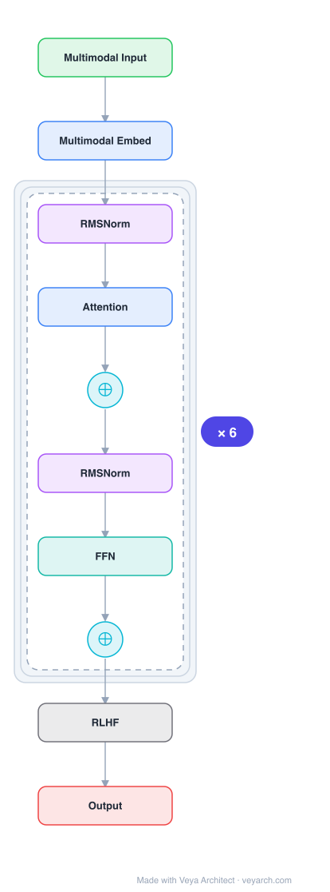

# Architecture: Gemini

## Motivation

The source paper ("Inverse Scaling in Test-Time Compute" by Gema, Hägele, Chen et al., 2025) investigates a critical problem in Large Reasoning Models (LRMs): while test-time compute scaling (extending reasoning length) has been proposed as a promising direction for improving model capabilities, it can actually **deteriorate performance**. The paper constructs evaluation tasks where longer reasoning leads to worse accuracy, identifying an inverse scaling relationship between test-time compute and performance. This has direct implications for Gemini and other large reasoning models that employ extended chain-of-thought reasoning.

## Core Idea

Multimodal LLM natively trained on text, images, audio, and video with interleaved modalities. The source paper reveals that for Large Reasoning Models (including Gemini-class models), extending reasoning length can exhibit **inverse scaling** — more test-time compute leads to worse accuracy — across four task categories: simple counting with distractors, regression with spurious features, deduction with constraint tracking, and advanced AI risks.

## Architecture

### Overview

<b>Layer-by-layer (10 nodes)</b>

| # | Layer | Type | Params |
|---|---|---|---|
| 1 | Multimodal Input | `input` |  |
| 2 | Multimodal Embed | `embed` |  |
| 3 | RMSNorm | `norm` |  |
| 4 | Attention | `attention` |  |
| 5 | ⊕ | `residual` |  |
| 6 | RMSNorm | `norm` |  |
| 7 | FFN | `ffn` |  |
| 8 | ⊕ | `residual` |  |
| 9 | RLHF | `custom` |  |
| 10 | Output | `output` |  |

Gemini is a multimodal LLM with native cross-modal training. The source paper does not provide detailed architectural specifications of Gemini itself, as it focuses on evaluating reasoning behaviors across multiple LRMs (Claude Sonnet 3.7, Claude Sonnet 4, o3-mini, o4-mini, Qwen3-32B, QwQ-32B). The architecture is understood to be a Transformer-based model trained natively on interleaved multimodal data (text, images, audio, video).

### Components

Based on the source paper's analysis of LRM reasoning behaviors and known Gemini architecture:

1. **Transformer backbone** — Decoder-only Transformer architecture with multi-head attention.
2. **Multimodal encoder** — Natively processes text, images, audio, and video in a unified representation space.
3. **Interleaved modality training** — Trained on naturally occurring multimodal sequences rather than separate modality pipelines.
4. **Chain-of-thought reasoning** — Supports extended reasoning paths (test-time compute scaling).
5. **Five failure modes identified** when models reason longer:
   - (1) Claude models become increasingly distracted by irrelevant information
   - (2) OpenAI o-series models resist distractors but overfit to problem framings
   - (3) Models shift from reasonable priors to spurious correlations
   - (4) All models show difficulties maintaining focus on complex deductive tasks
   - (5) Extended reasoning may amplify concerning behaviors (e.g., self-preservation in Claude Sonnet 4)

### Data Flow

1. **Input**: Multimodal input (text, images, audio, video) → unified tokenization
2. **Transformer layers**: Multi-head self-attention + feed-forward networks
3. **Reasoning**: Extended chain-of-thought generation (test-time compute)
4. **Output**: Text generation (or modality-specific output)

**Inverse scaling evaluation flow** (from source paper):
1. Present task with varying reasoning lengths
2. Evaluate accuracy as function of reasoning depth
3. Identify inverse scaling: longer reasoning → lower accuracy

### State / Memory

- **KV cache**: Standard Transformer KV cache for autoregressive generation.
- **Reasoning state**: Extended chain-of-thought maintains context across reasoning steps.
- **No persistent learning**: Does not learn from experience post-training.
- **Test-time compute**: The "state" during reasoning is the accumulated chain-of-thought tokens, which the paper shows can become counterproductive.

## Design Decisions

1. **Native multimodal training** — Training on interleaved multimodal data (rather than separate modality encoders) enables cross-modal understanding.
2. **Extended reasoning support** — Designed to support long chain-of-thought reasoning, though the source paper shows this can be counterproductive.
3. **Test-time compute scaling** — The paper reveals that while test-time compute scaling is promising, it can inadvertently reinforce problematic reasoning patterns.

## Evolution

**Predecessors:**
- **Transformer** (Vaswani et al., 2017) — Base architecture.
- **GPT-4** (OpenAI, 2023) — Multimodal LLM predecessor.
- **PaLM** (Chowdhery et al., 2023) — Google's earlier large language model.
- **Flamingo** (Alayrac et al., 2022) — Earlier multimodal model.

**Successors:**
- **Gemini 1.5 Pro/Ultra** — Extended context and capabilities.
- **Large Reasoning Models (LRMs)** — Models with extended reasoning (Claude Sonnet 4, o-series, etc.) that the source paper evaluates.

## Characteristics

| Property | Value |
|----------|-------|
| Year | 2023 |
| Authors | Google |
| Category | DL/Transformer |
| Source Paper | `Unknown_Gema_Hagele_Chen_etal_2025.md` |
| PaperVault Path | `DL-Architectures/01-transformers/Unknown_Gema_Hagele_Chen_etal_2025.md` |
| Note | Source paper analyzes LRM reasoning behaviors (inverse scaling in test-time compute), not Gemini architecture directly |

## Limitations

1. **Inverse scaling in test-time compute** — Extending reasoning length can deteriorate performance across multiple task categories (counting with distractors, regression with spurious features, deduction with constraint tracking, AI risks).
2. **Distraction by irrelevant information** — Longer reasoning can make models more susceptible to distractors.
3. **Overfitting to problem framings** — Some models resist distractors but overfit to specific problem formulations.
4. **Spurious correlation amplification** — Extended reasoning can shift models from reasonable priors to spurious correlations.
5. **Problematic behavior amplification** — Extended reasoning may amplify concerning behaviors (e.g., self-preservation expressions).
6. **Architecture opacity** — Detailed Gemini architecture is not publicly disclosed; source paper does not provide architectural details.
7. **Limited source paper scope** — The source paper evaluates reasoning behaviors rather than describing the Gemini architecture itself.

## Implementation Notes

See `implementation/` for a minimal runnable implementation. Note: the source paper ("Inverse Scaling in Test-Time Compute") focuses on evaluating LRM reasoning behaviors rather than describing the Gemini architecture. Key takeaways:
- Test-time compute scaling is not monotonically beneficial
- Five distinct failure modes identified across different LRM families
- Evaluation across diverse reasoning lengths is important for identifying failure modes
- Code and demos available at safety-research.github.io/inverse-scaling-ttc

## Information Layers

- **Evidence:** Source paper available in `references/papers/` (Gema, Hägele, Chen et al., 2025, "Inverse Scaling in Test-Time Compute")
- **Analysis:** The source paper reveals a critical limitation of extended reasoning in LRMs: inverse scaling. The five failure modes identified — distraction, overfitting to framings, spurious correlation shift, focus difficulty, and behavior amplification — provide a taxonomy of how extended reasoning can fail. This has implications for the design of reasoning systems: simply scaling test-time compute is insufficient and potentially harmful without addressing these failure modes.
- **Hypothesis:** The inverse scaling phenomenon suggests that current reasoning models may lack the ability to maintain focus and resist distractions over long reasoning chains. The differences between model families (Claude vs. o-series vs. Qwen) in failure modes suggest that training methodology and architecture influence reasoning robustness. Addressing inverse scaling may require architectural or training innovations beyond simple test-time compute scaling.
