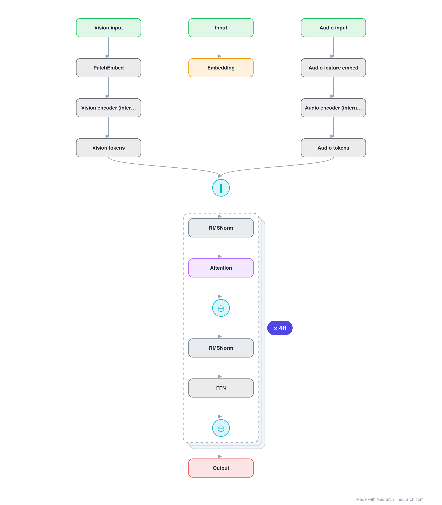

# Architecture: Gemma 4 12B

## Motivation

The 12B of Google's Gemma 4 generation, the strongest permissively-distributed dense model of the June 2026 wave. Wide 256-dim heads, 5:1 local:global attention, and a 262K vocabulary.

## Core Idea

The 12B of Google's Gemma 4 generation, the strongest permissively-distributed dense model of the June 2026 wave.

## Architecture

### Overview

*Identical repeated blocks are folded into one representative block with a `× N` badge, so the whole architecture fits on screen. `model.json` uses a NAXS block template + `repeat` directive: the identical repeated layers are defined once and expand to all 300 nodes (open it in Neurarch to see and edit every layer). Vector: [diagram.svg](assets/diagram.svg).*

| Hyperparameter | Value |
|---|---|
| Type | Decoder-only transformer (causal LM) |
| Parameters | 12B |
| Layers | 48 |
| Hidden size | 3840 |
| Attention | Grouped-query: 16 query heads, 8 KV heads |
| Head dim | 256 |
| FFN | GeGLU, hidden size 15,360 |
| Normalization | RMSNorm, pre-norm |
| Positions | RoPE; 5:1 local(1024-window):global attention layers (40 sliding, 8 full, verified from config) |
| Vocabulary | 262,144 |
| Max context | 262,144 |

`model.json` is the full 48-layer graph (the repeated layers expressed via a NAXS block template + `repeat`), produced with the same import path the Neurarch app uses for "load from Hugging Face" (with importer fixes noted in the generator script), with all hyperparameters from the official `config.json`.

### Design Notes

- Hyperparameters read directly from the June 2026 config.json (gemma4_unified_text): this entry tracks the release, not secondhand writeups.
- Oversized heads: 16 heads of dim 256 (4096-dim attention over 3840 hidden), continuing the Gemma trademark of few-but-wide heads.
- 5:1 local-to-global attention with a 1024-token window keeps the 262144-token context affordable; only 8 of 48 layers see the full sequence.
- GeGLU FFN at 15360 (4x hidden) and the huge 262144-token SentencePiece vocabulary; "unified" model_type with a built-in vision encoder, and the imported graph includes the vision patch-embed entry path feeding the shared decoder.

### Parameter Check

Neurarch's per-layer parameter estimate over this graph: **11.79B**.
Hugging Face safetensors metadata reports **11.96B** for the real weights.
Deviation from the authoritative count (11.96B): **-1.5%**.

## Design Decisions

> **Analysis** — Observations derived from studying the architecture.

- Hyperparameters read directly from the June 2026 config.json (gemma4_unified_text): this entry tracks the release, not secondhand writeups.
- Oversized heads: 16 heads of dim 256 (4096-dim attention over 3840 hidden), continuing the Gemma trademark of few-but-wide heads.
- 5:1 local-to-global attention with a 1024-token window keeps the 262144-token context affordable; only 8 of 48 layers see the full sequence.
- GeGLU FFN at 15360 (4x hidden) and the huge 262144-token SentencePiece vocabulary; "unified" model_type with a built-in vision encoder, and the imported graph includes the vision patch-embed entry path feeding the shared decoder.

## Implementation Notes

- `model.json` contains the full structural graph with real dimensions and parameters, using a NAXS block template + `repeat` for the identical repeated layers.
- Open in [Neurarch](https://www.neurarch.com/) to visualize, edit, or export training code.
- Diagrams fold repeated identical blocks with a `× N` badge; `model.json` defines each repeated layer once at real dimensions and expands to all nodes.

## Limitations

- This package focuses on the architectural structure. Training pipelines, 
dataset preparation, and production optimizations are out of scope.

## Evolution

> See `references/related/` for predecessor and successor architectures.

