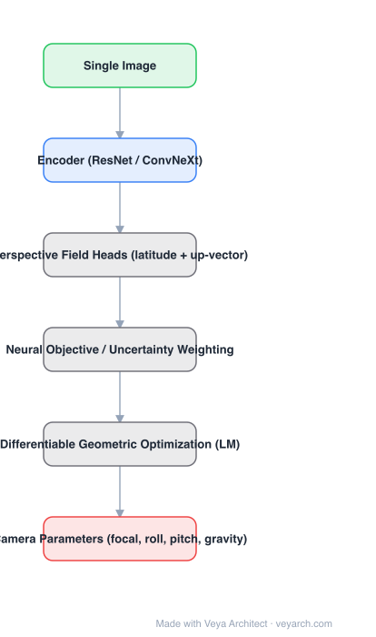

# Architecture: GeoCalib

## Motivation

Camera calibration from a single image is classically a geometric problem: find vanishing points or horizon lines, then solve for intrinsics and gravity. Learned regressors skip the geometry and predict parameters directly, which is fragile because the mapping from pixels to parameters is ill-conditioned. GeoCalib's position: let the network do perception and let an **optimization layer inside the graph** do the geometry.

## Core Idea

The network predicts a dense **perspective field** — per-pixel *latitude* (encoding the horizon/focal geometry) and *up-vector* (encoding gravity direction) — together with per-pixel uncertainties. A **differentiable geometric optimization** then fits the camera parameters to those fields by weighted least squares. Because the whole thing is differentiable, the network learns to output fields that are easy to calibrate from.

## Architecture

### Overview

<b>Layer-by-layer (6 nodes)</b>

| # | Layer | Type | Params |
|---|---|---|---|
| 1 | Single Image | `input` |  |
| 2 | Encoder (ResNet / ConvNeXt) | `conv2d` |  |
| 3 | Perspective Field Heads (latitude + up-vector) | `custom` |  |
| 4 | Neural Objective / Uncertainty Weighting | `custom` |  |
| 5 | Differentiable Geometric Optimization (LM) | `custom` |  |
| 6 | Camera Parameters (focal, roll, pitch, gravity) | `output` |  |

### Components

1. **Encoder** (ResNet / ConvNeXt-style) — produces dense features for the single input image.
2. **Perspective field heads** — two dense heads predicting latitude and up-vector per pixel, plus aleatoric uncertainty per pixel. The representation is deliberately geometric: it is the quantity a camera model can be fitted to.
3. **Neural objective / uncertainty weighting** — the network's predicted uncertainties become the weights of the least-squares residuals, so unreliable regions (sky, textureless areas, humans) are down-weighted automatically.
4. **Differentiable geometric optimization layer** — solves for the camera parameters (focal length, roll/pitch from gravity, optionally distortion) by iterative least squares (Levenberg–Marquardt-style), with gradients flowing back to the network.
5. **Outputs** — gravity direction, focal length, principal point assumptions, and optional distortion coefficients.

### Data Flow

Single image → encoder → perspective field heads (latitude + up + uncertainty) → differentiable optimization → camera parameters. Gradients from the parameter error flow back through the solver into the encoder.

### State / Memory

No recurrent state. The optimization layer holds a small iterative solve per image (a fixed number of LM iterations), which is the model's "inference-time computation" component.

## Design Decisions

- **Perception network + geometric solver** — keeps the output a valid camera model instead of an unconstrained regression.
- **Perspective field representation** — an intermediate that is both learnable and geometrically meaningful; this is what makes the fit well-posed.
- **Learned uncertainty as solver weights** — the network decides which evidence to trust, replacing hand-tuned robust losses.
- **End-to-end differentiability through the solver** — the network is trained to produce *calibratable* fields, not just visually plausible ones.

## Evolution

- **Classical calibration** (predecessor): patterns, vanishing points, horizon lines — accurate but fragile in the wild.
- **PerspectiveFields / learned calibration**: direct regression of gravity and intrinsics.
- **GeoCalib**: dense perspective fields + differentiable optimization with uncertainty weighting.
- **Related/successors**: DUSt3R / MASt3R / VGGT (jointly estimate geometry including intrinsics), MoGe (point map + focal), Metric3D, DeepCalib (distortion-focused).

## Characteristics

| Property | Value |
|---|---|
| Task | single-image camera calibration |
| Encoder | ResNet / ConvNeXt-style |
| Representation | dense perspective field (latitude + up-vector + uncertainty) |
| Solver | differentiable weighted least squares (LM-style) |
| Outputs | gravity direction (roll/pitch), focal length, optional distortion |
| Input | single image, no calibration pattern |

## Limitations

- Single-image calibration is ill-posed in principle: crops, heavy distortion, and images without clear structure degrade results.
- Assumes a pinhole-style model with (by default) a centered principal point; unusual intrinsics need extra parameterization.
- Distortion modeling is optional/limited compared with multi-image calibration.
- The iterative solver adds per-image latency (a handful of LM steps), though it is small relative to the encoder.

## Implementation Notes

Essentials: (1) dense latitude/up heads with a per-pixel uncertainty output, (2) build the residual from the perspective field using the current camera estimate, (3) run a fixed number of differentiable least-squares iterations and backprop through them, (4) supervise on camera parameters *and* on the field so the intermediate representation stays meaningful. Keep the number of solver iterations small — accuracy saturates quickly and each iteration carries gradient cost.
