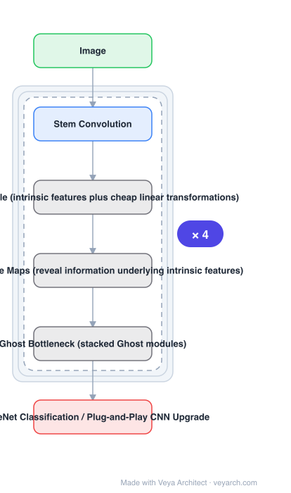

# Architecture: GhostNet

## Motivation

Deploying CNNs on embedded devices is hard because memory and computation are limited. Standard compression tools — network pruning, low-bit quantization, knowledge distillation — help, but their performance is **upper bounded by the pre-trained deep neural networks** they start from. Meanwhile, **redundancy in feature maps** is an important characteristic of successful CNNs, yet had rarely been investigated in neural architecture *design*. That redundancy is the untapped resource.

## Core Idea

Generate more features from **cheap operations**. Start from a set of **intrinsic feature maps** produced by an ordinary (but reduced) convolution, then apply a series of **cheap linear transformations** to produce many **ghost feature maps** that reveal the information underlying the intrinsic ones. The intrinsic maps plus the ghosts together reproduce the full feature map — for a fraction of the cost.

## Architecture

### Overview

<b>Layer-by-layer (6 nodes)</b>

| # | Layer | Type | Params |
|---|---|---|---|
| 1 | Image | `input` |  |
| 2 | Stem Convolution | `conv2d` |  |
| 3 | Ghost Module (intrinsic features plus cheap linear transformations) | `custom` |  |
| 4 | Ghost Feature Maps (reveal information underlying intrinsic features) | `custom` |  |
| 5 | Ghost Bottleneck (stacked Ghost modules) | `custom` |  |
| 6 | ImageNet Classification / Plug-and-Play CNN Upgrade | `output` |  |

### Components

1. **Ghost module** — the plug-and-play unit: a primary convolution producing intrinsic features, then cheap linear transformations producing ghost features; output is the concatenation.
2. **Intrinsic feature maps** — the smaller set computed by the ordinary convolution; the source of the information.
3. **Ghost feature maps** — generated by cheap linear transformations, intended to fully reveal the information underlying the intrinsic features.
4. **Ghost bottleneck** — stacked Ghost modules, designed so GhostNet can be built easily; includes a residual/shortcut path and, in some variants, a squeeze-and-excite step.
5. **GhostNet** — the resulting lightweight network; plug-and-play upgrade for existing CNNs.

### Data Flow

Image → stem convolution → stacked Ghost bottlenecks (primary convolution → intrinsic features → cheap linear transform → ghost features → concatenate → optional SE and residual) → classification head.

### State / Memory

No recurrent state. The efficiency argument is about arithmetic and parameters: the cheap transformations produce most of the channel count without most of the multiply-adds.

## Design Decisions

- **Exploit redundancy by design, not post-hoc** — the paper's stated gap is that feature-map redundancy had rarely been investigated in architecture design; compression-after-training is the alternative being exceeded.
- **Cheap linear transformations rather than full convolutions** — the point is that most feature maps do not need a full convolution to be useful.
- **Keep the module plug-and-play** — so it can upgrade existing CNNs, not only GhostNet.
- **Compare against MobileNetV3 at similar cost** — the fair comparison is computational cost, not parameter count alone.

## Evolution

- **Pruning, quantization, distillation** (contrast): upper bounded by their pre-trained baselines.
- **MobileNetV1/V2/V3** (predecessors and the comparison point).
- **GhostNet (2019)**: Ghost module + Ghost bottlenecks.
- **Siblings**: ShuffleNet V2, MobileNetV4, StarNet, FasterNet.
- **Contrast**: standard convolutions, where every feature map costs a full convolution.

## Characteristics

| Property | Value |
|---|---|
| Task | efficient image classification / CNN upgrade |
| Core module | Ghost module (intrinsic + cheap-transformation ghost features) |
| Bottleneck | stacked Ghost modules |
| Reusability | plug-and-play for existing CNNs |
| Result | 75.7% ImageNet top-1, better than MobileNetV3 at similar cost |

## Limitations

- The cheap linear transformations are typically depthwise; their real speed depends on hardware memory behaviour (the concern FasterNet later quantifies).
- Transformation quality is bounded by what the intrinsic features contain — if the intrinsics lose information, ghosts cannot recover it.
- Evaluation is classification-centric; dense prediction behaviour is not the reported focus.
- Requires choosing the ratio of intrinsic to ghost channels, a per-model trade.

## Implementation Notes

Essentials: (1) implement the Ghost module as primary convolution **plus** cheap transform with concatenation — replacing it with a plain convolution removes the entire mechanism, (2) keep the module swappable into existing CNNs, since plug-and-play is a stated property, (3) tune the intrinsic/ghost ratio; it sets the accuracy-cost point, (4) stack Ghost bottlenecks with residual and SE rather than scattering individual Ghost modules, (5) compare at equal computational cost against MobileNetV3, not at equal parameter count.
