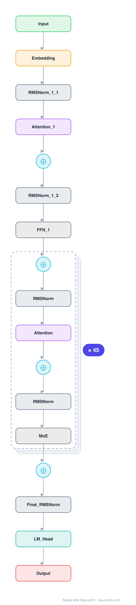

# Architecture: GLM-4.5-Air

## Motivation

Zhipu AI's agent-focused MoE in its deployable Air size. Distinctive for spending parameters on attention (96 heads, 3x hidden) while keeping experts slim, the opposite allocation from most 2025 MoEs.

## Core Idea

Zhipu AI's agent-focused MoE in its deployable Air size.

## Architecture

### Overview

*Identical repeated blocks are folded into one representative block with a `× N` badge, so the whole architecture fits on screen. `model.json` uses a NAXS block template + `repeat` for the isomorphic MoE-layer tail (dense prefix kept expanded); it expands back to all 281 nodes (open it in Neurarch to see and edit every layer). Vector: [diagram.svg](assets/diagram.svg).*

| Hyperparameter | Value |
|---|---|
| Type | Decoder-only transformer, sparse MoE (causal LM) |
| Parameters | 106B total, 12B active |
| Layers | 46 |
| Hidden size | 4096 |
| Attention | Grouped-query: 96 query heads, 8 KV heads |
| Head dim | 128 |
| FFN | MoE: 128 routed experts, top-8 + 1 shared, expert dim 1,408; first 1 layer dense (10,944) |
| Normalization | RMSNorm, pre-norm |
| Positions | RoPE (rotary dim 64) |
| Vocabulary | 151,552 |
| Max context | 131,072 |

`model.json` is the full 46-layer graph (MoE-layer tail expressed via a NAXS block template + `repeat`; dense prefix kept expanded), produced with the same import path the Neurarch app uses for "load from Hugging Face", with all hyperparameters from the official `config.json`.

### Design Notes

- Wide attention: 96 query heads of dim 128 give a 12288-dim attention space over a 4096 hidden size (3x), an unusually attention-heavy budget the GLM-4.5 report credits for reasoning performance.
- GQA 96:8 with partial RoPE (half of each head), plus QKV bias (attention_bias = true), a Qwen2-style touch the rest of the 2025 wave dropped.
- 128 fine-grained experts, top-8 routing, 1 shared expert, slim 1408-dim experts; first layer dense at 10944.
- The "Air" tier of the GLM-4.5 agentic line: 106B total but only 12B active, sized to run on a single high-end node.

### Parameter Check

Neurarch's per-layer parameter estimate over this graph: **106.85B**.
Hugging Face safetensors metadata reports **110.47B** for the real weights.
Deviation from the authoritative count (110.47B): **-3.3%**.

## Design Decisions

> **Analysis** — Observations derived from studying the architecture.

- Wide attention: 96 query heads of dim 128 give a 12288-dim attention space over a 4096 hidden size (3x), an unusually attention-heavy budget the GLM-4.5 report credits for reasoning performance.
- GQA 96:8 with partial RoPE (half of each head), plus QKV bias (attention_bias = true), a Qwen2-style touch the rest of the 2025 wave dropped.
- 128 fine-grained experts, top-8 routing, 1 shared expert, slim 1408-dim experts; first layer dense at 10944.
- The "Air" tier of the GLM-4.5 agentic line: 106B total but only 12B active, sized to run on a single high-end node.

## Implementation Notes

- `model.json` contains the full structural graph with real dimensions and parameters, using a NAXS block template + `repeat` for the isomorphic MoE-layer tail.
- Open in [Neurarch](https://www.neurarch.com/) to visualize, edit, or export training code.
- Diagrams fold repeated identical blocks with a `× N` badge; `model.json` defines the repeated MoE layers once at real dimensions and expands to all nodes.

## Limitations

- This package focuses on the architectural structure. Training pipelines, 
dataset preparation, and production optimizations are out of scope.

## Evolution

> See `references/related/` for predecessor and successor architectures.

