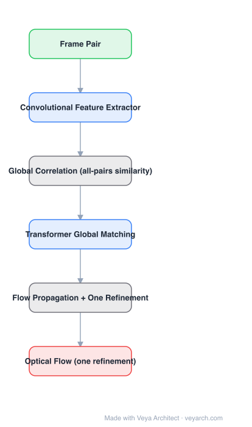

# Architecture: GMFlow

## Motivation

PWC-Net (coarse-to-fine) and RAFT (iterative refinement) both regress flow from a **local** cost volume, which cannot resolve large displacement in one step — hence multi-scale pyramids or dozens of sequential refinements. That sequential chain is the problem: inference time grows linearly with refinements, which is hostile to speed optimization and to integration into real systems.

## Core Idea

Reformulate optical flow as **global matching**: compute global correlation over features and let a **transformer** resolve the correspondence across the whole image. Large displacements are then handled in a single pass, followed by **one** refinement instead of many.

## Architecture

### Overview

<b>Layer-by-layer (6 nodes)</b>

| # | Layer | Type | Params |
|---|---|---|---|
| 1 | Frame Pair | `input` |  |
| 2 | Convolutional Feature Extractor | `conv2d` |  |
| 3 | Global Correlation (all-pairs similarity) | `custom` |  |
| 4 | Transformer Global Matching | `attention` |  |
| 5 | Flow Propagation + One Refinement | `custom` |  |
| 6 | Optical Flow (one refinement) | `output` |  |

### Components

1. **Convolutional feature extractor** — shared-weight CNN features from both frames.
2. **Global correlation** — all-pairs similarity over features, giving a global rather than local matching signal.
3. **Transformer global matching** — reasons over the global correlation to produce matches, handling large displacement that local regression cannot.
4. **Flow propagation** — converts matched correspondences into a dense flow field, filling regions where matching is uncertain.
5. **One refinement stage** — a single refinement (as opposed to RAFT's dozens) polishes the flow.
6. **Convex upsampling** — as in RAFT, produces full-resolution flow.

### Data Flow

Frame pair → features → global correlation → transformer global matching → flow propagation → one refinement → convex upsampling → optical flow.

### State / Memory

The global correlation is the large intermediate structure; unlike iterative methods there is no per-iteration hidden state to carry, which is the source of the speed claim.

## Design Decisions

- **Matching instead of regression** — the reformulation: estimate correspondences directly rather than regressing displacement from a local window.
- **Global, not local** — the reason large displacement stops requiring incremental estimation.
- **Minimize refinement stages** — sequential refinements are what make latency hard to optimize, so removing them is worth more than tuning them.
- **Transformer for the matching step** — the model class suited to reasoning over all-pairs similarity.

## Evolution

- **PWC-Net (2018)** (predecessor): coarse-to-fine, multi-scale.
- **RAFT (2020)**: single resolution, many iterative refinements.
- **GMFlow (2021)**: global matching with a transformer, one refinement.
- **Siblings**: DICL (local matching with convolutions), GLU-Net (global correlation with convolutions, restricted to fixed resolution), FlowFormer (cost-memory transformer), SEA-RAFT.
- **Successor**: GMFlow+ / follow-up work on matching-based flow.

## Characteristics

| Property | Value |
|---|---|
| Task | optical flow |
| Paradigm | global matching (not local regression) |
| Matching module | transformer over global correlation |
| Refinements | one (vs. RAFT's ~31) |
| Reported result | outperforms 31-refinement RAFT on Sintel, faster |

## Limitations

- Global correlation is memory-heavy at high resolution; tiling or downsampling is needed for large inputs.
- Matching fails in textureless/occluded regions, where local smoothness priors would help; propagation and refinement only partly compensate.
- One refinement trades peak accuracy on small displacements against speed.
- Synthetic pretraining → real fine-tuning remains necessary.

## Implementation Notes

Essentials: (1) compute global correlation over features, not a local window — that is the identity of the method, (2) feed it to the transformer matching module and supervise with ground-truth correspondence/flow, (3) implement flow propagation to densify sparse matches, (4) keep refinement to a single stage and measure latency against a RAFT baseline at equal accuracy, (5) watch memory at high resolution: global correlation scales as the product of feature-map sizes.
