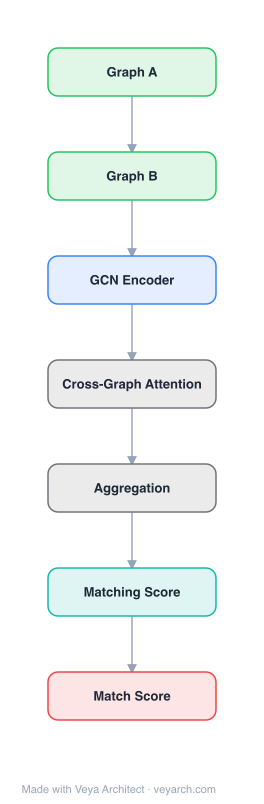

# Architecture: Graph Matching Networks (GMN)

## Motivation

Graphs are natural representations for encoding relational structures across many domains—molecules in computational biology and chemistry, knowledge graphs for NLU, control-flow graphs in software security. A key problem in these domains is graph similarity learning: given two graphs, compute a similarity score that captures both structural and semantic similarity. This appears in important real-world applications such as similarity-based retrieval in graph databases and binary function similarity search for vulnerability detection in software systems.

Prior approaches to graph similarity relied on non-learning-based methods (exact or sub-graph isomorphism, graph edit distance) or hand-designed graph kernels (walk-based, substructure-based, subtree-based). While effective for specific cases, these methods cannot adapt to learned similarity metrics and struggle when subtle structural differences make graphs semantically very different, or when graphs with different structures are still semantically similar.

Graph Neural Networks (GNNs) had emerged as effective models for supervised prediction on graphs (node classification, graph classification), but problems beyond classification—particularly similarity learning and graph matching—were relatively unstudied. The GMN paper addresses this gap by proposing two models: (1) a GNN-based graph embedding model that maps each graph independently to a vector, and (2) a novel Graph Matching Network (GMN) that computes similarity jointly on a pair of graphs through cross-graph attention, making it more powerful than independent embedding approaches at the cost of extra computation.

A motivating application is binary function similarity search: given a binary that may contain vulnerable code, check whether any control-flow-graph in it is sufficiently similar to a database of known-vulnerable functions. This requires exploiting graph structure and reasoning about both structural and learned semantic similarity—a task where hand-engineered baselines fall short.

## Core Idea

Graph-level similarity learning via cross-graph attention and node-level matching for graph comparison.

## Architecture

### Overview

<b>Layer-by-layer (7 nodes)</b>

| # | Layer | Type | Params |
|---|---|---|---|
| 1 | Graph A | `input` |  |
| 2 | Graph B | `input` |  |
| 3 | GCN Encoder | `gcn_conv` |  |
| 4 | Cross-Graph Attention | `custom` |  |
| 5 | Aggregation | `custom` |  |
| 6 | Matching Score | `linear` |  |
| 7 | Match Score | `output` |  |

The paper proposes two models for graph similarity learning. The first is a **Graph Embedding Model** based on standard GNNs: each graph is independently encoded into a vector via an encoder, propagation layers, and an aggregator, then similarity is computed in the vector space (Euclidean, cosine, or Hamming). The second is the **Graph Matching Network (GMN)**, which takes a pair of graphs as input and computes similarity jointly through cross-graph attention. Instead of computing representations independently for each graph, the GMN modifies the propagation process to incorporate cross-graph matching vectors, allowing it to identify differences between graphs and adjust representations accordingly.

The key insight of the GMN is that by making graph representation computation dependent on the pair being compared, the model becomes more powerful than the embedding model. When two graphs match perfectly, the cross-graph attention weights peak at the exact match and the matching vectors reduce to zero, leaving the graphs' representations identical. When graphs differ, the differences are captured in the cross-graph matching vectors and amplified through propagation, making the model sensitive to discrepancies. The models can be trained with margin-based pairwise or triplet losses.

### Components

- **Encoder:** Maps node and edge features to initial vectors through separate MLPs: `h_i = MLP_node(x_i)` for each node, `e_ij = MLP_edge(x_ij)` for each edge. If no features exist, vectors are set to constant vectors of 1s.

- **Propagation Layers (shared by both models):** Iteratively update node representations by aggregating messages from neighbors:
  - **Message function:** `m_{j→i} = f_message(h_i, h_j, e_ij)` — an MLP on concatenated inputs of source node, target node, and edge features.
  - **Node update function:** `h_i^{(t+1)} = f_node(h_i, Σ m_{j→i})` — can be an MLP or a recurrent unit (GRU, LSTM). GRUs were found to work better than MLPs.
  - Message aggregation uses a simple sum (alternatively mean, max, or attention-based weighted sum).
  - Multiple layers (T rounds) allow information to accumulate from local neighborhoods.

- **Cross-Graph Matching (GMN only):** The key innovation. For each node i in graph G1 and node j in graph G2, compute a cross-graph matching vector:
  - Attention weights: `a_{j→i} = exp(s_h(h_i, h_j)) / Σ exp(s_h(h_i, h_j'))` — normalized similarity between node representations across graphs.
  - Matching vector: `µ_{j→i} = a_{j→i} (h_i - h_j)` — measures the difference between node i and its closest neighbor in the other graph.
  - Node update incorporates both intra-graph messages and cross-graph matching: `h_i^{(t+1)} = f_node(h_i, Σ m_{j→i}, Σ µ_{j'→i})`.

- **Aggregator:** After T propagation rounds, computes a graph-level representation using a gated weighted sum: `h_G = Σ σ(MLP_gate(h_i)) ⊙ MLP(h_i)`. The gating helps filter irrelevant information, being more powerful than simple sum.

- **Similarity Scorer:** For the embedding model, computes vector space similarity (Euclidean, cosine, or Hamming). For the GMN, applies the same after computing graph vectors for both graphs: `s = f_s(h_G1, h_G2)`.

### Data Flow

1. **Input:** A pair of graphs G1 = (V1, E1) and G2 = (V2, E2), each with optional node features x_i and edge features x_ij.
2. **Encoding:** Apply encoder MLPs to produce initial node vectors h_i and edge vectors e_ij for both graphs.
3. **Propagation with cross-graph matching (GMN):** For T rounds:
   - (a) Compute intra-graph messages m_{j→i} for edges within each graph using the message function.
   - (b) Compute cross-graph attention weights a_{j→i} between all node pairs across the two graphs.
   - (c) Compute cross-graph matching vectors µ_{j→i} = a_{j→i}(h_i - h_j).
   - (d) Update each node's representation using GRU with concatenated intra-graph messages and cross-graph matching vectors as input.
4. **Aggregation:** Apply the gated aggregator to produce graph vectors h_G1 and h_G2.
5. **Similarity scoring:** Compute similarity s = f_s(h_G1, h_G2) (Euclidean distance, cosine, or Hamming similarity).
6. **Training:** Optimize margin-based pairwise loss or triplet loss using gradient descent.

### State / Memory

The architecture has stateful components:
- **Node state vectors:** Each node maintains a hidden state h_i that is iteratively updated through T propagation rounds. The GRU update function provides memory of previous states across rounds.
- **Cross-graph attention memory:** The attention weights a_{j→i} encode which nodes in one graph correspond to nodes in the other, and this correspondence is refined across propagation layers.
- **Shared parameters:** Propagation layers can optionally share the same set of parameters across all T rounds, which can be a useful inductive bias and was found to help performance more often than not.
- **No persistent memory between graph pairs:** The model is stateless across different graph pairs—each pair is processed independently.

## Design Decisions

- **Cross-graph attention over independent embedding:** The key design choice. By computing representations jointly on the pair rather than independently, the GMN can adjust graph representations based on the other graph being compared—making them more different when they don't match. This provides a nice accuracy-computation trade-off: more powerful than the embedding model at O(|V1||V2|) per round vs. O(|V|+|E|).

- **Attention-based matching vector design:** The matching vector µ_{j→i} = a_{j→i}(h_i - h_j) has an elegant property: when graphs match perfectly and attention peaks at the exact match, the sum of matching vectors is zero, leaving representations unchanged. Differences are captured and amplified through propagation, making the model sensitive to discrepancies.

- **GRU for node updates:** GRUs were found to generally work better than one-hidden-layer MLPs for the node update function. The input to the GRU is the concatenation of intra-graph message sum and cross-graph matching sum.

- **Small weight initialization for message MLPs:** Initializing f_message weights with a small scaling factor (0.1× Glorot) stabilizes training by preventing huge message scales when summed, which is bad for learning.

- **Gated aggregation over simple sum:** The aggregator uses a gated weighted sum (σ(MLP_gate) ⊙ MLP) rather than a simple sum. This filters irrelevant information and works significantly better empirically.

- **Binary graph vectors option:** For applications requiring fast retrieval through large databases, the model can produce binary graph vectors h_G ∈ {-1, +1}^H via a tanh transformation, enabling efficient nearest-neighbor search with Hamming distance.

- **Pair vs. triplet training:** Both margin-based pairwise and triplet losses are supported. Triplet training only needs relative similarity (which of G2, G3 is closer to G1), while pairwise training needs absolute similar/dissimilar labels.

## Evolution

- **Predecessors:** Graph Neural Networks (Scarselli et al., 2009; Li et al., 2015; Gilmer et al., 2017) provided the propagation-based node representation framework. Siamese networks (Bromley et al., 1994) for visual similarity learning applied shared-parameter networks independently to two inputs. Graph kernels (Weisfeiler-Lehman, random walk, substructure-based) for hand-designed graph similarity. The Weisfeiler-Lehman isomorphism test (Weisfeiler & Lehman, 1968) provided the theoretical connection to GNN discriminative power (Xu et al., 2018).

- **Contemporaries:** Deep Sets / PointNet (Zaheer et al., 2017; Qi et al., 2017) for set-level representation (the 0-propagation-step special case). Cross-example attention for visual similarity (Shyam et al., 2017) independently proposed similar cross-input attention.

- **Successors:** The GMN's cross-graph attention mechanism influenced subsequent graph matching and comparison architectures. The concept of jointly reasoning on graph pairs was extended in later graph similarity and graph-level interaction models.

## Characteristics

| Property | Value |
|----------|-------|
| Year | 2019 |
| Authors | Li et al. |
| Category | GNN/Architecture |
| Source Paper | `Graph_Matching_Networks_for_Learning_the_Similarity_of_Graph_Unknown_2019.md` |
| PaperVault Path | `GNN/03-gnn-architectures/Graph_Matching_Networks_for_Learning_the_Similarity_of_Graph_Unknown_2019.md` |

## Limitations

- **Quadratic cross-graph computation cost:** The cross-graph attention requires computing attention weights for every pair of nodes across the two graphs, costing O(|V1||V2|) per propagation round. This is significantly more expensive than the O(|V|+|E|) per round of the embedding model, making the GMN less suitable for large-scale or real-time retrieval scenarios.

- **Fixed-size graph vectors:** The model uses a fixed-dimensional graph vector regardless of graph size. In contrast, the WL kernel can have up to 2|V|^T dimensional representation vectors, giving it more "features" to work with for large graphs. This limits the GMN's expressiveness on very large graphs.

- **Generalization to larger graphs:** When trained on small graphs (20–50 nodes) and tested on larger graphs (100–200 nodes), performance falls off, particularly on dense graphs. This is partially caused by the fixed graph vector size and partially by the model's limited capacity to capture long-range structural patterns.

- **No persistent cross-pair memory:** Each graph pair is processed independently. The model cannot leverage knowledge from previously compared pairs or build a reusable index, unlike the embedding model which can pre-compute and index graph vectors.

- **Propagation step sensitivity:** Performance generally improves with more propagation steps, but the optimal number T requires tuning. The paper used up to 5 layers; increasing beyond 5 may help but was not fully explored.

- **Binary similarity search specific limitations:** For the control-flow-graph application, the model's performance depends on the quality of node features (assembly instruction embeddings). When using only graph structure without instruction features, performance degrades significantly.

## Implementation Notes

See `implementation/` for a minimal runnable implementation.

## Information Layers

- **Evidence:** Source paper available in `references/papers/`
- **Analysis:** The GMN's key innovation is making graph representation computation pair-dependent through cross-graph attention. The matching vector design µ = a(h_i - h_j) is elegant: it naturally reduces to zero for perfect matches and amplifies differences otherwise. The ablation studies consistently show GMNs outperform both the embedding model and Siamese networks across all tasks and propagation step counts. The binary vector option (tanh + Hamming) is a practical design for database retrieval scenarios.
- **Hypothesis:** The fixed-size graph vector may be a fundamental bottleneck for large-graph generalization. An adaptive-size representation (e.g., hierarchical pooling or variable-length encoding) could potentially address this. The cross-graph attention's quadratic cost might be reducible through sparse or approximate attention without significant accuracy loss.
