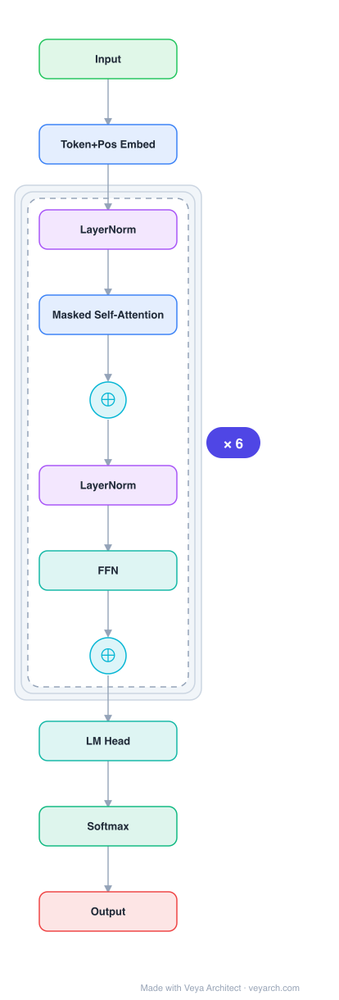

# Architecture: GPT-1

## Motivation

Natural language understanding encompasses diverse tasks — textual entailment, question answering, semantic similarity assessment, document classification — but labeled data for these specific tasks is scarce, while large unlabeled text corpora are abundant. Discriminatively trained models require substantial manually labeled data, limiting their applicability. Prior approaches leveraged pre-trained word embeddings (word2vec, GloVe) to transfer word-level information, but could not capture higher-level semantics.

Two fundamental challenges existed: (1) it was unclear what optimization objective is most effective at learning transferable text representations (language modeling, machine translation, and discourse coherence each had different strengths); and (2) there was no consensus on how to transfer learned representations to target tasks — existing techniques required task-specific architectural changes, intricate learning schemes, or auxiliary objectives. GPT-1 addresses both by using a **generative pre-training** objective (language modeling) followed by **discriminative fine-tuning** with minimal architectural changes.

## Core Idea

Generative pre-trained transformer using decoder-only architecture with unsupervised pre-training then fine-tuning.

## Architecture

### Overview

<b>Layer-by-layer (11 nodes)</b>

| # | Layer | Type | Params |
|---|---|---|---|
| 1 | Input | `input` |  |
| 2 | Token+Pos Embed | `embed` |  |
| 3 | LayerNorm | `layernorm` |  |
| 4 | Masked Self-Attention | `attention` |  |
| 5 | ⊕ | `residual` |  |
| 6 | LayerNorm | `layernorm` |  |
| 7 | FFN | `ffn` |  |
| 8 | ⊕ | `residual` |  |
| 9 | LM Head | `linear` |  |
| 10 | Softmax | `softmax` |  |
| 11 | Output | `output` |  |

GPT-1 uses a **two-stage training procedure**: (1) unsupervised pre-training of a language model on a large unlabeled corpus, then (2) supervised fine-tuning on each target task. The model is a 12-layer decoder-only Transformer with masked self-attention. During fine-tuning, structured inputs (sentence pairs, document-question-answer triplets) are converted into ordered token sequences using a "traversal-style" approach, allowing the same pre-trained model to process all tasks with minimal architectural modification — only a linear output layer `W_y` and delimiter token embeddings are added.

### Components

1. **Decoder-only Transformer** — A variant of the original Transformer using only the decoder stack. Each layer applies multi-headed masked self-attention followed by position-wise feed-forward layers. Masking ensures auto-regressive property (tokens only attend to previous positions). 12 layers, 768-dimensional states, 12 attention heads.

2. **Token Embeddings** — Input tokens `U = (u_{-k}, ..., u_{-1})` are embedded via `W_e`, combined with learned position embeddings `W_p`: `h_0 = UW_e + W_p`.

3. **Transformer Blocks** — Each block applies masked multi-head self-attention and position-wise feed-forward layers: `h_l = transformer_block(h_{l-1})` for `l ∈ [1, n]`.

4. **Language Modeling Head** — Output distribution over target tokens: `P(u) = softmax(h_n W_e^T)`. The token embedding matrix `W_e` is reused for the output projection (weight tying).

5. **Task-specific Output Layer** — During fine-tuning, the final transformer block's activation `h_l^m` is fed into an added linear layer `W_y` to predict labels: `P(y|x_1, ..., x_m) = softmax(h_l^m W_y)`.

6. **Input Transformations** — Structured inputs are converted to contiguous token sequences:
   - **Textual entailment**: `[premise; $; hypothesis]`
   - **Similarity**: Both sentence orderings processed independently, representations added element-wise
   - **Question Answering**: `[document; question; $; answer_k]` for each candidate answer, normalized via softmax
   - **Text classification**: Direct fine-tuning
   - All transformations include start/end tokens `⟨s⟩`, `⟨e⟩` and delimiter `$`.

### Data Flow

**Pre-training:**
1. Unlabeled tokens from BooksCorpus are sampled as contiguous 512-token sequences.
2. Tokens are embedded and combined with learned positional embeddings.
3. The 12-layer decoder-only Transformer processes the sequence with masked self-attention.
4. Output activations are projected via the tied embedding matrix to produce next-token probabilities.
5. Language modeling objective: maximize `L_1(U) = Σ_i log P(u_i | u_{i-k}, ..., u_{i-1}; Θ)`.

**Fine-tuning:**
1. Structured task inputs are converted to ordered token sequences with delimiters.
2. The pre-trained model (with same parameters) processes the sequence.
3. The final block's activation is fed through a task-specific linear layer `W_y`.
4. Supervised objective: maximize `L_2(C) = Σ_{(x,y)} log P(y | x_1, ..., x_m)`.
5. Optional auxiliary language modeling objective: `L_3(C) = L_2(C) + λ · L_1(C)` with `λ = 0.5`.

### State / Memory

- **No recurrent state**: Like the base Transformer, GPT-1 has no hidden state propagated across time steps. The decoder-only architecture processes the entire context window in a single forward pass.
- **Context window as memory**: The model conditions on a fixed context of `k` tokens (512 tokens during pre-training). This is the primary "memory" mechanism — all information from the input must fit within this window.
- **Structured memory via Transformer**: The paper explicitly notes that the Transformer provides "a more structured memory for handling long-term dependencies in text, compared to alternatives like recurrent networks," enabling robust transfer across diverse tasks.
- **Pre-trained parameters as knowledge**: The pre-training phase encodes linguistic knowledge into the model parameters, which serve as a form of long-term memory transferred to downstream tasks.

## Design Decisions

1. **Decoder-only architecture** — Chosen over the full encoder-decoder Transformer. The language modeling objective (predicting next tokens) is naturally auto-regressive, making the decoder-only design appropriate. This also simplifies the architecture for the generative pre-training objective.

2. **Generative pre-training (language modeling)** — Chosen over other objectives (machine translation, discourse coherence) because: (a) it requires no labeled data; (b) it forces the model to learn long-range dependencies and generate coherent text; (c) BooksCorpus provides long contiguous text stretches enabling long-range conditioning.

3. **Learned positional embeddings** — Used instead of the sinusoidal encodings from the original Transformer. This was a practical choice; the original paper showed both performed similarly.

4. **Traversal-style input transformations** — Instead of designing task-specific architectures on top of transferred representations (which re-introduces task-specific customization), structured inputs are converted to ordered token sequences. This allows the same pre-trained model to handle diverse tasks with minimal architectural changes (only `W_y` and delimiter embeddings added).

5. **Auxiliary language modeling objective during fine-tuning** — Including `L_1` alongside `L_2` improved generalization and accelerated convergence, consistent with prior work. Weight `λ = 0.5`.

6. **GELU activation** — Used instead of ReLU, following recent work showing improved performance.

7. **Weight tying** — Token embedding matrix `W_e` is shared between input embeddings and the output projection, reducing parameters.

8. **BooksCorpus over 1B Word Benchmark** — BooksCorpus contains long contiguous text (unshuffled), preserving long-range structure. The 1B Word Benchmark is shuffled at sentence level, destroying long-range dependencies.

## Evolution

**Predecessors:**
- **Transformer** (Vaswani et al., 2017) — The base architecture GPT-1 adopts.
- **ELMo** (Peters et al., 2018) — Contextual word embeddings from bidirectional LSTM, but transfers only word-level features.
- **Dai et al. / Howard & Ruder** — Pre-trained LSTM language models for text classification, but LSTM's short-range prediction ability limited transfer.
- **Pre-trained word embeddings** (word2vec, GloVe) — Transferred word-level information only.

**Successors:**
- **GPT-2** (2019) — Scaled to 1.5B parameters, demonstrated zero-shot task transfer without fine-tuning.
- **BERT** (2018) — Bidirectional encoder-only Transformer using masked language modeling.
- **GPT-3** (2020) — Scaled to 175B parameters, demonstrated few-shot and zero-shot capabilities.
- The entire GPT family and modern LLM paradigm trace to this pre-train-then-fine-tune approach.

## Characteristics

## Characteristics

| Property | Value |
|----------|-------|
| Year | 2018 |
| Authors | Radford et al. |
| Category | DL/Transformer |
| Source Paper | `GPT_Unknown_Radford_Narasimhan_Salimans_etal_2025.md` |
| PaperVault Path | `DL-Architectures/01-transformers/GPT_Unknown_Radford_Narasimhan_Salimans_etal_2025.md` |

## Limitations

1. **Fixed context window** — The 512-token context limits the model's ability to handle long documents or multi-turn conversations. All input must fit within this window.

2. **Unidirectional attention** — The decoder-only architecture with masked self-attention means each token only attends to previous tokens, not future ones. This is suboptimal for tasks requiring bidirectional context understanding (addressed by BERT's masked language modeling).

3. **Task-specific fine-tuning required** — Unlike later GPT models that exhibit zero-shot/few-shot capabilities, GPT-1 requires supervised fine-tuning on each target task with labeled data.

4. **Limited scale** — 117M parameters trained on BooksCorpus (~7000 books). Later scaling (GPT-2, GPT-3) revealed emergent capabilities at larger scales.

5. **Delimiter-based input formatting** — The traversal-style approach requires task-specific input transformations, limiting true task-agnostic deployment.

## Implementation Notes

See `implementation/` for a minimal runnable implementation.

Key implementation details from the paper:
- 12-layer decoder-only Transformer, 768-dimensional states, 12 attention heads
- Feed-forward inner dimension: 3072
- BPE vocabulary with 40,000 merges
- Adam optimizer, max learning rate 2.5e-4, linear warmup over 2000 updates, cosine schedule
- 100 epochs, minibatches of 64 randomly sampled contiguous 512-token sequences
- Weight initialization: N(0, 0.02)
- Dropout rate 0.1 (residual, embedding, attention)
- L2 regularization with w = 0.01 on non-bias/gain weights
- GELU activation
- Learned position embeddings
- Fine-tuning: learning rate 6.25e-5, batch size 32, 3 epochs, λ = 0.5 for auxiliary LM objective

## Information Layers

- **Evidence:** Source paper available in `references/papers/` — architecture dimensions, training procedure, and task-specific input transformations are directly stated.
- **Analysis:** GPT-1's central contribution is the demonstration that generative pre-training on unlabeled text, followed by discriminative fine-tuning with minimal architectural changes, can produce a task-agnostic model outperforming task-specific architectures. The traversal-style input transformation is the key enabler of multi-task transfer with a single architecture.
- **Hypothesis:** The choice of decoder-only (unidirectional) over encoder-only (bidirectional, as in BERT) may limit performance on understanding tasks that benefit from bidirectional context, but enables generative capabilities that proved crucial for scaling to zero-shot/few-shot learning in GPT-2/GPT-3.
