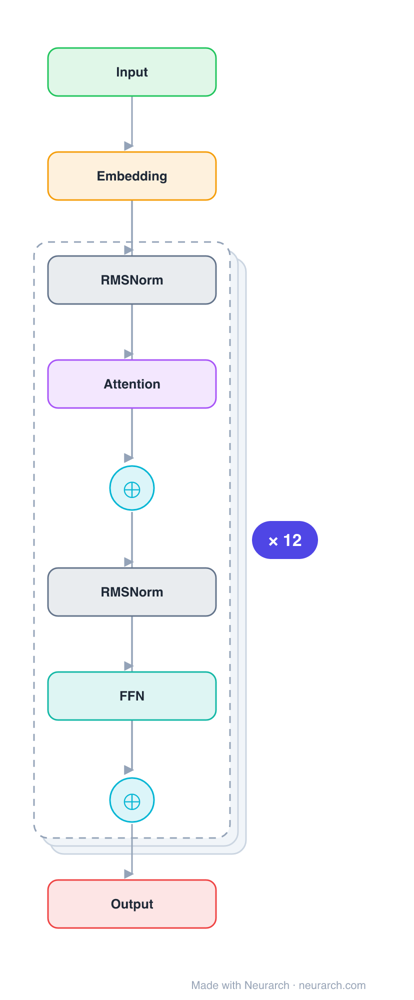

# Architecture: GPT-2

## Motivation

Current ML systems are "narrow experts" rather than "competent generalists" — brittle and sensitive to slight changes in data distribution and task specification. The dominant approach of collecting task-specific labeled datasets, training, and evaluating on IID held-out examples has produced erratic behavior on diverse inputs. The prevalence of single-task training on single-domain datasets is a major contributor to lack of generalization.

Multitask learning is a promising framework, but multitask training in NLP is nascent — the most ambitious efforts trained on only 10–17 (dataset, objective) pairs. From a meta-learning perspective, each (dataset, objective) pair is a single training example, and current ML systems need hundreds to thousands of examples to generalize. Brute-forcing dataset creation to the required scale is impractical.

GPT-2's key insight: language modeling on a sufficiently large and diverse corpus can learn to perform downstream tasks **without explicit supervision** in a **zero-shot setting** — without any parameter or architecture modification. The language modeling objective `p(x) = Π p(s_n | s_1, ..., s_{n-1})` is the same as the supervised objective but evaluated on a subset of the sequence, so a sufficiently capable language model should learn to infer and perform tasks demonstrated in natural language sequences.

## Core Idea

Decoder-only Transformer scaled to 1.5B parameters, trained on WebText (40GB of text from 45 million Reddit-curated links), demonstrating zero-shot task transfer across NLP tasks without fine-tuning.

## Architecture

### Overview

<b>Layer-by-layer (75 nodes)</b>

| # | Layer | Type | Params |
|---|---|---|---|
| 1 | Input | `input` | shape: [1, 512, 768] |
| 2 | Embedding | `embedding` | vocabSize: 50257, embeddingDim: 768, maxSeqLen: 1024 |
| 3 | RMSNorm_1_1 | `rmsNorm` | normalizedShape: 768 |
| 4 | Attention_1 | `multiHeadAttention` | numHeads: 12, hiddenDim: 768 |
| 5 | Add_1_attn | `add` |  |
| 6 | RMSNorm_1_2 | `rmsNorm` | normalizedShape: 768 |
| 7 | FFN_1 | `feedForward` | hiddenDim: 768, ffDim: 3072 |
| 8 | Add_1_ffn | `add` |  |
| 9 | RMSNorm_2_1 | `rmsNorm` | normalizedShape: 768 |
| 10 | Attention_2 | `multiHeadAttention` | numHeads: 12, hiddenDim: 768 |
| 11 | Add_2_attn | `add` |  |
| 12 | RMSNorm_2_2 | `rmsNorm` | normalizedShape: 768 |
| 13 | FFN_2 | `feedForward` | hiddenDim: 768, ffDim: 3072 |
| 14 | Add_2_ffn | `add` |  |
| 15 | RMSNorm_3_1 | `rmsNorm` | normalizedShape: 768 |
| 16 | Attention_3 | `multiHeadAttention` | numHeads: 12, hiddenDim: 768 |
| 17 | Add_3_attn | `add` |  |
| 18 | RMSNorm_3_2 | `rmsNorm` | normalizedShape: 768 |
| 19 | FFN_3 | `feedForward` | hiddenDim: 768, ffDim: 3072 |
| 20 | Add_3_ffn | `add` |  |
| 21 | RMSNorm_4_1 | `rmsNorm` | normalizedShape: 768 |
| 22 | Attention_4 | `multiHeadAttention` | numHeads: 12, hiddenDim: 768 |
| 23 | Add_4_attn | `add` |  |
| 24 | RMSNorm_4_2 | `rmsNorm` | normalizedShape: 768 |
| 25 | FFN_4 | `feedForward` | hiddenDim: 768, ffDim: 3072 |
| 26 | Add_4_ffn | `add` |  |
| 27 | RMSNorm_5_1 | `rmsNorm` | normalizedShape: 768 |
| 28 | Attention_5 | `multiHeadAttention` | numHeads: 12, hiddenDim: 768 |
| 29 | Add_5_attn | `add` |  |
| 30 | RMSNorm_5_2 | `rmsNorm` | normalizedShape: 768 |
| 31 | FFN_5 | `feedForward` | hiddenDim: 768, ffDim: 3072 |
| 32 | Add_5_ffn | `add` |  |
| 33 | RMSNorm_6_1 | `rmsNorm` | normalizedShape: 768 |
| 34 | Attention_6 | `multiHeadAttention` | numHeads: 12, hiddenDim: 768 |
| 35 | Add_6_attn | `add` |  |
| 36 | RMSNorm_6_2 | `rmsNorm` | normalizedShape: 768 |
| 37 | FFN_6 | `feedForward` | hiddenDim: 768, ffDim: 3072 |
| 38 | Add_6_ffn | `add` |  |
| 39 | RMSNorm_7_1 | `rmsNorm` | normalizedShape: 768 |
| 40 | Attention_7 | `multiHeadAttention` | numHeads: 12, hiddenDim: 768 |
| 41 | Add_7_attn | `add` |  |
| 42 | RMSNorm_7_2 | `rmsNorm` | normalizedShape: 768 |
| 43 | FFN_7 | `feedForward` | hiddenDim: 768, ffDim: 3072 |
| 44 | Add_7_ffn | `add` |  |
| 45 | RMSNorm_8_1 | `rmsNorm` | normalizedShape: 768 |
| 46 | Attention_8 | `multiHeadAttention` | numHeads: 12, hiddenDim: 768 |
| 47 | Add_8_attn | `add` |  |
| 48 | RMSNorm_8_2 | `rmsNorm` | normalizedShape: 768 |
| 49 | FFN_8 | `feedForward` | hiddenDim: 768, ffDim: 3072 |
| 50 | Add_8_ffn | `add` |  |
| 51 | RMSNorm_9_1 | `rmsNorm` | normalizedShape: 768 |
| 52 | Attention_9 | `multiHeadAttention` | numHeads: 12, hiddenDim: 768 |
| 53 | Add_9_attn | `add` |  |
| 54 | RMSNorm_9_2 | `rmsNorm` | normalizedShape: 768 |
| 55 | FFN_9 | `feedForward` | hiddenDim: 768, ffDim: 3072 |
| 56 | Add_9_ffn | `add` |  |
| 57 | RMSNorm_10_1 | `rmsNorm` | normalizedShape: 768 |
| 58 | Attention_10 | `multiHeadAttention` | numHeads: 12, hiddenDim: 768 |
| 59 | Add_10_attn | `add` |  |
| 60 | RMSNorm_10_2 | `rmsNorm` | normalizedShape: 768 |
| 61 | FFN_10 | `feedForward` | hiddenDim: 768, ffDim: 3072 |
| 62 | Add_10_ffn | `add` |  |
| 63 | RMSNorm_11_1 | `rmsNorm` | normalizedShape: 768 |
| 64 | Attention_11 | `multiHeadAttention` | numHeads: 12, hiddenDim: 768 |
| 65 | Add_11_attn | `add` |  |
| 66 | RMSNorm_11_2 | `rmsNorm` | normalizedShape: 768 |
| 67 | FFN_11 | `feedForward` | hiddenDim: 768, ffDim: 3072 |
| 68 | Add_11_ffn | `add` |  |
| 69 | RMSNorm_12_1 | `rmsNorm` | normalizedShape: 768 |
| 70 | Attention_12 | `multiHeadAttention` | numHeads: 12, hiddenDim: 768 |
| 71 | Add_12_attn | `add` |  |
| 72 | RMSNorm_12_2 | `rmsNorm` | normalizedShape: 768 |
| 73 | FFN_12 | `feedForward` | hiddenDim: 768, ffDim: 3072 |
| 74 | Add_12_ffn | `add` |  |
| 75 | Output | `output` |  |

GPT-2 uses a Transformer-based architecture following the original GPT model with several modifications. It is a decoder-only Transformer with masked self-attention. Four model sizes were trained (117M, 345M, 762M, 1542M parameters), with the largest called GPT-2. The architecture uses pre-activation layer normalization, modified initialization for residual depth scaling, byte-level BPE tokenization, and an expanded context window of 1024 tokens.

### Components

1. **Decoder-only Transformer** — Multi-layer Transformer decoder with masked multi-head self-attention and position-wise feed-forward networks. Model sizes:
   - 117M: 12 layers, d_model = 768 (equivalent to original GPT)
   - 345M: 24 layers, d_model = 1024 (equivalent to largest BERT)
   - 762M: 36 layers, d_model = 1280
   - 1542M: 48 layers, d_model = 1600

2. **Pre-activation Layer Normalization** — LayerNorm moved to the input of each sub-block (pre-LN), similar to pre-activation residual networks, rather than post-LN as in the original Transformer. An additional layer normalization is added after the final self-attention block. This improves training stability at scale.

3. **Modified Residual Initialization** — Weights of residual layers are scaled by `1/√N` at initialization, where N is the number of residual layers, to account for accumulation on the residual path with model depth.

4. **Byte-level BPE Tokenization** — Byte Pair Encoding applied at the byte level (base vocabulary 256) rather than Unicode code point level. Prevents BPE from merging across character categories (except spaces) to avoid sub-optimal vocabulary allocation. Vocabulary expanded to 50,257. This allows the model to assign probability to any Unicode string and be evaluated on any dataset regardless of pre-processing.

5. **Learned Positional Embeddings** — Context size increased from 512 to 1024 tokens.

### Data Flow

1. **Input**: Raw text is encoded as UTF-8 bytes, then byte-level BPE is applied to produce token IDs.
2. **Embedding**: Tokens are embedded and combined with learned positional embeddings.
3. **Transformer processing**: The decoder-only stack processes the 1024-token context with masked self-attention. Each layer: pre-LN → multi-head self-attention → residual → pre-LN → feed-forward → residual.
4. **Output**: Final layer normalization → linear projection via tied embeddings → softmax over 50,257-token vocabulary to produce next-token probabilities.
5. **Zero-shot task execution**: Tasks are specified as natural language sequences (e.g., `(translate to french, english text, french text)`). The model generates completions auto-regressively without any parameter or architecture modification.

### State / Memory

- **Fixed context window (1024 tokens)** — The primary memory is the 1024-token context window. All information the model can condition on must fit within this window.
- **No recurrent state** — Like all Transformers, no hidden state is propagated across steps. The full context is processed in a single forward pass.
- **Parameters as knowledge** — The 1.5B parameters encode knowledge from WebText training, serving as long-term memory that enables zero-shot task performance.
- **Auto-regressive generation cache** — During generation, previously generated tokens serve as input for subsequent predictions, functioning as working memory within the context window.

## Design Decisions

1. **Zero-shot over fine-tuning** — GPT-2 eliminates the fine-tuning stage required by GPT-1, demonstrating that a sufficiently large language model can perform tasks without parameter modification. This is a step toward general systems that don't require manually labeled training datasets for each task.

2. **WebText dataset** — Created from 45 million Reddit links with ≥3 karma (human quality filtering), yielding 40GB of text. Chosen over Common Crawl (which had severe data quality issues) to ensure diverse, high-quality text containing natural demonstrations of tasks across domains.

3. **Byte-level BPE** — Chosen as a middle ground between character and word-level modeling. Combines word-level efficiency for frequent sequences with byte-level generality. Prevents the need for pre-processing, tokenization, or vocab size assumptions, enabling evaluation on any dataset. Character category boundaries prevent sub-optimal merges.

4. **Pre-activation LayerNorm** — Moved from post-activation to pre-activation position, improving training stability at scale. This was an important practical modification for training the 1.5B parameter model.

5. **Residual scaling initialization** — `1/√N` scaling accounts for the accumulation of variance on the residual path as depth increases, preventing activation explosion in deep models.

6. **Log-uniformly spaced model sizes** — Four models trained at 117M, 345M, 762M, 1542M to study the relationship between capacity and zero-shot task performance, confirming log-linear improvement with scale.

## Evolution

**Predecessors:**
- **GPT-1** (Radford et al., 2018) — Same decoder-only Transformer architecture but smaller (117M) and requiring fine-tuning.
- **BERT** (Devlin et al., 2018) — Bidirectional encoder-only Transformer; the 345M GPT-2 model is size-comparable.
- **Transformer** (Vaswani et al., 2017) — Base architecture.

**Successors:**
- **GPT-3** (2020) — Scaled to 175B parameters, demonstrating few-shot learning.
- **GPT-4** (2023) — Multimodal, further scaled.
- The zero-shot transfer paradigm established by GPT-2 became foundational for modern LLM evaluation.

## Characteristics

| Property | Value |
|----------|-------|
| Year | 2019 |
| Authors | Radford et al. |
| Category | DL/Transformer |
| Source Paper | `GPT2_Unknown_Radford_Wu_Child_etal_2025.md` |
| PaperVault Path | `DL-Architectures/01-transformers/GPT2_Unknown_Radford_Wu_Child_etal_2025.md` |

## Limitations

1. **Context window limit (1024 tokens)** — The model cannot condition on information beyond its fixed context window, limiting performance on long documents.
2. **Underfitting** — Even the 1.5B parameter model still underfits WebText; held-out perplexity continued to improve with more training, suggesting insufficient capacity.
3. **Unreliable zero-shot performance** — While showing promising results, zero-shot performance is inconsistent across tasks. The model sometimes generates coherent but factually incorrect text (hallucination).
4. **Training data bias** — WebText reflects Reddit user demographics and interests, introducing biases in what the model learns.
5. **Computational cost** — Training requires substantial compute; the 1.5B model is expensive to train and deploy.
6. **No explicit task conditioning** — Unlike multitask approaches, the model has no mechanism to explicitly know which task to perform; it must infer this from context.
7. **Safety concerns** — The model can generate deceptive, biased, or harmful content, leading OpenAI to initially release only the smaller 124M model.

## Implementation Notes

See `implementation/` for a minimal runnable implementation. Key implementation details:
- Pre-LN Transformer decoder with tied input/output embeddings
- Byte-level BPE tokenizer (vocabulary 50,257)
- Learned positional embeddings (max 1024 positions)
- GELU activation in feed-forward networks
- Adam optimizer with cosine learning rate schedule

## Information Layers

- **Evidence:** Source paper available in `references/papers/` (Radford et al., 2019, "Language Models are Unsupervised Multitask Learners")
- **Analysis:** GPT-2 demonstrates that scaling a decoder-only Transformer enables zero-shot task transfer, establishing the paradigm that larger language models become more general-purpose. The log-linear scaling relationship between model capacity and task performance is a key empirical finding.
- **Hypothesis:** The authors speculate that further scaling could close the gap with supervised systems on many tasks, though the fundamental limitations of autoregressive language modeling (context window, no explicit task signal) may require architectural innovation to fully overcome.
