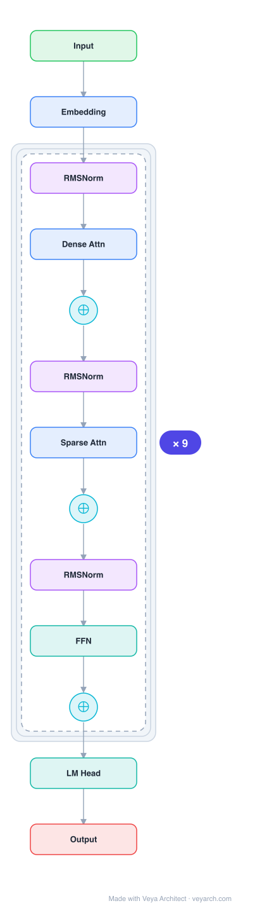

# Architecture: GPT-3

## Motivation

The pre-training plus fine-tuning paradigm, while successful, has a major limitation: while the architecture is task-agnostic, it still requires task-specific datasets and fine-tuning — typically thousands to hundreds of thousands of labeled examples per task. This limits applicability, creates vulnerability to spurious correlations (since large models fine-tuned on narrow distributions generalize poorly out-of-distribution), and contrasts sharply with human learning, where a brief directive or a few demonstrations suffices.

GPT-3 addresses this by demonstrating that **scaling up language models greatly improves task-agnostic, few-shot performance**, sometimes reaching competitiveness with prior state-of-the-art fine-tuning approaches — without any gradient updates or fine-tuning, with tasks and few-shot demonstrations specified purely via text interaction with the model.

## Core Idea

Autoregressive language model with 175 billion parameters (10× any previous non-sparse model), demonstrating few-shot in-context learning: tasks are specified via natural language instructions and a few examples in the model's context window, with no parameter updates.

## Architecture

### Overview

<b>Layer-by-layer (13 nodes)</b>

| # | Layer | Type | Params |
|---|---|---|---|
| 1 | Input | `input` |  |
| 2 | Embedding | `embed` |  |
| 3 | RMSNorm | `rmsnorm` |  |
| 4 | Dense Attn | `attention` |  |
| 5 | ⊕ | `residual` |  |
| 6 | RMSNorm | `rmsnorm` |  |
| 7 | Sparse Attn | `attention` |  |
| 8 | ⊕ | `residual` |  |
| 9 | RMSNorm | `rmsnorm` |  |
| 10 | FFN | `ffn` |  |
| 11 | ⊕ | `residual` |  |
| 12 | LM Head | `linear` |  |
| 13 | Output | `output` |  |

GPT-3 uses the same model and architecture as GPT-2, including modified initialization, pre-normalization, and reversible tokenization, with one key addition: alternating dense and locally banded sparse attention patterns in the Transformer layers, similar to the Sparse Transformer. Eight model sizes were trained, ranging from 125M to 175B parameters across three orders of magnitude. All models use a context window of 2048 tokens.

### Components

1. **Decoder-only Transformer** — Same architecture family as GPT-2, with masked self-attention. Eight model sizes:
   - 125M to 175B parameters
   - n_layers, d_model, n_heads vary per size
   - Feed-forward layer is 4× the bottleneck dimension: `d_ff = 4 × d_model`
   - Context window: `n_ctx = 2048` tokens (2× GPT-2's 1024)

2. **Alternating Dense and Locally-Banded Sparse Attention** — The key architectural innovation over GPT-2. Layers alternate between standard dense self-attention and locally-banded sparse attention patterns (similar to Sparse Transformer [Child et al., 2019]). This reduces the O(n²) attention cost for long sequences while maintaining expressivity.

3. **Pre-normalization** — Same as GPT-2: LayerNorm applied at the input of each sub-block (pre-LN).

4. **Modified initialization** — Same as GPT-2: residual layer weights scaled by `1/√N` at initialization.

5. **Byte-level BPE tokenization** — Same reversible tokenization as GPT-2.

### Data Flow

1. **Input**: Text encoded via byte-level BPE into token IDs.
2. **Embedding**: Token embeddings + learned positional embeddings (up to 2048 positions).
3. **Transformer processing**: Decoder-only stack with alternating dense/sparse attention layers. Each layer: pre-LN → attention (dense or sparse) → residual → pre-LN → feed-forward → residual.
4. **Output**: Final layer norm → linear projection → softmax over vocabulary.
5. **Few-shot task execution**: Tasks are specified via text interaction:
   - **Zero-shot**: Natural language instruction only (e.g., "Translate to French: ...")
   - **One-shot**: One demonstration example + instruction
   - **Few-shot**: K demonstration examples + instruction
   - The model generates completions auto-regressively, with no gradient updates.

### State / Memory

- **Context window (2048 tokens)** — The primary working memory, doubled from GPT-2's 1024. All task instructions, few-shot demonstrations, and generated text must fit within this window.
- **In-context learning** — The model's "inner loop" of learning occurs within the forward pass on each sequence. During pre-training, the model develops broad skills and pattern recognition abilities; at inference time, it uses these to rapidly adapt to or recognize the desired task from context.
- **Parameters as knowledge** — 175B parameters encode knowledge from ~500B tokens of training data, serving as long-term memory enabling few-shot task performance.
- **No recurrent state or external memory** — Like all Transformers, no hidden state propagates across forward passes.

## Design Decisions

1. **Scale over architecture innovation** — GPT-3's primary contribution is scale (175B parameters, 10× previous models) rather than architectural novelty. The architecture is essentially GPT-2 + sparse attention. The hypothesis: with enough training data, validation loss scales as a smooth power law of model size, and downstream task performance follows.

2. **Few-shot over fine-tuning** — Eliminates fine-tuning entirely. Tasks are specified purely via text interaction. This avoids the narrow-distribution generalization problem of fine-tuning and the practical burden of collecting labeled data for each task.

3. **Sparse attention** — Alternating dense and locally-banded sparse attention reduces computational cost at scale, making 175B parameter training feasible.

4. **Training data curation** — Common Crawl filtered for quality (similarity to high-quality reference corpora), fuzzy deduplication at document level, augmented with curated datasets (WebText, Books1, Books2, Wikipedia). Higher-quality datasets sampled more frequently than their size proportion, accepting slight overfitting for better data quality.

5. **Model partitioning** — Models partitioned across GPUs along both depth and width dimensions to minimize data transfer between nodes.

6. **Eight model sizes** — Trained models spanning three orders of magnitude (125M–175B) to study scaling laws and test the hypothesis that validation loss follows a smooth power law of model size.

## Evolution

**Predecessors:**
- **GPT-2** (Radford et al., 2019) — Direct predecessor; same architecture with dense attention, 1.5B parameters, demonstrated zero-shot transfer.
- **Sparse Transformer** (Child et al., 2019) — Source of the sparse attention pattern used in GPT-3.
- **Scaling Laws** (Kaplan et al., 2020) — Provided the theoretical basis for scaling model size as a smooth power law.

**Successors:**
- **InstructGPT** (2022) — Aligned GPT-3 with human intent via RLHF.
- **GPT-4** (2023) — Multimodal, further scaled, with improved reasoning and instruction following.
- The few-shot in-context learning paradigm established by GPT-3 became the standard evaluation framework for subsequent LLMs.

## Characteristics

| Property | Value |
|----------|-------|
| Year | 2020 |
| Authors | Brown et al. (OpenAI) |
| Category | DL/Transformer |
| Source Paper | `GPT_3_Kaplan_Dhariwal_Neelakantan_etal_2025.md` |
| PaperVault Path | `DL-Architectures/01-transformers/GPT_3_Kaplan_Dhariwal_Neelakantan_etal_2025.md` |

## Limitations

1. **Text synthesis weaknesses** — Despite high overall quality, GPT-3 samples sometimes repeat themselves semantically at the document level, lose coherence over long passages, contradict themselves, and contain non-sequitur sentences or paragraphs.

2. **Common sense physics** — GPT-3 has difficulty with commonsense physics questions (e.g., "If I put cheese into the fridge, will it melt?"), despite performing well on some related benchmarks.

3. **Comparison tasks** — GPT-3 does little better than chance on some comparison tasks (e.g., determining if two words are used the same way, or if one sentence implies another) in one-shot or few-shot settings.

4. **Unidirectional architecture** — The autoregressive (left-to-right) architecture lacks bidirectionality, potentially hurting performance on fill-in-the-blank tasks, content comparison, and tasks requiring re-reading. Bidirectional models at scale could be stronger for fine-tuning.

5. **Pre-training objective limitations** — The objective weights every token equally and lacks a notion of what is important to predict. Self-supervised prediction forces tasks into prediction problems rather than goal-directed actions. The model is not grounded in other modalities (video, physical interaction).

6. **Poor sample efficiency** — Despite improved test-time efficiency (few-shot), GPT-3 still sees far more text during pre-training than a human sees in their lifetime.

7. **Training data contamination** — Some test benchmarks may have been seen during training, inflating performance metrics.

8. **Societal risks** — GPT-3 can generate news articles that humans have difficulty distinguishing from human-written ones, raising concerns about misinformation, bias, and misuse.

## Implementation Notes

See `implementation/` for a minimal runnable implementation. Key implementation details:
- Pre-LN Transformer decoder with alternating dense/sparse attention
- Byte-level BPE tokenizer
- Learned positional embeddings (max 2048 positions)
- GELU activation in feed-forward networks
- Adam optimizer with cosine learning rate schedule
- Model partitioned across GPUs along depth and width dimensions

## Information Layers

- **Evidence:** Source paper available in `references/papers/` (Brown et al., 2020, "Language Models are Few-Shot Learners")
- **Analysis:** GPT-3 demonstrates that scale alone — without architectural innovation — can unlock few-shot in-context learning, a qualitatively new capability. The power-law scaling relationship between model size and task performance provides a predictive framework for future model development. The emergence of few-shot learning as a capability that appears only at sufficient scale is a key empirical finding.
- **Hypothesis:** The authors conjecture that scaling pure self-supervised prediction will hit limits, and that augmentation with human feedback (RLHF), reinforcement learning, or additional modalities will be necessary for further progress — a hypothesis subsequently validated by InstructGPT and GPT-4.
