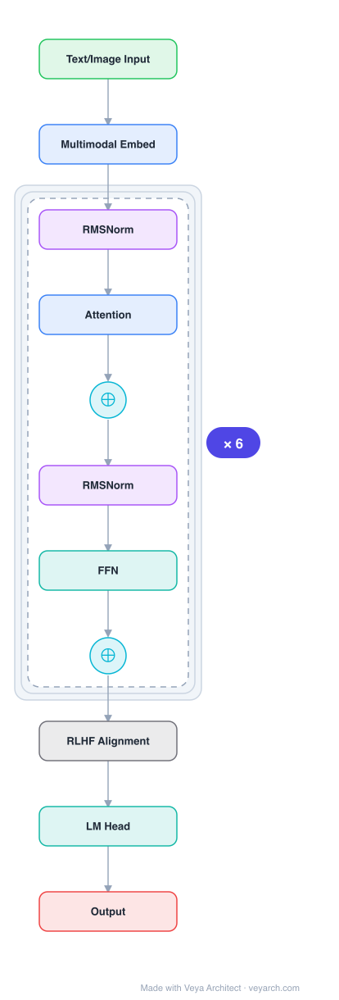

# Architecture: GPT-4

## Motivation

Prior large language models (GPT-3 and successors) demonstrated strong capabilities but were unreliable — they hallucinated facts, made reasoning errors, and could not process visual information. The goal of GPT-4 was to build a **large-scale multimodal model** that accepts image and text inputs, produces text outputs, and achieves human-level performance on professional and academic benchmarks (e.g., passing the bar exam in the top 10% of test takers), while improving factuality and behavioral alignment through post-training.

A secondary motivation was developing **deep learning infrastructure and optimization methods that behave predictably across scales**, enabling accurate performance prediction from small runs (1/1000th the compute) to the final large model.

## Core Idea

Transformer-based multimodal model pre-trained to predict the next token in a document, then fine-tuned with Reinforcement Learning from Human Feedback (RLHF) for alignment. Key innovation: predictable scaling infrastructure allowing performance prediction from small-scale runs.

## Architecture

### Overview

<b>Layer-by-layer (11 nodes)</b>

| # | Layer | Type | Params |
|---|---|---|---|
| 1 | Text/Image Input | `input` |  |
| 2 | Multimodal Embed | `embed` |  |
| 3 | RMSNorm | `rmsnorm` |  |
| 4 | Attention | `attention` |  |
| 5 | ⊕ | `residual` |  |
| 6 | RMSNorm | `rmsnorm` |  |
| 7 | FFN | `ffn` |  |
| 8 | ⊕ | `residual` |  |
| 9 | RLHF Alignment | `custom` |  |
| 10 | LM Head | `linear` |  |
| 11 | Output | `output` |  |

GPT-4 is a Transformer-style model pre-trained to predict the next token in a document, using both publicly available data (internet data) and data licensed from third-party providers. It is **multimodal**: it accepts both image and text inputs and produces text outputs. The model was fine-tuned using RLHF for improved factuality and adherence to desired behavior. The report deliberately withholds architectural details (model size, hardware, training compute, dataset construction) due to competitive and safety considerations.

### Components

1. **Transformer backbone** — Pre-trained with a next-token prediction objective. Architecture details (size, layers, dimensions) are not disclosed.

2. **Multimodal input processing** — The model accepts image inputs alongside text inputs, enabling visual understanding tasks. (The technical report does not detail the image encoding architecture.)

3. **RLHF post-training** — Reinforcement Learning from Human Feedback applied after pre-training to align model behavior with human intent, improving factuality and reducing harmful outputs.

4. **Predictable scaling infrastructure** — Deep learning stack with optimization methods that behave predictably across scales, enabling performance prediction from small models (1/1000–1/10000 the compute) to the final run.

### Data Flow

1. **Input**: Text and/or images provided as input.
2. **Pre-training**: Next-token prediction on a large corpus of internet data and licensed third-party data.
3. **Post-training (RLHF)**: Fine-tuning with human feedback to align behavior.
4. **Inference**: The model generates text outputs auto-regressively, conditioned on the multimodal input context.
5. **Evaluation**: Tested on professional/academic exams (bar exam, SAT, AP exams, GRE, etc.) and traditional NLP benchmarks (MMLU, HumanEval, TruthfulQA).

### State / Memory

- **Context window** — Limited context window (not fully disclosed), constraining how much input the model can process at once.
- **Parameters** — Pre-training data cuts off in September 2021; the model does not learn from experience after training.
- **No online learning** — The model does not update from interactions; all knowledge is fixed at training time.

## Design Decisions

1. **Multimodality** — Extending beyond text-only to accept image inputs, enabling visual reasoning and understanding tasks that were impossible with GPT-3.

2. **RLHF alignment** — Post-training with human feedback to improve factuality (19 percentage point improvement on adversarial factuality evaluations vs. GPT-3.5) and adherence to desired behavior, including safety properties.

3. **Predictable scaling** — Infrastructure designed so that final loss follows a power law in compute: `L(C) = aC^b + c` (with irreducible loss term). This enabled predicting GPT-4's final loss from models trained with up to 10,000× less compute. Capability metrics (e.g., HumanEval pass rate) also follow approximate power laws.

4. **Information withholding** — Deliberately withholding architectural details (model size, hardware, compute, dataset) due to competitive landscape and safety implications of large-scale models.

5. **Adversarial testing** — Domain experts conducted adversarial testing to identify and mitigate potential harms before deployment.

## Evolution

**Predecessors:**
- **GPT-3** (Brown et al., 2020) — 175B parameter autoregressive language model demonstrating few-shot in-context learning.
- **GPT-3.5 / ChatGPT** — RLHF-aligned versions of GPT-3, predecessors in the alignment approach.
- **Scaling Laws** (Kaplan et al., 2020; Hoffmann et al., 2022) — Theoretical basis for predictable scaling.

**Successors:**
- **GPT-4 Turbo / GPT-4o** — Improved versions with larger context windows and multimodal output.
- The predictable scaling methodology established by GPT-4 became a standard practice for training frontier models.

## Characteristics

| Property | Value |
|----------|-------|
| Year | 2023 |
| Authors | OpenAI |
| Category | DL/Transformer |
| Source Paper | `GPT_4_OpenAI_2025.md` |
| PaperVault Path | `DL-Architectures/01-transformers/GPT_4_OpenAI_2025.md` |

## Limitations

1. **Hallucinations** — GPT-4 is not fully reliable; it still hallucinates facts and makes reasoning errors, though significantly reduced relative to GPT-3.5.

2. **Limited context window** — The context window is finite, limiting the amount of input the model can process at once.

3. **No learning from experience** — The model does not learn from interactions; all knowledge is fixed at training time.

4. **Knowledge cutoff** — GPT-4 lacks knowledge of events after September 2021 (when most pre-training data cuts off).

5. **Simple reasoning errors** — The model can make simple reasoning errors inconsistent with its competence across many domains, and can be overly gullible in accepting obviously false statements.

6. **Confident wrongness** — GPT-4 can be confidently wrong, not taking care to double-check work when likely to make a mistake. (Interestingly, the pre-trained model is highly calibrated, but RLHF reduces calibration.)

7. **Security vulnerabilities** — The model can introduce security vulnerabilities into code it produces, failing at hard problems similarly to humans.

8. **Safety challenges** — GPT-4's capabilities create significant and novel safety challenges around bias, disinformation, over-reliance, privacy, cybersecurity, and proliferation.

## Implementation Notes

See `implementation/` for a minimal runnable implementation. Key aspects:
- Transformer-based next-token prediction architecture
- Multimodal input processing (image + text)
- RLHF post-training pipeline for alignment
- Predictable scaling: fit power law `L(C) = aC^b + c` from small-scale runs
- Capability prediction via approximate power laws on metrics like HumanEval pass rate

## Information Layers

- **Evidence:** Source paper available in `references/papers/` (OpenAI, 2023, "GPT-4 Technical Report")
- **Analysis:** GPT-4's primary contribution is not architectural novelty but the combination of multimodality, RLHF alignment, and predictable scaling infrastructure. The deliberate withholding of architectural details marks a shift in the field from open science toward safety-motivated opacity. The predictable scaling methodology — predicting final loss and capabilities from 1000× smaller runs — is a significant engineering contribution.
- **Hypothesis:** The report suggests that the pre-trained model is highly calibrated but RLHF post-training reduces calibration, raising the question of whether alignment and calibration can be simultaneously achieved. The authors also suggest that further progress may require grounding in additional modalities and goal-directed action beyond prediction.
