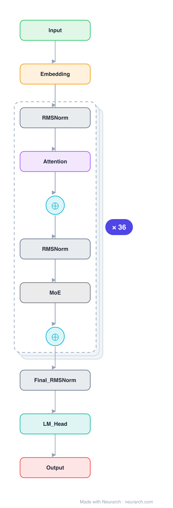

# Architecture: gpt-oss-120b

## Motivation

The larger of OpenAI's two 2025 open-weight MoEs, sized to run on a single 80GB GPU at MXFP4. Same recipe as [gpt-oss-20b](../gpt-oss-20b/) but 128 experts and 36 layers: 117B total, 5.1B active.

## Core Idea

The larger of OpenAI's two 2025 open-weight MoEs, sized to run on a single 80GB GPU at MXFP4.

## Architecture

### Overview

*Identical repeated blocks are folded into one representative block with a `× N` badge, so the whole architecture fits on screen. `model.json` uses a NAXS block template + `repeat` directive: the identical repeated layers are defined once and expand to all 221 nodes (open it in Neurarch to see and edit every layer). Vector: [diagram.svg](assets/diagram.svg).*

| Hyperparameter | Value |
|---|---|
| Type | Decoder-only transformer, sparse MoE (causal LM) |
| Parameters | 117B total, 5.1B active |
| Layers | 36 |
| Hidden size | 2880 |
| Attention | GQA 64:8, head dim 64 |
| FFN | MoE: 128 experts, top-4 (no shared) |
| Normalization | RMSNorm, pre-norm |
| Positions | RoPE + YaRN; alternating sliding-window (128) and full attention |
| Vocabulary | 201,088 |
| Max context | 131,072 |

`model.json` is the full graph (repeated layers expressed via a NAXS block template + `repeat`), produced with the same import path the Neurarch app uses for "load from Hugging Face".

### Design Notes

- 128 experts, top-4 routed, no shared expert; 5.1B of 117B parameters active per token.
- Alternating attention: odd layers a 128-token sliding window, even layers full attention, plus learned attention-sink logits.
- Ships MXFP4-quantized; trained with the harmony response format for tool use and chain-of-thought.

### Parameter Check

Neurarch's per-layer parameter estimate over this graph: **116.79B**.
Hugging Face safetensors metadata reports **120.41B** for the real weights.
Deviation from the authoritative count (120.41B): **-3.0%**.

## Design Decisions

> **Analysis** — Observations derived from studying the architecture.

- 128 experts, top-4 routed, no shared expert; 5.1B of 117B parameters active per token.
- Alternating attention: odd layers a 128-token sliding window, even layers full attention, plus learned attention-sink logits.
- Ships MXFP4-quantized; trained with the harmony response format for tool use and chain-of-thought.

## Implementation Notes

- `model.json` contains the full structural graph with real dimensions and parameters, using a NAXS block template + `repeat` for the identical repeated layers.
- Open in [Neurarch](https://www.neurarch.com/) to visualize, edit, or export training code.
- Diagrams fold repeated identical blocks with a `× N` badge; `model.json` defines each repeated layer once at real dimensions and expands to all nodes.

## Limitations

- This package focuses on the architectural structure. Training pipelines, 
dataset preparation, and production optimizations are out of scope.

## Evolution

> See `references/related/` for predecessor and successor architectures.

